RESEARCH ARTICLE | FEBRUARY 25 2025 

# Phase-field lattice Boltzmann model with adaptive mesh refinement for ferrofluid interfacial dynamics 

Zhenchao Guo (郭振超) ; Shiting Zhang (章诗婷) ; Yuqi Zhu (朱玉麒) ; Yang Hu (胡洋)  ; Qiang He (何强) ; Xiaolong Yang (杨小龙) ; Decai Li (李德才) 

Check for updates 

Physics of Fluids 37, 022148 (2025) 

https://doi.org/10.1063/5.0256574 

View Online

Export Citation

## Articles You May Be Interested In

An experimental study on Rosensweig instability of a ferrofluid droplet 

Physics of Fluids (May 2008) 

Rosensweig instability in ferrofluids 

Low Temp. Phys. (October 2011) 

On the Rosensweig instability of ferrofluid-infused surfaces under a uniform magnetic field 

Physics of Fluids (November 2023) 

AIP Publishing 

Physics of Fluids 

## Special Topics Open for Submissions

Learn More 

# Phase-field lattice Boltzmann model with adaptive mesh refinement for ferrofluid interfacial dynamics

Cite as: Phys. Fluids 37, 022148 (2025); doi: 10.1063/5.0256574 Submitted: 6 January 2025 . Accepted: 28 January 2025 . Published Online: 25 February 2025 

Zhenchao Guo (郭振超),1 Shiting Zhang (章诗婷),1 Yuqi Zhu (朱玉麒),1 Yang Hu (胡洋),1,a) Qiang He (何强),2 D Xiaolong Yang (杨小龙),3 and Decai Li (李德才) 2 

## AFFILIATIONS

1 Beijing key laboratory of Flow and Heat Transfer of Phase Changing in Micro and Small Scale, School of Mechanical, Electronic and Control engineering, Beijing Jiaotong University, Beijing 100044, People’s Republic of China 

2 State Key Laboratory of Tribology in Advanced Equipment, Tsinghua University, Beijing 100084, People’s Republic of China 

3 School of Mechanical and Automotive Engineering, Guangxi University of Science and Technology, Liuzhou 545006, People’s Republic of China 

)Author to whom correspondence should be addressed: yanghu@bjtu.edu.cn 

## ABSTRACT

In this paper, we propose a phase-field model that integrates the lattice Boltzmann method with an adaptive mesh refinement technique to study the interfacial dynamics of ferrofluids. In this model, we employ the second-order conservative Allen–Cahn equation to accurately capture the ferrofluid interface. The velocity-based hydrodynamic equations and a magnetic scalar potential equation with a pseudo-time term are utilized to describe the flow and magnetic fields. All governing equations are solved using a finite difference lattice Boltzmann scheme. To effectively resolve the interfacial dynamics of ferrofluids while reducing computational overhead, the numerical scheme is implemented on a block-structured adaptive mesh. To evaluate the accuracy and efficiency of the proposed model, we conduct simulations on several benchmark problems, including a circular cylinder in a uniform magnetic field, the deformation of a ferrofluid droplet, and the rising of a bubble in ferrofluid. The results obtained show good agreement with exact solutions and well-validated results in the existing literature. Furthermore, three types of ferrofluid instabilities under a uniform magnetic field—namely, the Rosensweig instability, the Rayleigh–Taylor instability, and the Kelvin–Helmholtz instability—are also investigated. Numerical results demonstrate that the magnetic field can significantly promote or suppress the occurrence of flow instabilities. 

Published under an exclusive license by AIP Publishing. https://doi.org/10.1063/5.0256574 

## I. INTRODUCTION

Multiphase phase ferrofluid flows have garnered significant attention due to their inherently rich physical properties and diverse applications across various fields.1–4 The presence of a magnetic field induces a jump in magnetic stress force across the ferrofluid interface, and this jump, combined with interfacial tension, leads to complex interfacial behaviors. Numerous theoretical and experimental studies have been conducted to investigate the dynamics of ferrofluid interfaces.3,4 However, theoretical methods are often applicable only in simplified scenarios. Additionally, the opacity of ferrofluids presents challenges for experimental techniques in accurately measuring microscopic phenomena and transient behaviors. With advancements in computer hardware and numerical techniques, numerical simulations have emerged as powerful tools for gaining insights into ferrofluid interfacial dynamics with enhanced precision and efficiency. Various numerical methods, including the finite volume method,5 finite difference method,6 and finite element method,7 have been employed to simulate fluid flows. Among these, the lattice Boltzmann method (LBM) has gained popularity as an effective computational tool. LBM is now widely used for solving complex flow systems, such as multiphase and multicomponent flows,8–10 turbulent flows,11,12 microflows,13,14 fluid–solid interactions,15,16 porous media flows,17,18 and thermal flows.19–21 

According to the mesh structure used, the lattice Boltzmann method (LBM) can be categorized into two types: uniform mesh-based LBM and non-uniform mesh-based LBM.22 The former employs a consistent mesh size throughout the computational domain, simplifying the implementation process. In recent years, numerous researchers have focused on investigating two-phase ferrofluid flows using uniform mesh-based LBM.23–29 Hu et $a l . ^ { 2 3 }$ were the first to extend the phase field-lattice Boltzmann model to simulate the dynamics of multiphase ferrofluids. Their work successfully simulated several classical numerical examples, including the deformation of ferrofluid droplets under a uniform magnetic field, the coalescence of bubbles in ferrofluid systems, and the motion and merging of ferrofluid droplets on a flat surface in the presence of a permanent magnet. The research by Hu et al. has sparked a significant amount of subsequent work. For instance, Li et al.24 developed a multiphase LBM that integrates magnetic fields to simulate the dynamics of multiphase ferrofluid systems, particularly focusing on droplet merging processes. In another significant contribution, Li et al.25 introduced a lattice Boltzmann flux solver equipped with a self-correcting procedure to explore bubble dynamics in ferrofluids under a uniform magnetic field. Khan et al.26 employed a simplified multiphase LBM in conjunction with a magnetic field correction method to investigate the dynamics of ferrofluid droplets on solid substrates with varying wettability, analyzing the wetting kinetics involved. Zhang et al.27 applied a generalized conservative phase-field simplified multiphase lattice Boltzmann model to elucidate the dynamical mechanisms and a general deformation law of a ferrofluid droplet suspended between air and a liquid substrate under the influence of an applied vertical uniform magnetic field. Huang et al.28 developed an enhanced multicomponent multiphase pseudopotential LBM coupled with a magnetic field solver to study the wetting dynamics of a ferrofluid droplet influenced by non-uniform magnetic fields and gravitational effects. He et al.29 introduced a hybrid phase-field-LBM for multiphase ferrofluid flow, employing the immersed interface method to solve the Laplace equation for magnetic potential with an interface jump condition. It should be pointed out that, in multiphase ferrofluid problems, the region of interest predominantly lies near the interface, where surface tension, magnetic interfacial forces, and fluid properties exhibit significant variations. The small characteristic thickness of the interface results in large gradients in physical quantities, necessitating a high-resolution mesh for accurate representation. Conversely, in regions farther from the interface, a coarser mesh suffices to maintain numerical accuracy. However, many of the studies referenced above utilize uniform meshes for simulating ferrofluid interfacial dynamics under magnetic field influence, which can lead to computational inefficiencies. 

To tackle the inefficiencies associated with uniform meshing, adaptive mesh refinement (AMR) based on the lattice Boltzmann method (LBM) implemented on non-uniform meshes has demonstrated significant improvements in computational efficiency. AMR-LBM techniques intelligently allocate computational resources by refining the mesh only in regions close to interfaces, where high resolution is critical, while utilizing coarser meshes in areas farther away. Several implementation strategies for AMR-LBM have emerged. T€olke et al.30 introduced an AMR-LBM for multiphase problems using a Rothman–Keller-type model,31 which employs an unstructured treetype mesh. Building on a multi-block structured mesh, Yu and Fan32 developed an enhanced interaction potential model that utilizes AMR-LBM to simulate bubble rising problems. In this approach, the original “collision–propagation” algorithm in LBM is complicated by additional “explosion” and “coalescence” operations to transfer information between coarse and fine levels. Chen et al.33 proposed a nonuniform mesh-based LBM combined with an image reconstruction technique to create a quadtree mesh for simulating fluid flow in porous media. Liu et al.34 presented an adaptive mesh refinement method based on an octree structural representation, utilizing individual hash tables for each refinement level to avoid key value conflicts. Hasegawa et al.35 developed a block-structured AMR-LBM leveraging an octree forest and employed GPU acceleration for aerodynamic simulations. Deiterding and Wood36 applied block-structured AMR to lattice Boltzmann methods to address complex engineering challenges, highlighting the potential of AMR-LBM to enhance computational efficiency in simulating turbulent wake issues arising from wind turbine operations. It is noteworthy that in the aforementioned AMR-LB models, the standard collision-streaming procedures in LBM necessitate the use of different time steps on meshes with varying lattice sizes, leading to the need for both temporal and spatial interpolations. This results in a significant increase in algorithm complexity and imposes limits on the ratio of the coarsest to the finest mesh spacings. Furthermore, when employing a tree-type data structure in AMR, the memory and time required for tree traversal can be substantial. To mitigate these drawbacks, Fakhari et al.37 introduced a finite-difference LBM with a block-structured AMR technique, utilizing pointer attributes to determine the neighbors of a specific block through appropriate adjustments of its child identifications. This approach employs the Lax–Wendroff scheme to maintain a uniform time step across meshes with different lattice sizes. Within this framework, both the center-ofcell approach and the apex-of-cell approach38 were evaluated to assess the accuracy and efficiency of AMR in multiphase fluid simulations. The AMR-LBM has also been applied to three-phase flows and phase change problems.39,40 

In this paper, we propose a block-structured AMR-LBM for twophase ferrofluid flows to investigate interfacial dynamics under the influence of a magnetic field. The governing equations in discrete Boltzmann form for the phase field, flow field, and magnetic field are solved using the Lax–Wendroff scheme. Furthermore, to maintain a uniform magnetic field, we implement a specialized treatment of the Neumann boundary condition for the magnetic scalar potential within the Lax–Wendroff framework. Importantly, we note that most existing studies of two-phase ferrofluid flows focus primarily on droplet and bubble dynamics. However, flow instabilities in two-phase ferrofluid systems exhibit a richer variety of interfacial dynamic behaviors. With the aid of the proposed AMR-LBM, we conduct a detailed investigation into Rosensweig instability, Rayleigh–Taylor instability, and Kelvin–Helmholtz instability under different magnetic field configurations. 

The remainder of the paper is organized as follows. In Sec. II, we introduce the governing equations for two-phase ferrofluid flows, the lattice Boltzmann scheme, and the implementation details of AMR on block-structured meshes. Section III presents simulations of several typical problems, including the deformation of ferrofluid droplets, bubble rising in ferrofluid, Rosensweig instability, Rayleigh–Taylor instability under a uniform vertical magnetic field, and Kelvin– Helmholtz instability under a uniform horizontal magnetic field. The results of these simulations will be discussed in detail. Finally, Sec. IV offers concluding remarks and outlines future perspectives. 

## II. MATHEMATICAL MODEL AND NUMERICAL METHOD A. Governing equations for two-phase ferrofluid flows

The magnetic governing equations of ferrofluid flows are described by the Maxwell equations for nonconducting fluids41 

$$
\nabla \cdot \mathbf {B} = 0, \tag {1}
$$

$$
\nabla \times \mathbf {H} = 0, \tag {2}
$$

where $\mathbf { H } ( \mathrm { A } / \mathrm { m } )$ and (T) are the magnetic field strength and the mag-H Bnetic flux density, respectively. Considering a ferrofluid domain $X _ { d } ,$ surrounded by a nonmagnetizable medium $\dot { X } _ { c } ,$ can be expressed as 

$$
B = \left\{ \begin{array}{l l} \mu_ {0} (\mathbf {H} + \mathbf {M}), & \text { if   } X _ {d}, \\ \mu_ {0} \mathbf {H}, & \text { if   } X _ {c}, \end{array} \right. \tag {3}
$$

where  is the magnetization and it can be expressed as $\mathbf { M } = \chi \mathbf { H } .$ . The Mvacuum permeability $\mu _ { 0 }$ is $4 \pi \times 1 0 ^ { - 7 } \mathrm { \ : N / A } ^ { 2 } .$ M Hl can be expressed as $\mu = \mu _ { 0 } ( 1 + \chi ) . \mu$ and v are the permeability and the magnetic susceptibility, respectively. According to the irrotational condition, a scalar magnetic potential is defined that satisfies 

$$
\mathbf {H} = - \nabla \psi . \tag {4}
$$

Then, by substituting Eq. (3) and Eq. (4) into Eq. (1), we ultimately obtain the magnetic potential equation 

$$
\nabla \cdot (\mu \nabla \psi) = 0. \tag {5}
$$

The binary ferrofluid flows involved in this paper are presumed to be incompressible, isothermal, and immiscible. The Navier–Stokes equations governing the motion of the two-phase fluids are 

$$
\nabla \cdot \mathbf {u} = 0, \tag {6}
$$

$$
\rho \left(\frac {\partial \mathbf {u}}{\partial \mathbf {t}} + (\mathbf {u} \cdot \nabla) \mathbf {u}\right) = - \nabla p + \eta \nabla^ {2} \mathbf {u} + \mathbf {F} _ {\mathrm{s}} + \mathbf {F} _ {\mathrm{b}} + \mathbf {F} _ {\mathrm{m}}, \tag {7}
$$

where $\rho$ is the density of the fluid,  the velocity, and p the pressure, g the kinematic viscosity, $\mathbf { F _ { \mathrm { b } } }$ and ${ \bf F } _ { \mathrm { s } }$ uthe body force and surface tension, respectively; $\mathbf { F } _ { \mathrm { m } }$ F Fdenotes the magnetic force. When the magnetic sus-Fceptibility is constant corresponding to small magnetic field strengths, according to Hu et al., 23 $\mathbf { F } _ { \mathrm { m } }$ can be expressed by 

$$
F _ {m} = \frac {\mu_ {0} \chi}{2} \nabla \left(| \mathbf {H} | ^ {2}\right). \tag {8}
$$

In this study, the second-order conservative Allen–Cahn equation is adopted to capture the phase interfaces and it reads42 

$$
\frac {\partial \phi}{\partial t} + \nabla \cdot (\phi \mathbf {u}) = \nabla \cdot \left[ \mathrm{M} _ {\phi} \left(\nabla \phi - \frac {1 - 4 (\phi - \phi_ {0}) ^ {2}}{W} \mathbf {n}\right) \right], \tag {9}
$$

where / is the order parameter of phase field that indicates each phase. $\phi _ { 0 } = ( \phi _ { l } + \phi _ { h } ) / 2$ implies the interface location. In this study, we set $\phi _ { l } = 0$ and $\phi _ { h } = 1 . \ M _ { \phi }$ and W are the mobility and interface width parameter, respectively. is the normal vector to the interface, which is calculated by 

$$
\mathbf {n} = \frac {\nabla \phi}{| \nabla \phi |}. \tag {10}
$$

At equilibrium state, the phase field profile along the normal direction of the interface reads 

$$
\phi (\xi) = \phi_ {0} + \frac {\phi_ {h} - \phi_ {l}}{2} \tanh \left(\frac {2 \xi}{W}\right), \tag {11}
$$

where n is the signed distance from the interface. The surface tension $F _ { s }$ can be calculated as 

$$
\mathbf {F} _ {s} = \mu_ {\phi} \nabla \phi , \tag {12}
$$

where $\mu _ { \phi }$ is the chemical potential, which can be computed by 

$$
\mu_ {\phi} = 4 \beta (\phi - \phi_ {l}) (\phi - \phi_ {h}) (\phi - \phi_ {0}) - \kappa \nabla^ {2} \phi , \tag {13}
$$

where $\beta$ and j are the parameter relating to the surface tension coefficient r and the interfacial thickness W: 

$$
\beta = \frac {1 2 \sigma}{W}, \quad \kappa = \frac {3 W \sigma}{2}. \tag {14}
$$

## B. Finite difference lattice Boltzmann scheme

The traditional lattice Boltzmann method (LBM) is not well suited for non-uniform meshes. To implement the “collisionstreaming” process on the hierarchical mesh structure, the finite difference lattice Boltzmann method (FDLBM) proposed by Fakhari et $a l . ^ { 3 7 }$ is adopted herein. Using a time-splitting method and Lax-Wendroff scheme, the discrete Boltzmann equation (DBE) with a multiple-relaxation-time collision operator for phase field equation can be discretized as 

$$
\begin{array}{l} \bar {f} _ {\alpha} (\mathbf {x}) = f _ {\alpha} (\mathbf {x}) - \left(\mathbf {M} _ {9} ^ {- 1} \mathbf {S} ^ {f} \mathbf {M} _ {9}\right) _ {\alpha \beta} \left(f _ {\beta} (\mathbf {x}) - f _ {\beta} ^ {e q} (\mathbf {x})\right) \\ + \left(\mathbf {M} _ {9} ^ {- 1} \left(\mathbf {I} - \frac {\mathbf {S} ^ {f}}{2}\right) \mathbf {M} _ {9}\right) _ {\alpha \beta} F _ {\beta}, \tag {15} \\ \end{array}
$$

$$
f _ {\alpha} (\mathbf {x}, t + \delta t) = (1 - \gamma^ {2}) \bar {f} _ {\alpha} (\mathbf {x}, t) + \frac {\gamma (\gamma + 1)}{2} \bar {f} _ {\alpha} (\mathbf {x} - \delta \mathbf {x} _ {\alpha}, t)
$$

$$
+ \frac {\gamma (\gamma - 1)}{2} \bar {f} _ {\alpha} (\mathbf {x} + \delta \mathbf {x} _ {\alpha}, t), \tag {16}
$$

where $f _ { \alpha }$ and $\bar { f } _ { \alpha }$ are the distribution function for the order parameter. Here, the D2Q9 lattice velocity model is used, and the corresponding lattice discrete velocity $\mathbf { e } _ { \alpha }$ is given as 

$$
\mathbf {e} _ {\alpha} = \left\{ \begin{array}{l l} (0, 0), & \alpha = 0, \\ \left\{\cos \left[ (\alpha - 1) \frac {\pi}{2} \right], \sin \left[ (\alpha - 1) \frac {\pi}{2} \right] \right\} c, & \alpha = 1, 2, 3, 4, \\ \sqrt {2} \left\{\cos \left[ (2 \alpha - 1) \frac {\pi}{4} \right], \sin \left[ (2 \alpha - 1) \frac {\pi}{4} \right] \right\} c, & \alpha = 5, 6, 7, 8, \end{array} \right. \tag {17}
$$

where c is the lattice speed. It can be expressed as $c = \Delta x / \delta t ,$ , where Dx and dt are the lattice spacing and the time step, respectively. The phase-field equilibrium distribution function $f _ { \alpha } ^ { e q }$ is given as 

$$
f _ {\alpha} ^ {\mathrm{eq}} = \omega_ {\alpha} \phi \left(1 + \frac {\mathbf {e} _ {\alpha} \cdot \mathbf {u}}{c _ {s} ^ {2}}\right), \tag {18}
$$

where $c _ { s } = c / \sqrt { 3 }$ is the lattice speed of sound and $\omega _ { \alpha }$ is the weight coefficient set with $\omega _ { 0 } = 4 / 9 , \omega _ { 1 - 4 } = 1 / 9 , \omega _ { 5 - 8 } = 1 / 3 6 . \gamma = | \mathbf { e } _ { \alpha } | \delta t /$ $| \delta \mathbf { x } _ { \alpha } |$ is the Courant–Friedrichs–Lewy (CFL) number. $\delta \mathbf { x } _ { \alpha }$ eis the disx xplacement between two adjacent nodes along the direction of $\mathbf { e } _ { \mathfrak { x } } .$ The discrete source term $F _ { \beta }$ can be calculated by 

$$
F _ {\beta} = \omega_ {\beta} \mathbf {e} _ {\beta} \cdot \frac {4 \phi (1 - \phi)}{W} \mathbf {n}. \tag {19}
$$

The $9 \times 9$ transform matrix $\mathbf { M } _ { 9 }$ reads 

$$
\mathbf {M} _ {9} = \left[ \begin{array}{c c c c c c c c c} 1 & 1 & 1 & 1 & 1 & 1 & 1 & 1 & 1 \\ - 4 & - 1 & - 1 & - 1 & - 1 & 2 & 2 & 2 & 2 \\ 4 & - 2 & - 2 & - 2 & - 2 & 1 & 1 & 1 & 1 \\ 0 & 1 & 0 & - 1 & 0 & 1 & - 1 & - 1 & 1 \\ 0 & - 2 & 0 & 2 & 0 & 1 & - 1 & - 1 & 1 \\ 0 & 0 & 1 & 0 & - 1 & 1 & 1 & - 1 & - 1 \\ 0 & 0 & - 2 & 0 & 2 & 1 & 1 & - 1 & - 1 \\ 0 & 1 & - 1 & 1 & - 1 & 0 & 0 & 0 & 0 \\ 0 & 0 & 0 & 0 & 0 & 1 & - 1 & 1 & - 1 \end{array} \right]. \tag {20}
$$

The relaxation matrix ${ \bf S } ^ { \mathrm { f } }$ is 

$$
\mathbf {S} ^ {\mathrm{f}} = \operatorname{diag} \left\{s _ {0} ^ {f}, s _ {1} ^ {f}, \dots , s _ {8} ^ {f} \right\}, \tag {21}
$$

where the diagonal elements is chosen as 

$$
\frac {1}{s _ {3} ^ {f}} = \frac {1}{s _ {5} ^ {f}} = \frac {M _ {\phi}}{c _ {s} ^ {2} \delta t} + 0. 5, \tag {22}
$$

$$
s _ {0} ^ {f} = s _ {1} ^ {f} = s _ {2} ^ {f} = s _ {4} ^ {f} = s _ {6} ^ {f} = s _ {7} ^ {f} = s _ {8} ^ {f} = 1. \tag {23}
$$

The phase-field value $\phi$ can be determined by taking the zeroth moment of the phase-field distribution function $f _ { \alpha }$ 

$$
\phi = \sum_ {\alpha = 0} ^ {8} f _ {\alpha}. \tag {24}
$$

The Navier–Stokes equations can be reformulated in a velocitybased form, which is given by29 

$$
\frac {\partial \mathbf {u}}{\partial t} + \mathbf {u} \cdot \nabla \mathbf {u} = - \nabla \left(\frac {p}{\rho}\right) + \nabla \cdot [ v (\nabla \mathbf {u} + \mathbf {u} \nabla) ] + \frac {\mathbf {F} _ {\text {total}}}{\rho}, \tag {25}
$$

where $\nu = \eta / \rho$ is the kinematic viscosity, and $\mathbf { F } _ { t o t a l }$ is defined as 

$$
\mathbf {F} _ {\text { total }} = \mathbf {F} _ {v} + \mathbf {F} _ {p} + \mathbf {F} _ {s} + \mathbf {F} _ {b} + \mathbf {F} _ {m}, \tag {26}
$$

$$
\mathbf {F} _ {\nu} = \nu (\nabla \mathbf {u} + \mathbf {u} \nabla) \cdot \nabla \rho , \tag {27}
$$

$$
\mathbf {F} _ {p} = - \frac {p}{\rho} \nabla \rho . \tag {28}
$$

The finite difference LB equation for velocity-based Navier– Stokes equations can be written as 

$$
\begin{array}{l} \bar {g} _ {\alpha} (\mathbf {x}) = g _ {\alpha} (\mathbf {x}) - \left(\mathbf {M} ^ {- 1} \mathbf {S} ^ {g} \mathbf {M}\right) _ {\alpha \beta} \left(g _ {\beta} (\mathbf {x}) - g _ {\beta} ^ {e q} (\mathbf {x})\right) \\ + \left(\mathbf {M} ^ {- 1} \left(\mathbf {I} - \frac {\mathbf {S} ^ {g}}{2}\right) \mathbf {M}\right) _ {\alpha \beta} G _ {\beta}, \tag {29} \\ \end{array}
$$

$$
g _ {\alpha} (\mathbf {x}, t + \delta t) = (1 - \gamma^ {2}) \bar {g} _ {\alpha} (\mathbf {x}, t) + \frac {\gamma (\gamma + 1)}{2} \bar {g} _ {\alpha} (\mathbf {x} - \delta \mathbf {x} _ {\alpha}, t)
$$

$$
+ \frac {\gamma (\gamma - 1)}{2} \bar {g} _ {\alpha} (\mathbf {x} + \delta \mathbf {x} _ {\alpha}, t), \tag {30}
$$

where $g _ { \alpha }$ is the density distribution function. The equilibrium distribution function $g _ { \alpha } ^ { e q }$ is 

$$
g _ {\alpha} ^ {e q} = \omega_ {\alpha} \left[ \frac {p}{\rho c _ {s} ^ {2}} + \frac {\mathbf {e} _ {\alpha} \cdot \mathbf {u}}{c _ {s} ^ {2}} + \frac {\left(\mathbf {e} _ {\alpha} \cdot \mathbf {u}\right) ^ {2}}{2 c _ {s} ^ {2}} - \frac {\mathbf {u} \cdot \mathbf {u}}{2 c _ {s} ^ {2}} \right]. \tag {31}
$$

The discrete force term can be obtained by 

$$
G _ {\beta} = \omega_ {\beta} \left(\frac {\mathbf {e} _ {\beta} \cdot \mathbf {F} _ {t o t a l}}{c _ {s} ^ {2}} + \frac {\mathbf {u F} _ {t o t a l} : \left(\mathbf {e} _ {\beta} \mathbf {e} _ {\beta} - c _ {s} ^ {2} \mathbf {I}\right)}{c _ {s} ^ {4}}\right). \tag {32}
$$

The diagonal elements $s _ { i } ^ { g } ( 0 \leq i \leq 8 )$ in relaxation matrix $\mathbf { \boldsymbol { s } } ^ { g }$ is 

$$
\frac {1}{s _ {7} ^ {g}} = \frac {1}{s _ {8} ^ {g}} = \frac {\eta}{\rho c _ {s} ^ {2} \Delta t} + 0. 5, \tag {33}
$$

$$
s _ {0} ^ {g} = s _ {1} ^ {g} = s _ {2} ^ {g} = s _ {3} ^ {g} = s _ {4} ^ {g} = s _ {5} ^ {g} = s _ {6} ^ {g} = 1. \tag {34}
$$

With the hydrodynamic distribution function, the conserved quantities can be obtained as 

$$
\mathbf {u} = \sum_ {\alpha} g _ {\alpha} \mathbf {e} _ {\alpha} + \frac {\delta t}{2 \rho} \mathbf {F} _ {t o t a l}, \tag {35}
$$

$$
p = \rho c _ {s} ^ {2} \sum_ {\alpha} g _ {\alpha}. \tag {36}
$$

When solving the potential equation for magnetic field, as suggested by Hu et al.,23 the original Laplace equation needs to be modified by introducing a pseudo-time derivative term as well as a free parameter e. The resulting equation is expressed as 

$$
\frac {1}{\varepsilon} \frac {\partial \psi}{\partial t} = \nabla \cdot (\mu \nabla \psi). \tag {37}
$$

To ensure the solution of Eq. (37) is approaching to that of Eq. (5), a large value of e should be used. In our study, to ensure the numerical stability, $\varepsilon = 1 / \mu _ { 0 }$ is used. 

Unlike the phase field equation and the hydrodynamics equations, the magnetic field equation is relatively simple. As indicated by Li $e t ~ a l . , ^ { 4 3 }$ the D2Q5 model is sufficient to obtain the accurate solutions. In this study, the flowing finite difference LB model is also used to solve the magnetic field 

$$
\bar {h} _ {\alpha} (\mathbf {x}) = h _ {\alpha} (\mathbf {x}) - \left(\mathbf {M} _ {5} ^ {- 1} \mathbf {S} ^ {h} \mathbf {M} _ {5}\right) _ {\alpha \beta} \left(h _ {\beta} (\mathbf {x}) - h _ {\beta} ^ {e q} (\mathbf {x})\right), \quad \alpha = 0, 1, 2, 3, 4, \tag {38}
$$

$$
\begin{array}{l} h _ {\alpha} (\mathbf {x}, t + \delta t) = (1 - \gamma^ {2}) \bar {h} _ {\alpha} (\mathbf {x}, t) + \frac {\gamma (\gamma + 1)}{2} \bar {h} _ {\alpha} (\mathbf {x} - \delta \mathbf {x} _ {\alpha}, t) \\ + \frac {\gamma (\gamma - 1)}{2} \bar {h} _ {\alpha} (\mathbf {x} + \delta \mathbf {x} _ {\alpha}, t), \tag {39} \\ \end{array}
$$

where $h _ { \alpha }$ is the distribution function for the magnetic potential. The local equilibrium distribution function $h _ { \alpha } ^ { e q }$ can be expressed as 

$$
h _ {a} ^ {e q} = \omega_ {\alpha} ^ {5} \psi , \tag {40}
$$

where $\omega _ { \alpha } ^ { 5 } = 0 . 2 ( 0 \leq \alpha \leq 4 )$ . Here, $5 \times 5$ transform matrix $\mathbf { M } _ { 5 }$ is expressed as 

$$
\mathbf {M} _ {5} = \left[ \begin{array}{c c c c c} 1 & 1 & 1 & 1 & 1 \\ 0 & 1 & - 1 & 0 & 0 \\ 0 & 0 & 0 & 1 & - 1 \\ 4 & - 1 & - 1 & - 1 & - 1 \\ 0 & 1 & 1 & - 1 & - 1 \end{array} \right]. \tag {41}
$$

The diagonal elements $s _ { i } ^ { h }$ in relaxation matrix $\mathbf { \boldsymbol { s } } ^ { h }$ is 

$$
\frac {1}{s _ {1} ^ {h}} = \frac {1}{s _ {2} ^ {h}} = \frac {2 . 5 \varepsilon \mu}{c ^ {2} \delta t} + 0. 5, \tag {42}
$$

$$
s _ {0} ^ {h} = s _ {3} ^ {h} = s _ {4} ^ {h} = 1. \tag {43}
$$

The magnetic potential w is updated by taking the zeroth moment of the distribution function 

$$
\psi = \sum_ {\alpha} f _ {\alpha}. \tag {44}
$$

In the actual simulations, the magnetic field $H _ { n }$ on the boundaries are usually given. In other word, the Neumann boundary condition $\nabla \psi \cdot \mathbf { n } _ { b } = H _ { n }$ should be handled, where ${ \bf n } _ { b }$ is the unit normal n nvector on the boundary. As shown in Fig. 1, a layer of virtual nodes is arranged outside and the actual boundary location is half a cell size away from the lattice nodes. Within the time interval $[ t _ { n } , t _ { n + 1 } ]$ , we can get the following relation based on the conservation law: 

$$
\begin{array}{l} \left[ \frac {\gamma}{2} (\gamma + 1) \bar {h} _ {2} (x _ {0}, t _ {n}) + \frac {\gamma}{2} (\gamma - 1) \bar {h} _ {4} (x _ {0}, t _ {n}) \right] \delta x ^ {2} \\ = \left[ \frac {\gamma}{2} (\gamma - 1) \bar {h} _ {2} (x _ {1}, t _ {n}) + \frac {\gamma}{2} (\gamma + 1) \bar {h} _ {4} (x _ {1}, t _ {n}) \right] \delta x ^ {2} + \delta t (\varepsilon \mu H _ {n}) \delta x. \tag {45} \\ \end{array}
$$

Then using the non-equilibrium extrapolation method, we have 

$$
\bar {h} _ {2} (x _ {0}, t _ {n}) - \bar {h} _ {4} (x _ {0}, t _ {n}) = \bar {h} _ {2} (x _ {1}, t _ {n}) - \bar {h} _ {4} (x _ {1}, t _ {n}). \tag {46}
$$

Combining Eqs. (45) and (46) simultaneously yields 

$$
\bar {h} _ {2} (x _ {0}, t _ {n}) = \left(1 - \frac {1}{\gamma}\right) \bar {h} _ {2} (x _ {1}, t _ {n}) + \frac {1}{\gamma} \bar {h} _ {4} (x _ {1}, t _ {n}) + \frac {\varepsilon \mu H _ {n}}{\gamma}, \tag {47}
$$

$$
\bar {h} _ {4} (x _ {0}, t _ {n}) = - \frac {1}{\gamma} \bar {h} _ {2} (x _ {1}, t _ {n}) + \left(1 + \frac {1}{\gamma}\right) \bar {h} _ {4} (x _ {1}, t _ {n}) + \frac {\varepsilon \mu H _ {n}}{\gamma}. \tag {48}
$$

Once the post-collision distribution functions on the virtual nodes $j = 0$ are obtained, the streaming step can be performed. 

At last, we notice that the physical property parameters including density, viscosity, and permeability can be updated by a linear interpolation after obtaining the phase-field value 

$$
\rho = \rho_ {l} + \phi (\rho_ {h} - \rho_ {l}), \tag {49}
$$

$$
\eta = \eta_ {l} + \phi (\eta_ {h} - \eta_ {l}), \tag {50}
$$

$$
\mu = \mu_ {l} + \phi (\mu_ {h} - \mu_ {l}), \tag {51}
$$

where the subscripts l and h represent the light and heavy fluids, respectively. Moreover, we compute the gradient term $\dot { \nabla } \phi$ and 

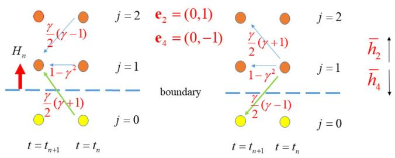

FIG. 1. Schematic depiction for the illustration of boundary condition treatment of magnetic field.

Laplacian term $\nabla ^ { 2 } \phi$ using second-order isotropically centered differences4 4 

$$
\nabla \phi = \frac {c}{c _ {s} ^ {2} \delta t} \sum_ {\alpha = 1} ^ {8} \frac {1}{2} \mathbf {e} _ {\alpha} \omega_ {\alpha} [ \phi (\mathbf {x} + \mathbf {e} _ {\alpha} \delta t) - \phi (\mathbf {x} - \mathbf {e} _ {\alpha} \delta t) ], \tag {52}
$$

$$
\nabla^ {2} \phi = \frac {2 c ^ {2}}{c _ {s} ^ {2} \delta t} \sum_ {\alpha = 1} ^ {8} \omega_ {\alpha} [ \phi (\mathbf {x} + \mathbf {e} _ {\alpha} \delta t, t) - \phi (\mathbf {x} - \mathbf {e} _ {\alpha} \delta t, t) ]. \tag {53}
$$

## C. Block-structured adaptive mesh refinement

In this work, we implement the adaptive mesh refinement (AMR) method using pointers instead of a tree data structure. This approach utilizes pointers to efficiently track all neighboring and child IDs without the need for maintaining or modifying a tree structure. Given that all blocks are structured and exhibit a degree of selfsimilarity, we employ a data structure to store relevant information. This structure encompasses both intra-block data—such as coordinates, distribution functions, and macroscopic quantities—and interblock data, which includes neighbor information. 

The AMR hierarchy is constructed using structured rectangular blocks, with each block consisting of $n _ { x } \times n _ { y }$ cells. The mesh spacing of these cells varies and is characterized by the refinement level l. The initial blocks with l are referred to as root blocks, while the finest blocks with the maximum refinement level $l _ { m a x }$ are referred to as leaf blocks. The relationship between the mesh spacing Dx, the refinement level l, and the size of the root block $( L _ { x } \times L _ { y } )$ is expressed as 

$$
\Delta x = \frac {L _ {x}}{n _ {x} \times 2 ^ {l}} = \frac {L _ {y}}{n _ {y} \times 2 ^ {l}}. \tag {54}
$$

As shown in Fig. 2, refining a mesh block once results in the creation of four child mesh blocks, with the mesh resolution doubling. Block information is updated accordingly, including the parent block identifier (ID), refinement level, four pointers to child blocks, eight pointers to orthogonal and diagonal neighboring blocks, and a logical variable indicating whether the block is a leaf block. Refinement continues until $l _ { m a x }$ or the refinement criteria are satisfied. 

The refinement criteria are based on the gradient of phase field parameter,37 expressed as 

$$
\epsilon = | \nabla \phi | = \sqrt {\left(\frac {\partial \phi}{\partial x}\right) ^ {2} + \left(\frac {\partial \phi}{\partial y}\right) ^ {2}}, \tag {55}
$$

where - represents the refinement error estimate. A block is marked for refinement when $\epsilon \geq \epsilon _ { d } = 0 . 0 0 2$ , while it is marked for coarsening when $\epsilon \le \epsilon _ { d } = 0 . 0 0 1$ . If $\epsilon _ { d } < \epsilon < \epsilon _ { r } ,$ the block retains its current refinement level, undergoing neither refinement nor coarsening. 

To facilitate information transfer between blocks, each block must have access to extract data from its neighboring blocks. This is achieved by using a ghost layer surrounding each block. When filling the ghost layer of a block, there are three possible scenarios, as illustrated in Fig. 3. Here, l and $l _ { B }$ denote the refinement levels of blocks A and B, respectively. The bold solid lines represent block interfaces, the thin solid lines represent mesh lines, the solid circles indicate mesh points, and the dashed circles indicate ghost points. 

As shown in Fig. 3(a), the simplest case occurs when two adjacent blocks are at the same refinement level, and both blocks A and B are leaf blocks. The ghost points of block A are assigned by directly copying data points from block B. 

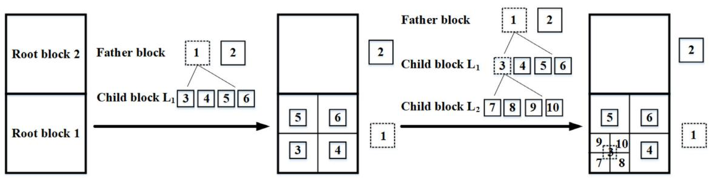

FIG. 2. The root block and the block hierarchy (dashed squares indicate blocks that disappear after refinement).

The second scenario, as illustrated in Fig. 3(b), occurs when two adjacent blocks are on the same hierarchical level, but block B contains sub-blocks. To fill the ghost points of the coarser block A using data from the finer block B, the biquadratic interpolation formula for interior nodes, shown in Fig. 4(a), is applied 

$$
\begin{array}{l} f (I, J) = [ 9 f (i, j) + 1 8 f (i + 1, j) - 3 f (i + 2, j) + 1 8 f (i, j + 1) \\ + 3 6 (i + 1, j + 1) - 6 f (i + 2, j + 1) - 3 f (i, j + 2) \\ \left. - 6 f (i + 1, j + 2) - 6 f (i + 2, j + 1) \right] / 6 4 + o \left(\Delta x ^ {3}\right). \tag {56} \\ \end{array}
$$

The final scenario, shown in Fig. 3(c), occurs when blocks A and B have different refinement levels, such that $l _ { A } = l _ { B } + 1$ . In this case, the ghost points of the finer block A are filled using data from the coarser block B. As depicted in Fig. 4(b), the biquadratic interpolation formula for interior nodes is employed 

$$
\begin{array}{l} f (i, j) = [ 2 5 f (I - 1, J - 1) + 1 5 0 f (I, J - 1) - 1 5 f (I + 1, J - 1) \\ + 1 5 0 f (I - 1, J) + 9 0 0 f (I, J) - 9 0 f (I + 1, J - 1) \\ \left. - 1 5 f (I - 1, I + 1) - 9 0 f (I, I + 1) + 9 f (I + 1, I + 1) \right] \\ / 1 0 2 4 + o \left(\Delta x ^ {3}\right). \tag {57} \\ \end{array}
$$

It should be noted that when filling the ghost points of the fine block, the ghost points of the adjacent coarse block are needed, as indicated by the rectangular block in Fig. 4(b). Therefore, the ghost points of the coarse block should be filled first, and then the ghost points of the fine block should be filled. 

## III. RESULTS AND DISCUSSION

In this section, several typical benchmark problems are simulated to evaluate the performance of the adaptive mesh refinement (AMR) model. First, the magnetic field strength within a stationary cylinder is simulated and compared with its analytical solution to validate the accuracy of the magnetic field model. Next, numerical experiments are conducted to investigate the deformation of ferrodroplets, bubble buoyancy, and Rosensweig instability in magnetic fluids under uniform magnetic fields, thereby demonstrating the model’s capability to simulate multiphysics coupling in two-phase flows while also assessing its computational efficiency. Finally, to enrich the interfacial dynamics of two-phase ferrofluid flows, the Rayleigh–Taylor instability and Kelvin–Helmholtz instability are examined at both low and high Reynolds numbers in the presence of magnetic fields. 

## A. A circular cylinder in a uniform magnetic field

An analytical solution is provided to determine the magnetic field strength inside a fixed cylinder subjected to an external uniform magnetic field, serving as a benchmark for verifying the model’s magnetic field computation. In the polar coordinate system, the Laplace equation for the magnetic potential is expressed as follows:23 

$$
\frac {\partial}{\partial r} \left(r \frac {\partial \psi}{\partial r}\right) + \frac {1}{r} \frac {\partial^ {2} \psi}{\partial \theta^ {2}} = 0, \tag {58}
$$

where r and h represent the radial and angular coordinates, respectively. Using the method of separation of variables and the properties of Legendre polynomials, the analytical solution of Eq. (58) is derived as 

$$
\psi = \left\{ \begin{array}{l l} A r s i n \theta , & r \leq R, \\ \left(C r + \frac {D}{r}\right) \sin \theta , & r > R, \end{array} \right. \tag {59}
$$

where R denotes the radius of the cylinder. The corresponding magnetic field is expressed as 

$$
\mathbf {H} = - \nabla \psi = \left\{ \begin{array}{l l} - A \sin \theta \mathbf {e} _ {\mathrm{r}} - A \cos \theta \mathbf {e} _ {\theta}, & r \leq R, \\ \left(\frac {D}{r ^ {2}} - C\right) \sin \theta \mathbf {e} _ {\mathrm{r}} - \left(\frac {D}{r ^ {2}} + C\right) \cos \theta \mathbf {e} _ {\theta}, & r > R, \end{array} \right. \tag {60}
$$

where and $\mathbf { e } _ { \theta }$ are the unit vectors in the radial and circumferential e edirections, respectively. $H _ { o }$ represents an external uniform magnetic field, while $A , C ,$ and D are constants 

$$
A = - \frac {2 \mu_ {2}}{\mu_ {1} + \mu_ {2}} H _ {0}, \quad C = - H _ {0}, \quad D = \frac {\mu_ {1} - \mu_ {2}}{\mu_ {1} + \mu_ {2}} R ^ {2} H _ {0}. \tag {61}
$$

In this simulation, a cylinder with a radius of R is placed at the center of the computational domain. The computational domain is discretized into L L lattice cells, where L 256 and R L/10. The boundary conditions at the bottom and top are 

$$
\frac {\partial \psi}{\partial y} = H _ {0}. \tag {62}
$$

The left and right boundaries are subjected to magnetic insulation conditions 

$$
\frac {\partial \psi}{\partial x} = 0. \tag {63}
$$

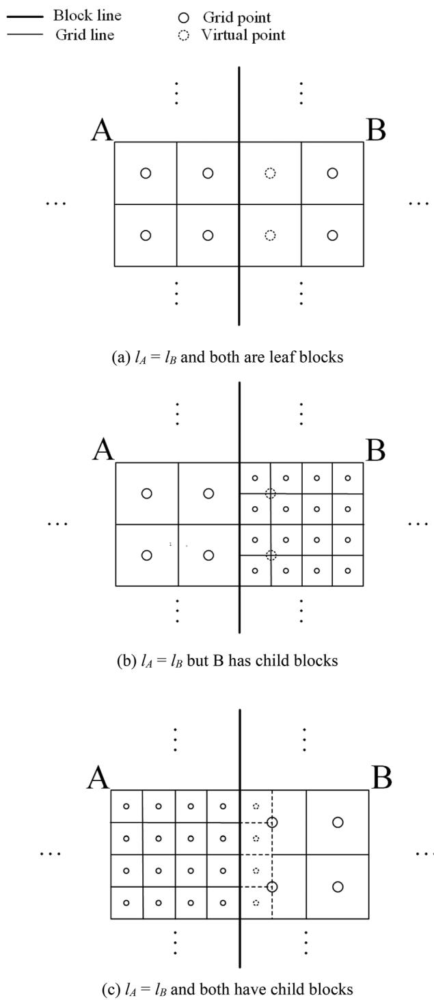

Block line

OGrid point

Grid line

Virtual point

FIG. 3. Transferring data between blocks, mesh cross section for different scenarios of block A and block B.

The magnetic field lines, magnetic field strength, and mesh block distribution when $\mu _ { 1 } / \mu _ { 2 } = 2$ are shown in Fig. 5. Evidently, the magnetic field lines inside the cylinder and near the outer boundary are aligned with the applied external magnetic field. However, due to the jump in permeability at the interface, the magnetic field lines are distorted near the cylinder. Additionally, it can be observed that the magnetic field inside the cylinder remains uniform, as expected in the analytical solution. The mesh block distribution is denser near the interface and sparser further away, which aligns with our expectations. In Fig. 6, a comparison is made between the numerical results of the magnetic field strength inside the cylinder and the analytical solution as the magnetic permeability ratio $\mu _ { 1 } / \mu _ { 2 }$ varies. Compared with the analytical solution, consistent results observed. 

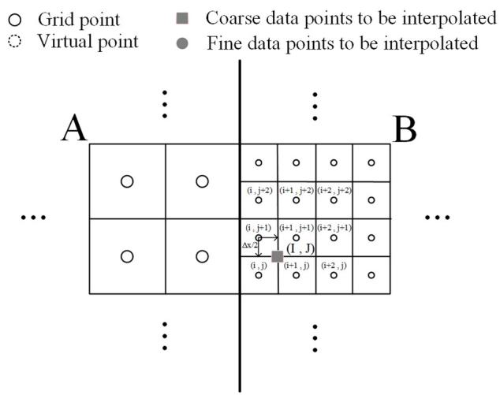

(a)

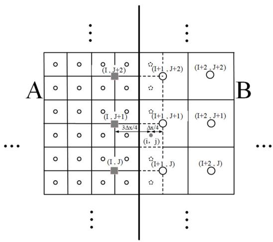

(b)

FIG. 4. Schematic diagram of fine-coarse interpolation: (a) Fill the buffer cell of the coarse block with the data points available on the fine block and (b) fill the buffer cell of the fine block with the data points of the data point of the coarse block.

## B. Ferrodroplet deformation

In engineering applications, various problems are related to the deformation of ferrofluid droplets under the influence of magnetic fields. Examples include microfluidic cancer cell sorting based on magnetron control,45 disease diagnosis,46 and chemical engineering.47 Flament et $a l . ^ { 4 8 }$ experimentally studied the deformation of ferrofluid droplets confined in a narrow gap between two parallel plane layers, while also measuring the surface tension of the ferrofluid. Hu et $a l . ^ { 2 3 }$ simulated the deformation of ferrofluid droplets using the same physical parameters as Flament’s experiment, employing an LBM phasefield model. He et $a l . ^ { 2 9 }$ also conducted numerical experiments on ferrofluid droplets, utilizing an immersed interface and phase-field lattice Boltzmann model with the same physical parameters as those in Flament’s experiment. Their experimental and numerical results thus serve as benchmarks for validating the ferrofluid multiphase flow model in this paper. 

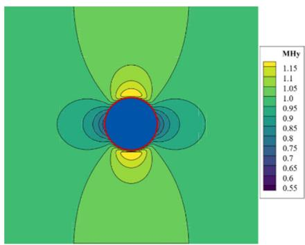

(a) Magnetic field strength

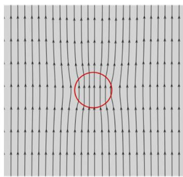

(b) Magnetic field lines

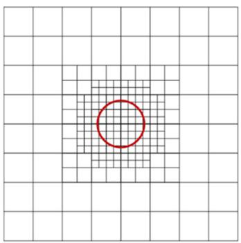

(c) Mesh block distribution

FIG. 5. Magnetic field strength, magnetic field lines, and mesh distribution when $\mu _ { 1 } / \mu _ { 2 } = 2$ (each square block includes 8  8 mesh cells).

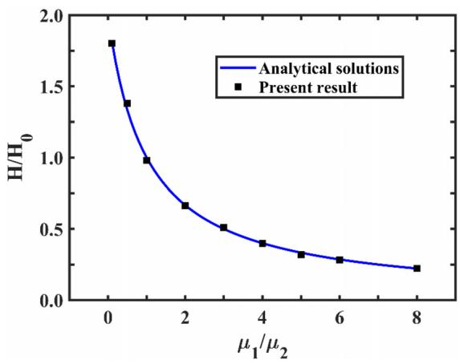

FIG. 6. Numerical results and analytical solutions of magnetic field intensity inside a cylinder as a function of magnetic permeability l1/l2.

As shown in Fig. 7, an organic solvent is filled in the square cavity and a magnetic liquid droplet immiscible with the organic solvent is placed in the center of the square cavity. A uniform magnetic field is applied in the vertical direction. To validate the model, parameters identical to those in Flament’s experiment are used. The length of the square domain is set to L 7.5 mm, and the radius of the ferrofluid droplet is $r = 0 . 7 8 \mathrm { m m }$ . The densities of the organic solvent and ferrofluid are $0 . 8 \times 1 0 ^ { 3 }$ and $1 . 5 8 \times 1 0 ^ { 3 } \mathrm { k g } / \mathrm { m } ^ { 3 }$ , respectively. The viscosities are $1 . 0 \times 1 0 ^ { - 3 }$ Pa s for the organic solvent and $4 . 0 \dot { \times } 1 0 ^ { - 3 }$ Pa s for the ferrofluid. The surface tension coefficient is set to $\sigma = 3 . 0 7$ mN/m, and the relative magnetic permeability is fixed at 2.2. In the simulation, the mobility is set to 0.01, and the interface thickness is set to 4. The lattice unit physical parameters are $\rho _ { l } = 1 , \rho _ { h } = 1 . 9 7 5 , \eta _ { l } = 0 . 0 1 4 2$ $\eta _ { h } = 0 . 0 5 6 8$ , and $\sigma = 0 . 0 1 4 6$ . Non-slip boundary conditions are applied at the top and bottom of the computational domain, while periodic boundary conditions are applied at the left and right sides. 

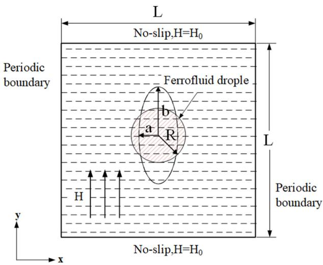

FIG. 7. Schematic diagram of ferrofluid droplet deformation.

Figure 8 shows the deformation of the droplet interface under magnetic field strengths of 1.2, 2.4, 2.9, and 3.7 kA/m in the vertical direction, as well as the comparison of aspect ratios with previous studies. The combined effects of surface tension and magnetic force cause the deformation of the ferrofluid droplet. As shown in Fig. 8, when the magnetic field strength is small, the ferrofluid droplet remains nearly spherical. However, as the magnetic field strength increases, the droplet deforms into an elliptical shape. Moreover, the simulated results align well with published experimental results,23,29 thus confirming the accuracy of the AMR-LB model’s computations. 

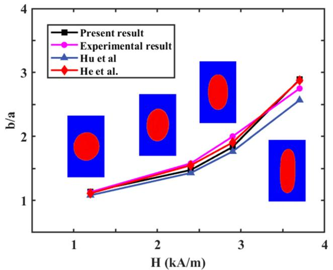

FIG. 8. Shapes of the ferrofluid droplet for different applied magnetic fields and the comparison between the numerical and experimental results with an aspect ratio b/ a. (magnetic field strength of H  1.2, 2.4, 2.9, and 3.7 kA/m).

Figure 9 shows the variation of computational time and mesh number for the ferrofluid droplet at $H { = } 3 . 7 \mathrm { k A / m }$ under adaptive mesh refinement. It can be concluded that, using adaptive mesh refinement requires less computational time and fewer mesh points to achieve the same accuracy compared to uniform meshes. The computational time is reduced by a factor of $3 . 5 ,$ and the mesh number is reduced to 0.27 times that of the uniform mesh. Figure 10 displays the mesh block structure for both uniform and adaptive meshes at a time step of $t = 1 2 0 0 0$ in the computational domain. It can be observed that, in the regions where numerical changes are significant, the adaptive mesh has a higher refinement level, similar to the uniform mesh. However, in areas away from these regions, the mesh is relatively sparse, which greatly enhances computational efficiency. 

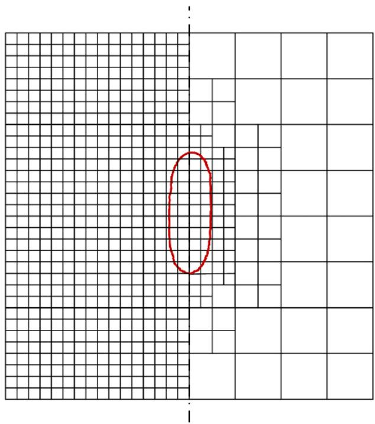

FIG. 10. Comparison of uniform mesh distribution and adaptive mesh distribution of steady state magnetic liquid droplets (magnetic field strength $\begin{array} { r } { H { = } 3 . 7 \mathsf { k A } / \mathsf { m } , } \end{array}$ uniform mesh on the left, adaptive mesh on the right, where each square block includes 8  8 mesh cells).

## C. Bubble rising in ferrofluid

This subsection uses the AMR-LB model to simulate the bubble rising problem under a uniform magnetic field.49 We consider the motion of a bubble surrounding ferrofuid in a rectangular channel. Initially, a circular bubble with diameter $D = 1 0 0$ is placed in a computational domain with a length of $L = 2 5 6$ and a height of $2 L ,$ where the mesh is divided into $2 5 6 \times 5 1 2$ . The coordinates of the bubble center are $( L / 2 , L / 2 )$ . A vertical uniform magnetic field $H _ { 0 }$ is applied. The initial position of the bubble is illustrated in Fig. 11. Periodic boundary conditions are applied in the horizontal direction, and no-slip boundary conditions are applied in the vertical direction. The body force is considered $\mathbf { F _ { b } } = \rho \mathbf { G } _ { \mathbf { y } }$ , with $\mathbf { G } _ { y }$ being the magnitude of gravitational Fb Gy Gacceleration in the vertical direction. Through dimensionless analysis, in addition to the density ratio $( \rho _ { h } / \rho _ { l } )$ and viscosity ratio $( \eta _ { h } / \eta _ { l } )$ , the Reynolds number $( R e ) _ { \mathrm { : } }$ , the E€otv€os number (Eo), and the magnetic Bond number $\left( B o _ { m } \right)$ are defined as 

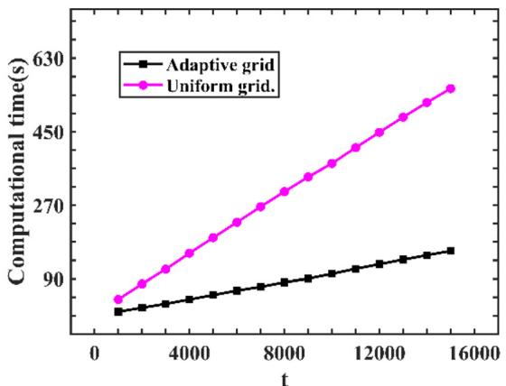

(a)Computational time

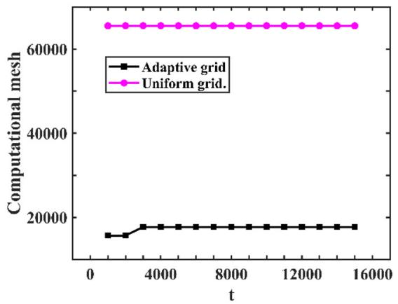

(b)Computational mesh

FIG. 9. Computational overhead for droplet deformation problem.

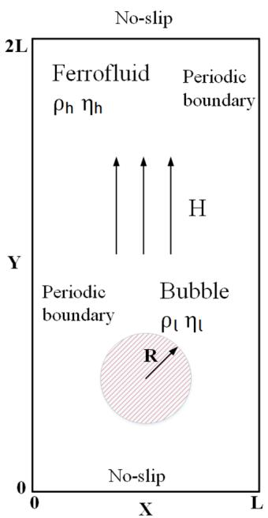

FIG. 11. Schematic diagram of bubble rising in ferrofluid.

$$
R e = \frac {\sqrt {| \mathbf {G} _ {y} | \rho_ {h} ^ {2} D ^ {3}}}{\eta_ {h}}, \tag {64}
$$

$$
E o = \frac {\left| \mathbf {G} _ {y} \right| \rho_ {h} D ^ {2}}{\sigma}, \tag {65}
$$

$$
B o _ {m} = \frac {\mu_ {0} H _ {0} ^ {2} D}{2 \sigma}. \tag {66}
$$

The dimensionless time reads 

$$
t ^ {*} = t \sqrt {\frac {| \mathbf {G} _ {y} |}{D}}. \tag {67}
$$

First, the evolution process of the bubble under buoyancy without the influence of a magnetic field is simulated. Three sets of simulations are performed for different values of the Eo $( E o = 5 , 2 0 , 1 2 5 .$ , and 400). The density ratio is set to 1000, the viscosity ratio to 100, and the Reynolds number to 40. Figure 12 shows the bubble shapes at $t ^ { * } = 1 , 2$ $^ { 3 , }$ and 4 for $R e = 4 0$ and $E o = 1 2 5$ . Figure 13 shows the bubble shapes at $t ^ { * } = 4$ for $R e = 4 0$ and $E o = 5 , 2 0$ , 125, and 400.From the simulation results, we observe that at lower Eo values, the bubble evolves into a two-dimensional elliptical shape. At medium Eo values, the bubble evolves into a two-dimensional hemispherical shape, while at higher Eo values, two filament structures behind bubble starts to form. Moreover, the experimental results are consistent with those observed by Fakhari et al., 37 Hu et al., 49 and Li et al.50 confirming the accuracy of the AMR-LB model. 

In order to further verify the accuracy of the AMR-LB model, we quantitatively compared the center of mass $Y _ { c }$ changes during the bubble rising, which can be expressed as 

$$
Y _ {c} = \frac {\sum_ {i , j} y _ {j} H _ {d} [ 5 (0 . 5 - \phi) ]}{\sum_ {i , j} H _ {d} [ 5 (0 . 5 - \phi) ]}, \tag {68}
$$

where $H _ { d }$ is the smeared-out Heaviside function 

$$
H _ {d} (x) = \left\{ \begin{array}{l} 0, x <   - 2, \\ 0. 5 + 0. 2 5 x + \frac {0 . 5}{\pi} \sin (0. 5 \pi x), - 2 \leq x \leq 2, \\ 1, x > 2. \end{array} \right. \tag {69}
$$

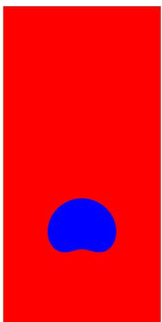

(a)

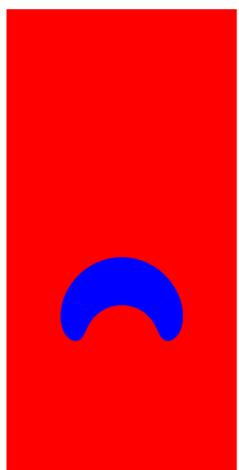

(b)

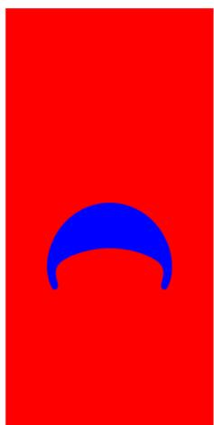

(d)

FIG. 12. Interfacial evolution of the bubble rising process: Re 40, $E O = 1 2 5$ , at $t ^ { * } = \bar { 1 } , \dot { 2 } , 3 , 4 ;$ (a) $t ^ { * } = 1 ,$ (b) t  ¼ 2, (c) $t ^ { * } = 3 , \mathsf { a n d } ( { \mathsf { d } } ) t ^ { * } = 4 .$

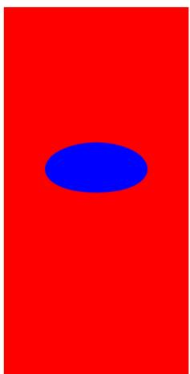

(a)

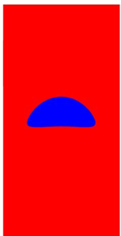

(b)

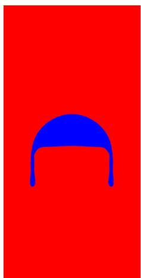

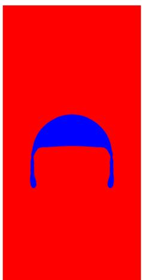

(d)

FIG. 13. Interfacial shape of the rising bubble at Re  40 and $E O = 5 ,$ 20, 125, and 400 when t ¼ 4:(a) Eo ¼ 5, (b) Eo ¼ 20, (c) Eo ¼ 125, and (d) Eo ¼ 400.

We recorded the vertical position of the center of mass $Y _ { c }$ during bubble rise. The numerical experiment uses the same parameters as the previous studies. The comparison results between them are shown in Fig. 14 it can be seen that the obtained results are in good agreement with those of Hu et $a l . ^ { 4 9 }$ and Aland and Voigt,51 further verifying the accuracy of the AMR-LB model. 

Figure 15 shows the variation in computation time and mesh numbers for the bubble rising simulation under an adaptive mesh, with $R e = 4 0 :$ , and $E o = 2 0$ , density ratio of 1000, and viscosity ratio of 100. The results indicate that, the use of adaptive mesh leads to a shorter computation time and fewer mesh points for achieving the same accuracy in the bubble rising experiment. At the time step of 20 000, the required computation time is reduced by a factor of $5 . 1 0 ,$ , and the number of meshes is reduced to 0.19 times that of the uniform mesh. This significant improvement in computational efficiency further validates the effectiveness of the AMR-LB model. 

Next, we simulate the evolution of bubbles in ferrofluid under gravity field with the presence of a magnetic field. The parameters are set as follows: $E o = 2 0 ,$ density ratio 1000, viscosity ratio 100, and Reynolds number $R e = 4 0$ . The simulation is conducted with a magnetic field applied, which is uniform and vertical (parallel to gravity). This setup allows us to study the effect of the magnetic field on the evolution of bubbles in a magnetic fluid, and observe the influence of different magnetic field strengths on bubble deformation and behavior under buoyancy. 

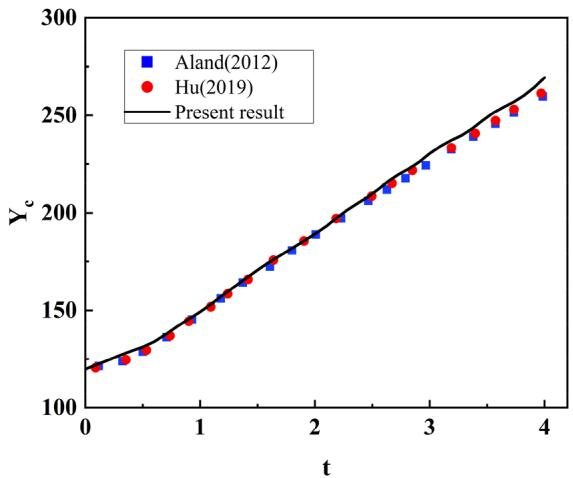

FIG. 14. Comparison $^ { 0 \dag }$ mass center of bubble with Hu, Aland at $R e = 3 5$ and $E o = 1 0 .$

The results show that due to the normal force acting on the interface, the bubble elongates along the direction of the magnetic field. This elongation is influenced by the interaction between the surface tension, buoyant force, upward motion, pressure variation along the bubble interface, and viscous stress. Figure 16 shows the bubble shapes at $t ^ { * } = 1$ for different magnetic Bond numbers $( B o _ { m } = 0 , \ 0 . 1 3 ,$ 0.27, $0 . 4 9 , 0 . 7 6 ,$ and 1.94). It can be seen that, for bubbles in the ferrofluid, when the magnetic field strength is relatively low, the magnetic force is weak, and the bubbles remain relatively elongated in the horizontal direction. As the magnetic field strength increases, the magnetic force becomes stronger, causing the originally horizontally elongated bubble to stretch in the vertical direction and a filament structure is formed behind the bubble. Furthermore, as the magnetic field strength increases, the degree of vertical elongation increases too. Figure 17 shows the mesh block distribution under the corresponding bubble shapes for different magnetic Bond numbers $( B o _ { m } = 0 , 0 . 1 3 , 0 . 2 7 , 0 . 4 9 ,$ $0 . 7 6 ,$ and 1.94) at $t ^ { * } = \bar { 1 } ,$ where each block consists of $8 \times 8$ mesh cells. It can be seen that the mesh is denser in the region near the bubble interface and sparser in the region away from the interface. 

To quantify the simulation results, we measured the longitudinal length of the bubbles at different $B o _ { m }$ numbers, as well as the bubble velocity, and the results are shown in Fig. 18. Here, the bubble rise velocity is defined as 

$$
U _ {y} = \frac {\int_ {\phi <   0 . 5} u _ {y} d x}{\int_ {\phi <   0 . 5} d x}, \tag {70}
$$

where $u _ { y }$ is the vertical component of the velocity. The results show that in the absence of a magnetic field, the elongation length is always smaller than the bubble diameter and gradually decreases until it stabilizes, indicating that the bubble undergoes horizontal stretching only. Under the influence of a magnetic field, the elongation length exceeds the value observed without the magnetic field. It first increases, then decreases, and eventually reaches an equilibrium state. If the magnetic field is too strong, the elongation increases, then decreases until the vertical length becomes zero, causing the bubble to split into two subbubbles. A larger Bond number is also associated with a higher bubble rise velocity. 

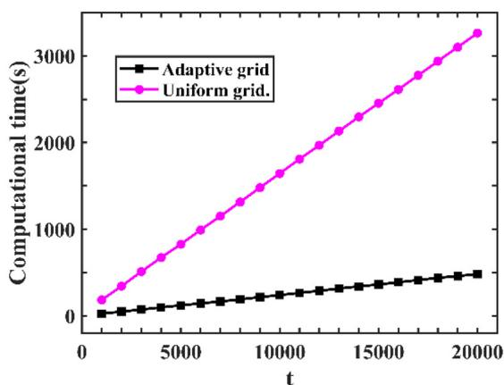

(a)Computational time

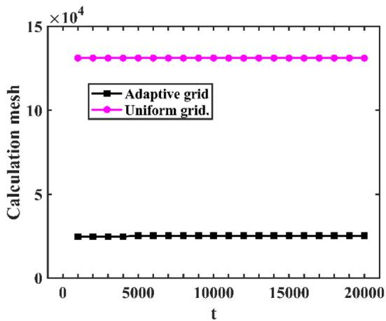

(b)Computational mesh

FIG. 15. Computational overhead for rising bubble problems.

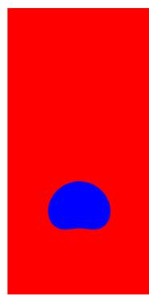

(a)

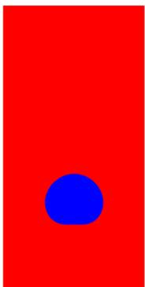

(b)

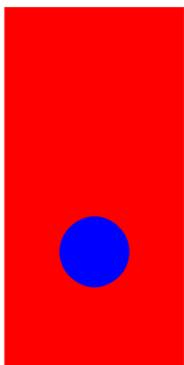

（c）

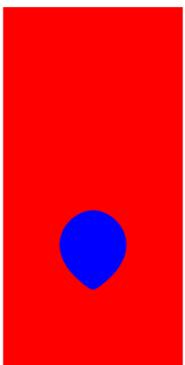

(d）

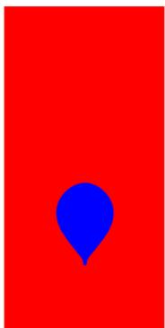

(e)

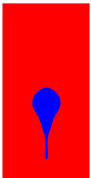

(f

FIG. 16. Interfacial shape of the rising bubble at $R e = 4 0$ and $E O = 2 0$ when $t * = 1 \cdot$ (a) $B o _ { m } = 0 ,$ (b) $B o _ { m } = 0 . 1 3 ,$ (c) $B o _ { m } = 0 . 2 7 ,$ (d) $B o _ { m } = 0 . 4 9 ,$ (e) $B o _ { m } = 0 . 7 6 ,$ and (f) $B o _ { m } = 1 . 9 4$ .

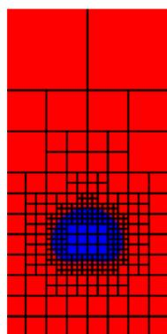

(a)

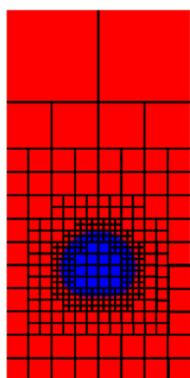

(b)

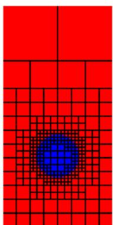

（c）

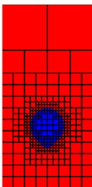

(d）

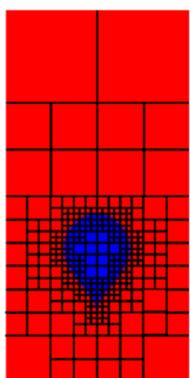

（e）

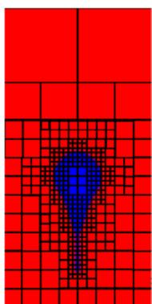

(f）

FIG. 17. Mesh block distribution of the rising bubble at $R e = 4 0$ and $E O = 2 0$ when $t * = 1 \colon$ (a) $B o _ { m } = 0 ,$ (b) $B o _ { m } = 0 . 1 3 ,$ (c) $B o _ { m } { = } 0 . 2 7 ,$ (d) $B o _ { m } = 0 . 4 9 ,$ (e) $B o _ { m } { = } 0 . 7 6 , \mathsf { a n d }$ (f) $B o _ { m } = 1 . 9 4 .$ (each square block includes 8  8 mesh cells).

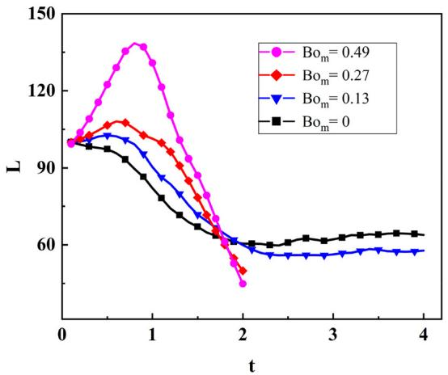

(a)Length of bubble

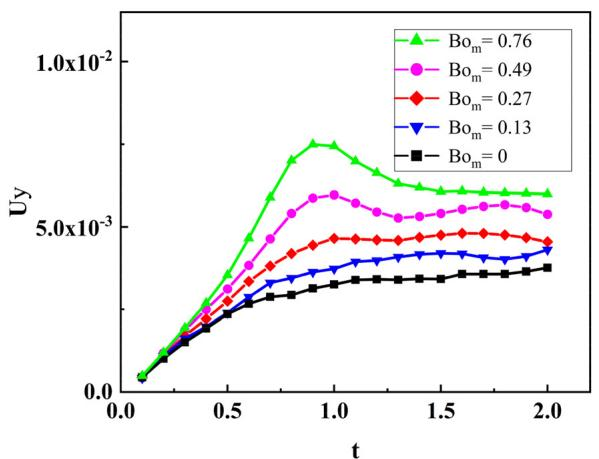

(b)Velocity of bubble

FIG. 18. Bubble elongation length vs rise velocity for different Bom (0, 0.13, 0.27, 0.49, and 0.76) at $R e = 4 0$ and $E O = 2 0 .$

## D. Rosensweig instability

This subsection uses the AMR-LB model to simulate the Rosensweig instability of ferrofluids under the influence of a uniform magnetic field. Rosensweig instability refers to the phenomenon exhibited by ferrofluids when exposed to a magnetic field, where various patterns, such as peaks, valleys, or ripples, form on the surface. This instability arises due to the competition between magnetic forces, gravity, and surface tension within the fluid layer. When the magnetic force reaches a balance with gravity and surface tension, the growth of these patterns stops.51,52 

As shown in Fig. 19, the immiscible binary fluids, an organic solvent and ferrofluid, fill the cavity, with the former occupying 2/3 of the volume and the latter occupying 1/3. The same parameters as in 

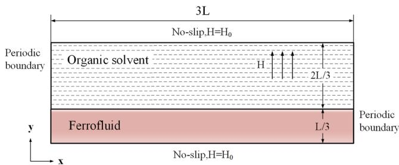

FIG. 19. Schematic representation of the Rosenweig instability of ferrofluid.

Flament’s experiment53 are used, and a uniform magnetic field is applied in the vertical direction. The length of the computational domain is set to $L _ { x } = 2 1$ and $L _ { y } = 7$ mm. The densities of the organic solvent and the ferrofluid are 0.8 103 and $1 . 5 8 \times 1 0 ^ { 3 } \mathrm { k g / m } ^ { 3 } .$ , respectively. The viscosities are $0 . 8 \times 1 0 ^ { - 3 }$ and $3 . 2 \times 1 0 ^ { - 3 }$ Pa s, respectively. The surface tension coefficient is set to $\sigma = 3 . 8 9 \mathrm { m N / m } ,$ , and the relative magnetic permeability is fixed at 2.2. The mobility is set to 0.01, and the interface thickness is set to 4. The lattice unit physical parameters are q 1, $\rho _ { h } = 1 . 9 7 5 ,$ $\eta _ { l } = 0 . 0 0 7 3$ , $\eta _ { h } = 0 . 2 9 2$ , and $\sigma = 0 . 0 0 7 1$ , respectively. No-slip boundary conditions are applied at the top and bottom boundaries, and periodic boundary conditions are applied at the left and right boundaries. 

Figure 20 shows a comparison of the morphology and structure of the peak formation of ferrofluid under the application of a uniform magnetic field in the vertical direction, with field strengths of 0, 4.9, and 8.2 kA/m. The figure also presents a comparison between experimental results (on the left) and numerical simulations (on the right). It can be seen clearly that when there is no magnetic field, the surface of the ferrofluid remains stationary. As the magnetic field strength exceeds 4.9 kA/m, wave-like disturbances form at the interface. When the field strength increases further to 8.2 kA/m, the disturbances become more pronounced, forming a comb-like structure. No hysteresis was observed in the simulations, and the magnetic susceptibility $\chi _ { O }$ $< 2 . 5 4$ , confirming that the peak instability is a second-order transition.54 The critical magnetic field is $H _ { c } { = } 4 . 7 \mathrm { k A / m }$ . the critical wavelength is $\lambda _ { c } = 2 . 8 2 \mathrm { m m } ,$ and the critical magnetization strength is $M _ { c } \approx 1 0 . 3 5 \mathrm { k A / m }$ . The simulation results are in good agreement with the experimental results, further verifying the accuracy of the model. 

Figure 21 shows the variation in computational time and mesh number for the Rosensweig instability of ferrofluids under an applied magnetic field of 4.9 kA/m using the adaptive mesh method. The computation time is reduced by a factor of 3.13, and the number of mesh cells is reduced to 0.31 of that required by a uniform mesh. 

It should be pointed out that Krakov et $a l . ^ { 5 5 }$ highlighted that mesh resolution, magnetic field strength, and the thickness of the diffused peak significantly influence the Rosensweig instability. To explore the effect of mesh resolution on wavelength of Rosensweig instability, we varied the number of mesh cells by adjusting the maximum refinement level and the base block size. Cowley and Rosensweig, in their pioneering work,56 proposed an expression for the relationship between key parameters affecting Rosensweig instability. The critical magnetic field $H _ { c }$ and critical wavelength $\lambda _ { c }$ are given as follows: 

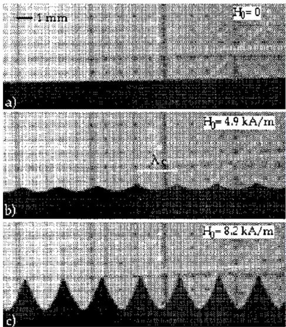

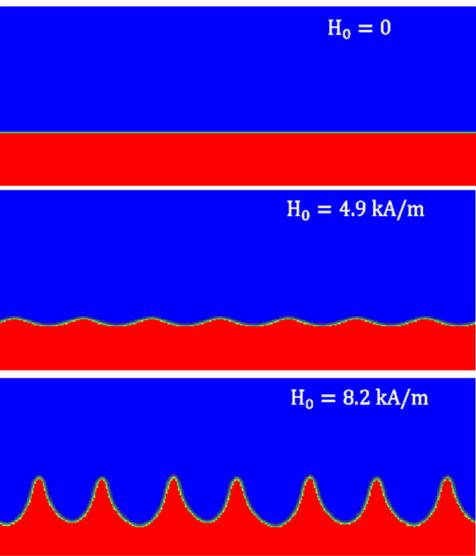

FIG. 20. Comparison of experimental results and numerical simulations of ferrofluid morphology under different magnetic fields (left column is the experimental result from literature,53 right column is the numerical simulation result).

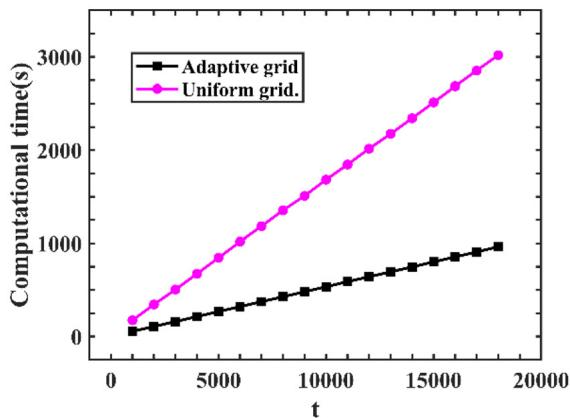

(a)Computational time

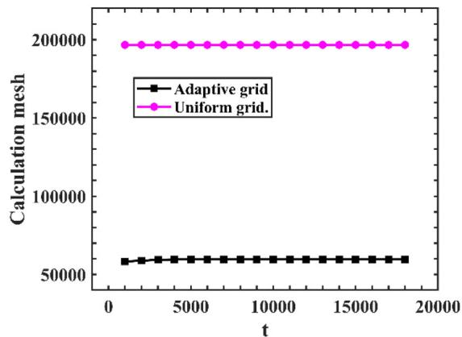

(b)Computational mesh

FIG. 21. Computational overhead for Rosensweig instability problems.

$$
H _ {c} = \left(\frac {2}{\mu_ {0}} \frac {\mu_ {0} / \mu + 1}{(\mu_ {0} / \mu - 1) ^ {2}}\right) ^ {1 / 2} (\sigma g \Delta \rho) ^ {1 / 4}, \quad \lambda_ {c} = 2 \pi \left(\frac {\sigma}{g \Delta \rho}\right) ^ {1 / 2}, \tag {71}
$$

where $\Delta \rho = \rho _ { h \textrm { - } } \rho _ { l } .$ . Equation (71) was used as a grounded estimate to predict the number of peaks in the container. We set the magnetic susceptibility to $\chi _ { O } = 0 . 9 ,$ the ferrofluid density to $\rho _ { h } = 1 . 5 8 \times \mathrm { \bar { 1 0 } } ^ { 3 } \mathrm { k g } / \mathrm { m } ^ { 3 }$ , the surface tension to $\sigma = 5 . 0$ mN/m and on-magnetic fluid density to $\rho _ { l } { = } 0 . 8 \times 1 0 ^ { 3 } \mathrm { k g } / \mathrm { m } ^ { 3 } .$ . Assuming $\lambda _ { c } = 2 . 5$ mm, the gravitational acceleration $g = 4 0 . 4 9 \mathrm { m } / \mathrm { s } ^ { 2 }$ was derived using the above equations. 

In this simulation, the geometry configurations and boundary conditions of physical fields are same as previous test. Simulations are conducted under different maximum refinement levels (with $L = 2 5 6 ,$ maximum refinement levels of 3, 4, and 5, and $L = 5 1 2 ,$ with a maximum refinement level of 5) to investigate the effects on the peak formation. For each mesh resolution, the interface thickness - spanned four mesh cells. The simulation results considered six complete wavelengths within the computational domain, where the theoretical value for six full wavelengths should be 15 mm. 

Figure 22 presents a comparison of steady-state peak shapes under different mesh sizes, with a magnetic field strength of $H _ { 0 } = 1 0 \mathrm { k A / m } .$ . The results show that the mesh size significantly affects the uniformity and wavelength of the peak. As the mesh was refined, the six wavelength lengths gradually converged from 16.1 mm to the theoretical value of 15 mm. This matches well with the simulation results for $L = 2 5 6$ and a refinement level of 5. Therefore, to further optimize simulation time and reduce computational cost, simulations were performed using a mesh of L ¼ 256 with a refinement level of 5. 

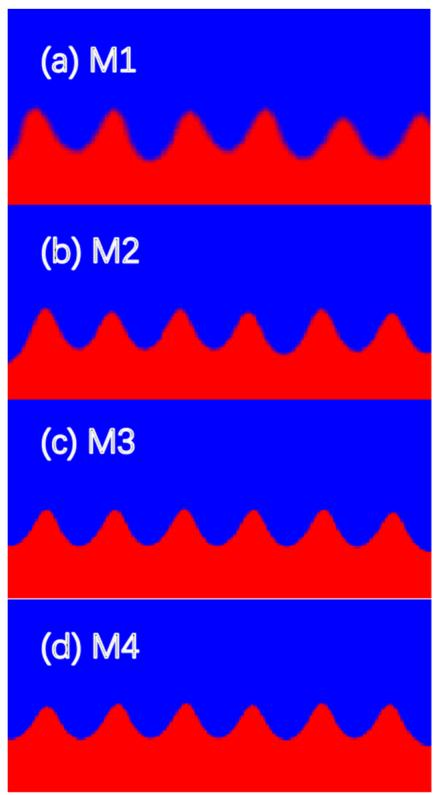

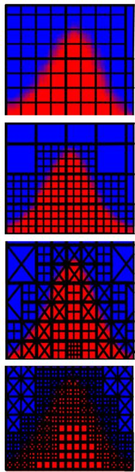

FIG. 22. Comparison of the shape of the steady state spikes of the magnetic liquid under different mesh sizes. (The left side is the numerical simulation results, and the right side is the local mesh details, in which the rectangular mesh is actually a $2 \times 2$ uniform square mesh cells, and the marked rectangular mesh is actually an $8 \times 8$ uniform square mesh cells).

Finally, the effect of magnetic field strength on the Rosensweig instability was investigated by conducting simulations at various magnetic field strengths: $H _ { 0 } = 6 , 7 , 8 , 9 , 1 0 , 1 1 , 1 2 , 1 4 , 1 5 , 1$ 6, and 18 kA/m. The numerical results indicate that the magnetic field strength has a significant impact on the peak height and trough depth. Specifically, as the magnetic field strength increases, the peak height and trough depth both increase, with the peak height and trough depth gradually approaching each other. Figure 23 presents a comparison of peak heights and trough depths at different magnetic field strengths. However, beyond a certain magnetic field strength, the peaks will no longer continue to grow. 

## E. Rayleigh–Taylor instability in a uniform magnetic field

This subsection uses the AMR-LB model to simulate the Rayleigh–Taylor instability of ferrofluid under the influence of a uniform magnetic field. The Rayleigh–Taylor instability typically occurs at the interface between two fluids of different densities. Under the influence of gravity, the denser fluid tends to move downward due to its higher density, while the lighter fluid moves upward. A small initial perturbation at the interface is amplified over time under the continuous influence of gravity. This instability caused by interface deformation is referred to as Rayleigh–Taylor instability. The phenomenon is characterized by interface deformation, progressing from ripples or wrinkles to mushroom-like or spike-shaped structures. 

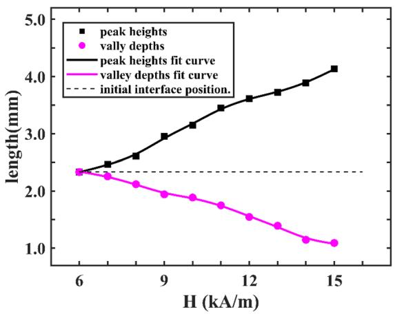

FIG. 23. Trend plots of peak height and valley depth for different magnetic field

The computational domain for this problem is set as a rectangular region of $[ 0 , \mathrm { L } ] \times [ 0 , 4 \mathrm { L } ]$ . Within this domain, the top and bottom boundaries are assigned no-slip solid boundary conditions, while periodic boundary conditions are applied in the horizontal direction. The top region contains the heavier fluid $( \rho _ { h } , \eta _ { h } ) ,$ and the lighter fluid $( \rho _ { b }$ g ) occupies the bottom region. The initial interface is a flat line located a $y = 2 L$ , and it is perturbed using a cosine function 

$$
y = 2 L + 0. 1 L \times \cos (2 \pi x / L), \tag {72}
$$

where $L = 2 5 6 .$ 

In order to compare the results of the AMR-LB model with other models in the literature, we define the dimensionless the Atwood number At, the Reynolds number Re, the Capillary number Ca, the magnetic Bond number $B o _ { m } ,$ and dimensionless time t as follows: 

$$
A t = \frac {\rho_ {h} - \rho_ {l}}{\rho_ {h} + \rho_ {l}}, \tag {73}
$$

$$
R e = \frac {\rho_ {l} U _ {0} L}{\eta_ {l}}, \tag {74}
$$

$$
C a = \frac {\mu_ {l} U _ {0}}{\sigma}, \tag {75}
$$

$$
B o _ {m} = \frac {\mu_ {0} H _ {0} ^ {2} L}{2 \sigma}, \tag {76}
$$

$$
t ^ {*} = \frac {t}{\sqrt {L / (g A t)}}, \tag {77}
$$

where $U _ { 0 } = \sqrt { g L }$ is the reference characteristic velocity. 

In this simulation, we define the position change of the light fluid at $x = 0$ as the advancement of the light fluid front and the position change of the heavy fluid at $x = L / 2$ as the displacement of the heavy fluid tip. Let $\sqrt { g L } = 0 . 0 1 , \ \rho _ { l } = 1 . 0 , \ A t = 0 . 5 , \ C a = 1$ , and $R e = 2 5 6 .$ The interface thickness W spans 5 mesh cells. Figure 24 shows the interface morphology of the Rayleigh–Taylor instability problem at 

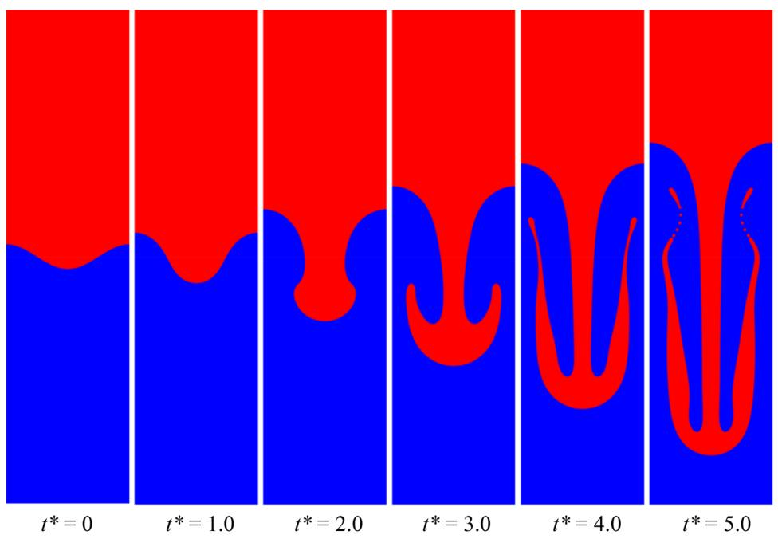

FIG. 24. Under the conditions of $A t = 0 . 5 ,$ Ca  1, and Re  256, evolution of Rayleigh–Taylor instability with characteristic time.

$R e = 2 5 6$ with dimensionless times at $t ^ { * } = 0 , 1 , 2 , 3 , 4 ,$ and 5, respectively. Then we let $R e = 3 0 0 0$ , other parameters remain unchanged. Figure 25 shows the interface morphology of the Rayleigh–Taylor instability problem at $R e = 3 0 0 0$ with dimensionless times at $t ^ { * } = 0 ;$ , 0.5, 1, 1.5, and 2, respectively. Figure 26(a) quantitatively present the evolution of the light fluid front and the heavy fluid tip positions over time, while Fig. 26(b) quantitatively display the velocity changes of the light fluid front and the heavy fluid tip over time. These results are compared with previously reported findings by Nourgaliev et al.57 and

Wang et $a l . ^ { 5 8 , 5 9 }$ The comparison reveals that our AMR-LB method aligns closely with the results from the referenced studies, confirming the applicability of our numerical method under high Reynolds number conditions. 

Subsequently, we applied a uniform vertical magnetic field to investigate the effect of the magnetic field on interface deformation. Magnetic fields with five different intensities, $B o _ { m } { = } 0 , \ 2 . 5 7 ,$ , 16.08, 41.18, and 64.34 are applied. Figure 27 illustrates the interface morphology of the Rayleigh–Taylor instability problem at $B o _ { m } = 4 1 . 1 8 ,$ 

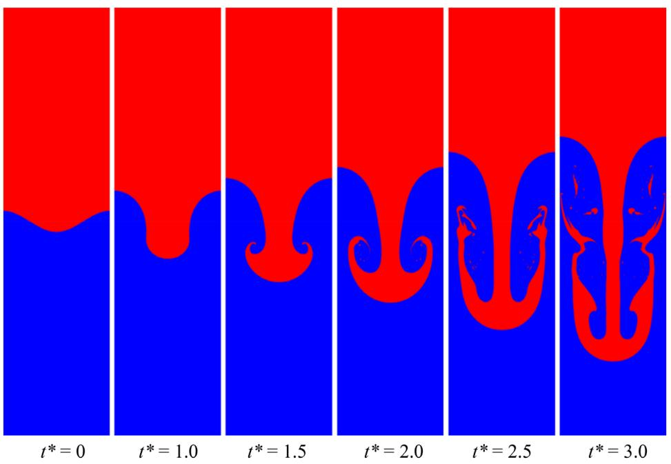

FIG. 25. Under the conditions of $A t = 0 . 5 ,$ Ca 1, and Re 3000, evolution of Rayleigh–Taylor instability with characteristic time.

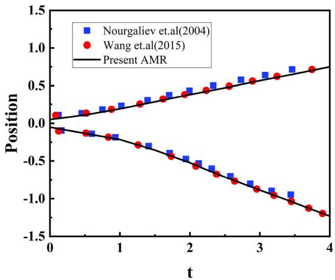

(a)Time-varying position

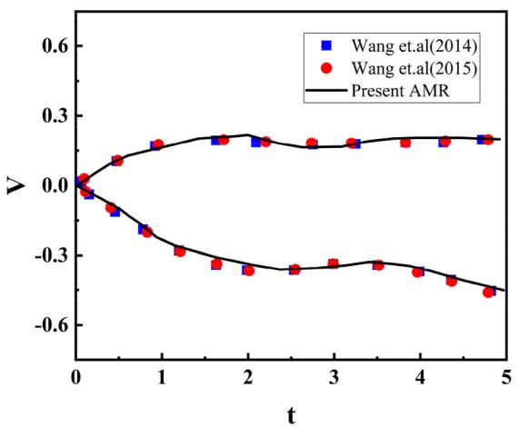

(b)Time-varying velocity

FIG. 26. Under the conditions of At 0.5, Ca 1, and Re 25, plot of light fluid front placement and heavy fluid tip position vs time.

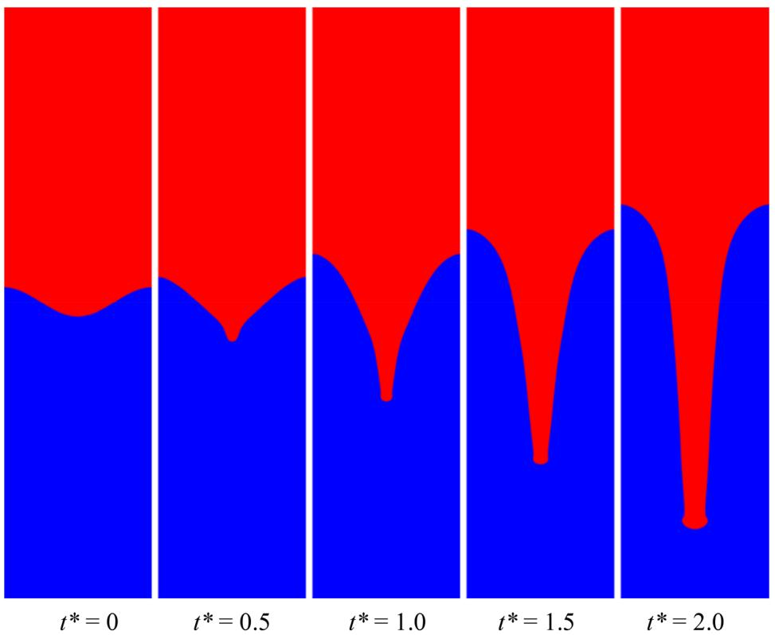

FIG. 27. Under the conditions of Bom 41.18, At 0.5, Ca 1, Re 256, evolution of Rayleigh–Taylor instability with dimensionless time.

and dimensionless times $t ^ { * } = 0 , 0 . 5 , 1 , 1 . 5 ,$ and 2. It can be observed that, under the influence of the magnetic field, the tail behind the heavy fluid as it penetrates the light fluid is significantly reduced. The magnetic field suppresses the reverse rotational vortices. Compared to the scenario without a magnetic field, the motion speeds of the light fluid front and the heavy fluid tip are faster, enabling them to reach the same positions more quickly than that in the absence of a magnetic field. 

Finally, to quantitatively represent the effect of different magnetic field intensities on Rayleigh–Taylor instability, we examined the position changes of the light fluid front and the heavy fluid tip over time under varying magnetic field strengths. Figure 28 show the position and velocity changes of the heavy fluid tip over time for $B o _ { m } = 0 , 2 . 5 7 ;$ 16.08, 41.18, and 64.34. Similarly, Fig. 29 illustrates the position and velocity changes of the light fluid front over time under the same magnetic field intensities. The numerical results indicate that the magnetic field intensity has a significant impact on the positions, velocities, and interface morphology of both the heavy fluid tip and the light fluid front. Specifically, as the magnetic field intensity increases, more pronounced positional changes and higher velocities are observed. 

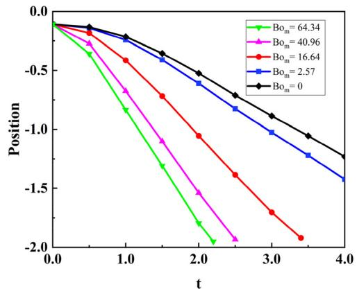

(a) Time-varying position of heavy liquid tips

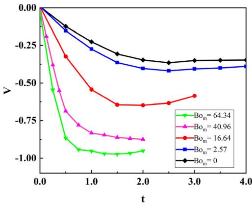

(b) Time-varying velocity of heavy liquid tips

FIG. 28. Plot of the position and velocity of the tip of a heavy fluid as a function of time for different magnetic field strengths $\langle B o _ { m } = 0 , 2 . 5 7 ,$ 16.64, 40.96, and 64.34).

## F. Kelvin–Helmholtz instability in a uniform magnetic field

In this subsection, the AMR-LB model is employed to simulate the Kelvin–Helmholtz instability of a ferrofluid influenced by a horizontally oriented uniform magnetic field.60 The Kelvin–Helmholtz instability typically arises at the interface between two fluids with different densities and relative velocities. When there is a velocity difference between the two fluid layers, a small perturbation occurs due to a combination of factors, including fluid viscosity, gravity, and interfacial tension. Under certain conditions, this perturbation is amplified, ultimately resulting in tumbling and mixing at the fluid interface, which creates an unstable state. 37,61 

As shown schematically in Fig. 30, the computational domain is set as a square region of $[ 0 , \dot { 2 } L ] \times [ \bar { 0 } , 2 L ]$ , where $\bar { L = 2 5 6 , }$ within which the top and bottom boundaries are set as no-slip boundary conditions, with periodic conditions on the left and right boundaries. The top half of the domain is filled by an organic solvent $( \rho _ { h } , \eta _ { h } ) .$ while the ferrofluid $( \rho _ { b } ~ \eta _ { l } )$ is located at the bottom half of the domain. The initial interface position is a flat line at $y = 2 L$ , which is subsequently perturbed by a cosine function 

$$
y (x) = 2 L + 0. 1 L \cos \left(\frac {2 \pi x}{L}\right). \tag {78}
$$

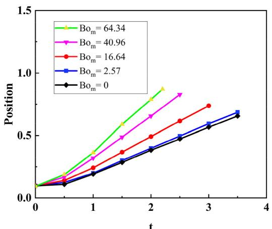

(a) Time-varying position of liquid fronts

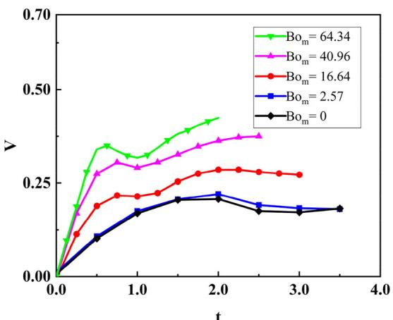

(b) Time-varying velocity of liquid fronts

FIG. 29. Plot of the position and velocity of the front end of a light fluid as a function of time for different magnetic field strengths $( B o _ { m } = 0 , 2 . 5 7 ,$ 16.64, 40.96, and 64.34).

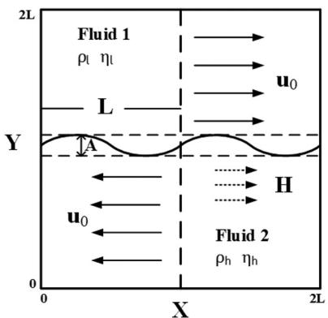

FIG. 30. Schematic diagram of the Kelvin–Helmholtz instability.

The initial order parameter and velocity field can be expressed as 

$$
\phi (i, j) = \phi_ {0} + \frac {\phi_ {\mathrm{h}} - \phi_ {l}}{2} \tanh \left(\frac {2 (y - y (x))}{W}\right), \tag {79}
$$

$$
\boldsymbol {u} (i, j) = \left(\frac {1}{2} - \phi (i, j)\right) \boldsymbol {u} _ {0}. \tag {80}
$$

We then define the dimensionless parameters, the Reynolds number (Re), the Weber number (We), the Froude number $( F r )$ , the magnetic Bond number $( B o _ { m } ) ,$ , and dimensionless time (t) as follows: 

$$
R e = \frac {\rho_ {h} U _ {0} L}{\mu_ {h}}, \tag {81}
$$

$$
W e = \frac {\rho_ {h} L U ^ {2}}{\sigma}, \tag {82}
$$

$$
F r = \frac {U ^ {2}}{g L}, \tag {83}
$$

$$
B o _ {m} = \frac {\mu_ {0} H _ {0} ^ {2} L}{2 \sigma}, \tag {84}
$$

$$
t ^ {*} = t \sqrt {\frac {g}{L}}. \tag {85}
$$

Let us consider the scenario without a magnetic field; first, the physical parameters are set as: $L = 2 5 6 ,$ U 0.02, $\rho _ { l } / \rho _ { h } = 0 . 9 9 $ , $W e = 1 0 0 0 0 ,$ and $F r { = } 1 . 0 .$ . Three different cases with $R e = 5 0 0 \AA$ 5000, and 50 000 are simulated. Figure 31 shows the interfacial evolution of the Kelvin–Helmholtz instability for $R e = 5 0 0 ,$ 5000, and 50 000. At lower Reynolds numbers $( R e = 5 0 0 )$ , the peak of the heavier fluid is elongated by the flow field of the lighter fluid, leading to the formation of comma-like liquid bridges under the combined effects of gravity and surface tension. A similar phenomenon is observed at higher Re values. As Re increases, the interfacial deformation intensifies, and the peak height increases slightly due to the weakening of the viscous effect. For $R e = 5 0 0 0 ,$ the comma-shaped liquid bridge curls further into a helical structure after $t ^ { * } = 4 ,$ with the bridge becoming less stable. When $R e = 5 0 0 0 0 ,$ , significant interfacial deformation occurs, forming an elongated liquid bridge, which eventually cracks after $t ^ { * } = 6 .$ The deformation intensifies as the peak height increases slightly. As Re increases, the interfacial deformation becomes progressively more unstable. Before the liquid bridge ruptures, the number of helical turns increases with higher Re. Figure 31 illustrates the time evolution of the Kelvin–Helmholtz unstable interface at $R e = 5 0 0$ , 5000, and 50 000. At the early stages, shear flow at the interface generates vorticity in the x-direction. The peaks of the heavier and lighter fluids are elongated in the y-direction on the positive and negative sides, respectively, causing the two fluids to rotate and interpenetrate. The interfacial peaks are stretched and wrinkled by the x-direction vorticity, ultimately forming a helical fluid bridge. Subsequently, catenary-like structures appear in the vorticity field, in better agreement with the phenomenon of Fakhari et $a l . ^ { \zeta > 7 }$ and Li $e t a l . ^ { 5 0 }$ 50 

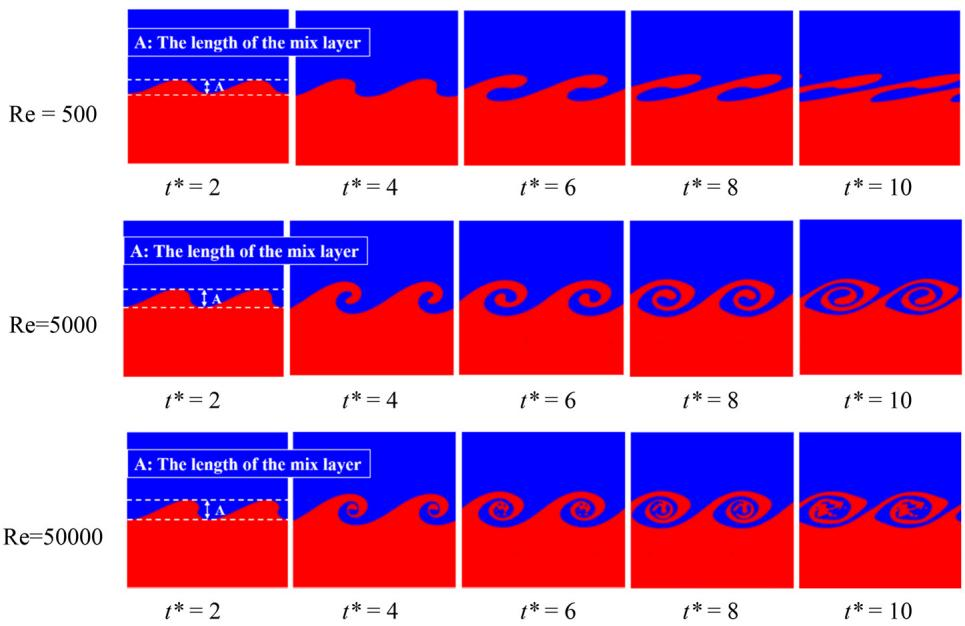

FIG. 31. Interfacial evolution of the Kelvin–Helmholtz instability at $R e = 5 0 0 ,$ 5000, and 50 000.

Then a horizontally oriented uniform magnetic field is applied to investigate the effect of the magnetic field on the Kelvin–Helmholtz instability. Seven different magnitudes of magnetic field strengths of $B o _ { m } { = } 0 , 6 3 6$ , 1434, 2547, and 3980 are used, respectively. Figure 32 shows the interfacial evolution of the Kelvin–Helmholtz instability at $R e = 5 0 0 0$ , We 10 000, Fr 1, and different $B o _ { m } = 6 3 6 ,$ 1434, and 2547. Figure 33 shows the two-phase interface morphology at $t ^ { * } = 5$ under $B o _ { m } = 0 , 6 3 6 ,$ 1434, 2547, and 3980, respectively. 

It can be observed that the applied magnetic field exerts an inhibitory effect on Kelvin–Helmholtz instability, specifically manifested in the varying degree of influence on the interface deformation of the two-phase liquid. When the strength of the applied magnetic field is low, the curling of the two-phase liquid experiences some inhibition, although the effect is minimal. As the magnetic field strength increases, the inhibitory effect becomes more pronounced, leading to a significant reduction in the degree of curling at the interface. When the magnetic field strength reaches a certain threshold, the interface of the two-phase liquid tends to flatten. Specifically, the horizontal component of the magnetic field inhibits Kelvin–Helmholtz instability, with greater magnetic field strengths resulting in a stronger inhibitory effect. 

To quantify the effect of different magnetic field strengths on the Kelvin–Helmholtz instability, we investigate the height of the twophase liquid mixing layer over time at different magnetic field strengths. Figure 34 shows the plots of the height of the two-phase liquid mixed layer as a function of time for $R e = 5 0 0 0 ,$ $W e = 1 0 0 0 0 ,$ Fr 1, and different $B o _ { m }$ values. The numerical results indicate that the magnetic field strength has a significant effect on both the height and the interface morphology of the two-phase liquid mixed into. 

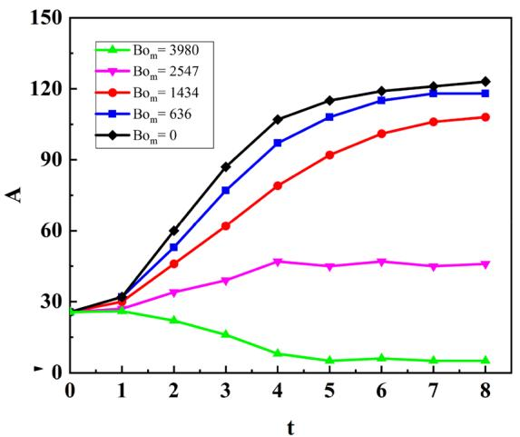

FIG. 34. Comparison plot of mixed layer heights at Re  5000, We  10 000, Fr ¼ 1, Bom (0, 636, 1434, 2547, and 3980).

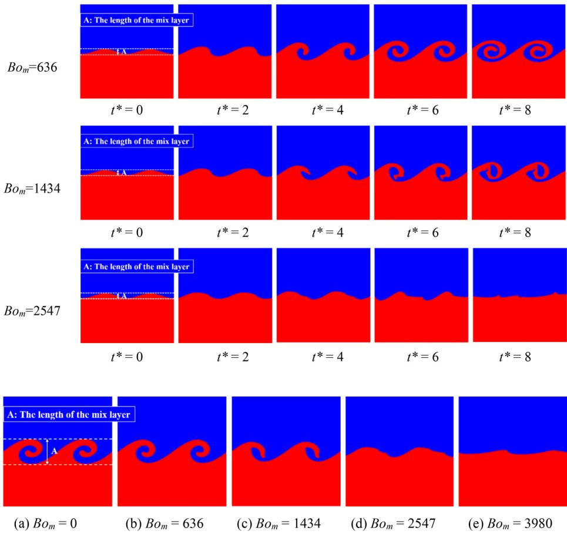

FIG. 32. Interfacial evolution of the Kelvin–Helmholtz instability at Re  5000, We  10 000, and Fr  1, Bom (636, 1434, and 2547).

FIG. 33. Interfacial morphology of the Kelvin–Helmholtz instability at Re 5000, We 10 000, Fr 1, and $t * = 5 , B o _ { m } ( 0 ,$ 636, 1434, 2547, and 3980).

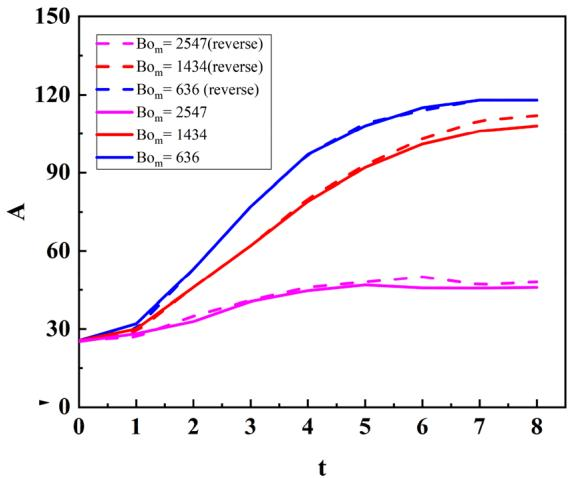

FIG. 35. Comparison plot of mixed layer heights at Re  5000, We  10 000, Fr  1, Bom (636, 1434, and 2547) for forward and reverse magnetic field.

Specifically, the height of the mixed layer of the two-phase liquid decreases by applying a horizontally oriented magnetic field, and the higher the magnetic field strength, the lower the height of the mixed layer. 

Figure 35 shows a comparative plot of the height of the mixed layer page after applying a forward magnetic field and a reverse magnetic field. The data shows that the horizontal direction of the magnetic field, whether it is forward or reverse magnetic field, has almost negligible effect on the height of the mixed layer of the two-phase liquid. Finally, the height of the mixed layer is investigated for $W e _ { I } = 1 0 0 0 0$ and $W e _ { 2 } = 1 0 0 0$ with different $B o _ { m }$ values $( B o _ { m } = 6 3 6 ,$ , 1434, and 2547), as shown in Fig. 36. The data show that as the We number increases, surface tension decreases, and the height of the mixed layer increases, indicating that surface tension inhibits Kelvin– Helmholtz instability. 

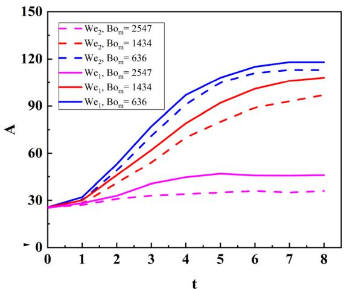

FIG. 36. Comparison plot of mixed layer heights at Re  5000, Fr  1 for Bom (636, 1434, and 2547), and We (We 10 000, We 1000).

## IV. CONCLUSIONS

In this paper, an adaptive-mesh-refinement (AMR) lattice Boltzmann method (LBM) is presented for two-phase ferrofluid flows to investigate interfacial dynamics under the influence of a magnetic field. In this study, the two-phase ferrofluid flow system is assumed to be incompressible, Newtonian and immiscible. 

The phase interface is captured by a second order diffuse interface model and the hydrodynamics equation in the velocity-based form is used. For the non-conductive fluid, a scalar potential equation is adopted to describe the magnetic field. The discrete Boltzmann equations which are equivalent to three governing equations are solved using the Lax–Wendroff scheme. To reduce the computational overhead, the numerical schemes are implemented on a block-structured adaptive mesh. Moreover, the Neumann boundary conditions for the magnetic scalar potential are specialized within the Lax–Wendroff framework. 

In the section of results and discussion, the simulation accuracy and efficiency of the AMR-LB model are tested by a circular cylinder in a uniform magnetic field, the deformation of a ferrofluid droplet, and the bubble rising in ferrofluid. Then, flow instabilities in twophase ferrofluid systems are simulated, including the Rosensweig instability, the Rayleigh–Taylor instability, and the Kelvin–Helmholtz instability under different magnetic field configurations. The results show that the AMR-LB model can well reflect the rich interfacial dynamics of ferrofluids. For the Rosensweig instability, the adaptivemesh-refinement method is verified or be very helpful to capture the correct wavelength relation. Moreover, the presence of a magnetic field is a very efficient factor in promoting Rayleigh–Taylor instability and suppresses the Kelvin–Helmholtz instability. 

## ACKNOWLEDGMENTS

This work was supported by the National Natural Science Foundation of China (Grant Nos. 12172039, 12102228, and 11802159). 

## AUTHOR DECLARATIONS

## Conflict of Interest

The authors have no conflicts to disclose. 

## Author Contributions

Data curation (equal); Formal analysis (equal); Zhenchao Guo:Validation (equal); Writing – original draft (equal); Writing – review & editing (equal).  Formal analysis (equal); Validation Shiting Zhang:(equal).   Formal analysis (equal); Validation (equal). Yuqi Zhu: Yang Data curation (equal); Formal analysis (equal); Validation (equal); Hu:Writing – review & editing (equal).   Formal analysis (equal); Qiang He:Validation (equal).  Formal analysis (equal); Validation Xiaolong Yang:(equal). Formal analysis (equal); Validation (equal). 

## DATA AVAILABILITY

The data that support the findings of this study are available within the article. 

## REFERENCES

1 W. Lee, R. Scardovelli, A. Trubatch, and P. Yecko, “Numerical, experimental and theoretical investigation of bubble aggregation and deformation in magnetic fluids,” Phys. Rev. E , 016302 (2010). 

2 R. E. Rosensweig, “Stress boundary-conditions in ferrohydrodynamics,” Ind. Eng. Chem. Res. (19), 6113–6117 (2007). 

complex interfacial behavior and large density contrast,” Int. J. Multiphase Flow , 103982 (2022). 

463 V. Segal, A. Rabinovich, D. Nattrass, K. Rag, and A. Nunes, “Experimental study of magnetic colloidal fluids behavior in power transformers,” J. Magn. Magn. Mater. – , 513–515 (2000). 

14951S. Aland and A. Voigt, “Benchmark computations of diffuse interface models fortwodimensional bubble dynamics,” Int. J. Numer. Methods Fluids , 747 (2012). 

215 2164 C. W. Ueberhuber, Numerical Computation 1: Methods, Software, and Analysis (Springer, 1997). 

6952X. D. Niu, A. Khan, Y. Ouyang, M. F. Chen, D. C. Li, and H. Yamaguchi, “A simplified phase-field lattice Boltzmann method with a self-corrected magnetic field for the evolution of spike structures in ferrofluids,” Appl. Math. Comput. , 127503 (2023). 

5 W. M. Yang, “A finite volume method for ferrohydrodynamic problems coupled with microscopic magnetization dynamics,” Appl. Math. Comput. (15), 127704 (2023). 

43653P. F. Yuan, Q. X. Cheng, Y. Hu, Q. He, W. F. Huang, and D. C. Li, “Phasefield-based finite element model for two-phase ferrofluid flows,” Phys. Fluids , 022016 (2024). 

4416 A. Khan, X. D. Niu, Q. Z. Li, Y. Li, D. C. Li, and H. Yamaguchi, “Dynamic study of ferrodroplet and bubbles merging in ferrofluid by a simplified multiphase lattice Boltzmann method,” J. Magn. Magn. Mater. (1), 165869 (2020). 

3654V. Zaitsev and M. I. Shliomis, “Nature of the instability of the interface between two liquids in a constant field,” Dokl. Phys. , 1001 (1970); available at 14https://api.semanticscholar.org/CorpusID:231268165 

7 T. Huang, X. Liao, Z. Q. Huang, and R. Y. Wang, “Numerical simulation of ferrofluid flow in heterogeneous and fractured porous media based on finite element method,” Front. Earth Sci. , 693531 (2021). 

55M. S. Krakov, A. R. Zakinyan, and A. A. Zakinyan, “Instability of the miscible magnetic/non-magnetic fluid interface,” J. Fluid Mech , A30 (2021). 

98 Y. Hu, D. C. Li, and Q. He, “Generalized conservative phase field model and its lattice Boltzmann scheme for multicomponent multiphase flows,” Int. J. Multiphase Flow , 103432 (2020). 

1329 Q. Li, K. H. Luo, Q. J. Kang, Y. L. He, Q. Chen, and Q. Liu, “Lattice Boltzmann methods for multiphase flow and phase-change heat transfer,” Prog. Energy Combust. Sci. , 62–105 (2016). 

56M. D. Cowley and R. E. Rosensweig, “The interfacial stability of a ferromagnetic fluid,” J. Fluid Mech. , 671–688 (1967). 

5210S. T. Zhang, Y. Hu, Q. Li, D. C. Li, Q. He, and X. D. Niu, “A second-order phase field-lattice Boltzmann model with equation of state inputting for two-phase flow containing soluble surfactants,” Phys. Fluids. , 022104 (2024). 

3057R. R. Nourgaliev, T. N. Dinh, and T. G. Theofanous, “A pseudocompressibility method for the numerical simulation of incompressible multifluid flows,” Int. J. Multiphase Flow , 901–937 (2004). 

3611F. B€osch, S. S. Chikatamarla, and I. V. Karlin, “Entropic multirelaxation lattice Boltzmann models for turbulent flows,” Phys. Rev. E (4), 043309 (2015). 

3058Y. Wang, C. Shu, and C. J. Teo, “Development of LBGK and incompressible LBGK-based lattice Boltzmann flux solvers for simulation of incompressible flows,” Numer. Methods Fluids. , 344–364 (2014). 

9212H. Yu, S. S. Girimaji, and L. S. Luo, “DNS and LES of decaying isotropic turbulence with and without frame rotation using lattice Boltzmann method,” J. Comput. Phys. (2), 599–616 (2005). 

7559Y. Wang, C. Shu, J. Y. Shao, J. Wu, and X. D. Niu, “A mass-conserved diffuse interface method and its application for incompressible multiphase flows with large density ratio,” J. Comput. Phys. , 336–351 (2015). 

20913C. Y. Lim, C. Shu, X. D. Niu, and Y. T. Chew, “Application of lattice Boltzmann method to simulate microchannel flows,” Phys. Fluids (7), 2299–2308 (2002). 

29060A. V€olkel, A. K€ogel, and R. Richter, “Measuring the Kelvin-Helmholtz instability, stabilized by a tangential magnetic field,” J. Magn. Magn. Mater. , 166693 (2020). 

1414S. Ansumali, I. V. Karlin, C. E. Frouzakis, and K. B. Boulouchos, “Entropic lattice Boltzmann method for microflows,” Physica A. , 289–305 (2006). 

61H. G. Lee and J. Kim, “Two-dimensional Kelvin–Helmholtz instabilities of multi-component fluids,” Eur. J. Mech. B Fluids , 77–88 (2015). 

359 15Y. Hu, D. C. Li, S. Shu, and X. D. Niu, “Modified momentum exchange method for fluid-particle interactions in the lattice Boltzmann method,” Phys. Rev. E (3), 033301 (2015). 

9116Y. Hu, H. Yuan, S. Shu, X. D. Niu, and M. Li, “An improved momentum exchanged-based immersed boundary–lattice Boltzmann method by using an iterative technique,” Comput. Math. Appl. (3), 140–155 (2014). 

6817Y. Hu, D. C. Li, S. Shu, and X. D. Niu, “Finite-volume method with lattice Boltzmann flux scheme for incompressible porous media flow at the representative-elementary-volume scale,” Phys. Rev. E (2), 023308 (2016). 

93   18Y. Hu, D. C. Li, S. Shu, and X. D. Niu, “A multiple-relaxation-time lattice Boltzmann model for the flow and heat transfer in a hydrodynamically and thermally anisotropic porous medium,” Int. J. Heat Mass Transfer , 544– 558 (2017). 

19N. I. Prasianakis and I. V. Karlin, “Lattice Boltzmann method for thermal flow simulation on standard lattices,” Phys. Rev. E (1), 016702 (2007). 

7620Y. Hu, D. C. Li, S. Shu, and X. D. Niu, “Study of multiple steady solutions for the 2D natural convection in a concentric horizontal annulus with a constant heat flux wall using immersed boundary-lattice Boltzmann method,” Int. J. Heat Mass Transfer , 591–601 (2015). 

81   21Y. Hu, D. C. Li, S. Shu, and X. D. Niu, “Full Eulerian lattice Boltzmann model for conjugate heat transfer,” Phys. Rev. E (6), 063305 (2015). 

9222B. An and W. M. Sang, “The numerical study of lattice Boltzmann method based on different grid structure,” Chin. J. Theor. Appl. Mech. (5), 699–706 (2013). 

23Y. Hu, D. C. Li, and X. D. Niu, “Phase-field-based lattice Boltzmann model for multiphase ferrofluid flows,” Phys. Rev. E (3), 033301 (2018). 

9824X. Li, P. Yu, X. D. Niu, D. C. Li, and H. Yamaguchi, “A magnetic field coupling lattice Boltzmann model and its application on the merging process of multiple-ferrofluid-droplet system,” J. Appl. Math. Comput. , 125769 (2021). 

39325Y. Li, X. D. Niu, A. Khan, D. C. Li, and H. Yamaguchi, “A numerical investigation of dynamics of bubbly flow in a ferrofluid by a self-correcting procedurebased lattice Boltzmann flux solver,” Phys. Fluids (8), 082107 (2019). 

26A. Khan, S. T. Zhang, Q. P. Li, H. Zhang, Y. Q. Wang, and X. D. Niu, “Wetting dynamics of a sessile ferrofluid droplet on solid substrates with different wettabilities,” Phys. Fluids (4), 042115 (2021). 

3327S. T. Zhang, X. D. Niu, Q. P. Li, A. Khan, Y. Hu, and D. C. Li, “A numerical investigation on the deformation of ferrofluid droplets,” Phys. Fluids (1), 012102 (2023). 

28Y. Huang, Z. Ke, Z. Li, Y. Gao, Z. Tang, and Y. Zhang, “A non-uniform magnetic field coupled lattice Boltzmann model and its application on the wetting dynamics of a ferrofluid droplet under gravity effects,” Comput. Math. Appl. , 73–93 (2023). 

14329Q. He, W. F. Huang, J. J. Xu, Y. Hu, and D. C. Li, “A hybrid immersed interface and phase-field-based lattice Boltzmann method for multiphase ferrofluid flow,” Comput. Fluids , 105821 (2023). 

25530J. T€olke, S. Freudiger, and M. Krafczyk, “An adaptive scheme using hierarchical grids for lattice Boltzmann multi-phase flow simulations,” Comput. Fluids , 820–830 (2006). 

31H. B. Huang, M. C. Sukop, and X. Y. Lu, Multiphase Lattice Boltzmann Methods: Theory and Application (John Wiley and Sons, 2015). 

32Z. Yu and L. S. Fan, “An interaction potential based lattice Boltzmann method with adaptive mesh refinement (AMR) for two-phase flow simulation,” J. Comput. Phys. (17), 6456–6478 (2009). 

22833Y. Chen, Q. Kang, Q. D. Cai, and D. X. Zhang, “Lattice Boltzmann method on quadtree grids,” Phys. Rev. E (2), 026707 (2011). 

8334Z. L. Liu, F. B. Tian, and X. Y. Feng, “An efficient geometry-adaptive mesh refinement framework and its application in the immersed boundary lattice Boltzmann method,” Comput. Methods Appl. Mech. Eng. , 114662 (2022). 

39235Y. Hasegawa, T. Aoki, H. Kobayashi, Y. Idomura, and N. Onodera, “Tree cutting approach for domain partitioning on forest-of-octrees-based blockstructured static adaptive mesh refinement with lattice Boltzmann method,” Parallel Comput. , 102851 (2021). 

108 36R. Deiterding and S. L. Wood, “Predictive wind turbine simulation with an adaptive lattice Boltzmann method for moving boundaries,” J. Phys.: Conf. Ser. , 082005 (2016). 

75337A. Fakhari, M. Geier, and T. Lee, “A mass-conserving lattice Boltzmann method with dynamic grid refinement for immiscible two-phase flows,” J. Comput. Phys. , 434–457 (2016). 

315 38A. Fakhari and T. Lee, “Finite-difference lattice Boltzmann method with a blockstructured adaptive-mesh-refinement technique,” Phys. Rev. E (3), 033310 (2014). 

89 39Q. He, W. F. Huang, Y. Yin, Y. Hu, and D. C. Li, “A mass-conserving and volume-preserving lattice Boltzmann method with dynamic grid refinement for immiscible ternary flows,” Phys. Fluids , 093321 (2022). 

3440Y. C. Xia, B. W. Yao, K. Wang, and Z. Y. Li, “A three-dimensional fully threaded tree adaptive mesh phase-field lattice Boltzmann method for gas–liquid phase change problems,” Phys. Fluids , 103323 (2023). 

35   41R. E. Rosensweig, Ferrohydrodynamics (Cambridge University Press, 1985). 

42P. H. Chiu and Y. T. Lin, “A conservative phase field method for solving incompressible two-phase flows,” J. Comput. Phys. , 185–204 (2011). 

230   43L. Li, R. Mei, and J. F. Klausner, “Lattice Boltzmann models for the convectiondiffusion equation: D2Q5 vs D2Q9,” Int. J. Heat Mass Transfer , 41–62 (2017). 

10844A. Fakhari, D. Bolster, and L. S. Luo, “A weighted multiple-relaxation-time lattice Boltzmann method for multiphase flows and its application to partial coalescence cascades,” J. Comput. Phys. , 22–43 (2017). 

34145J. Pipper, Y. Zhang, P. Neuzil, and T. M. Hsieh, “Clockwork pcr including sample preparation,” Angew. Chem., Int. Ed. , 3900–3904 (2008). 

4746L. Hajba and L. Guttman, “Circulating tumor-cell detection and capture using microfluidic devices,” Trends Analyt. Chem. , 9–16 (2014). 

59 47P. K. Yuen, L. J. Kricka, P. M. Fortina, N. J. Panaro, T. Sakazume, and P. Wilding, “Microchip module for blood sample preparation and nucleic acid amplification reactions,” Genome Res. (3), 405–412 (2001). 

11 48C. Flament, S. Lacis, J. C. Bacri, A. Cebers, S. Neveu, and R. Perzynski, “Measurements of ferrofluid surface tension in confined geometry,” Phys. Rev. E (5), 4801–4806 (1996). 

53 49Y. Hu, D. C. Li, and L. Jin, “Hybrid Allen-Cahn-based lattice Boltzmann model for incompressible two-phase flow: The reduction of numerical dispersion,” Phys. Rev. E , 023302 (2019). 

99 50X. Li, Z. Q. Dong, F. Li, L. P. Wang, X. D. Niu, H. Yamaguchi, D. C. Li, and P. Yu, “A fractional-step lattice Boltzmann method for multiphase flows with 

