# 气泡在液池中生成及上升行为特性研究

张飞扬，牟天翰，朱田波，王文帅，朱慧嘉，娄 钦* 

上海理工大学能源与动力工程学院，上海 

收稿日期：2024年12月17日；录用日期：2025年1月10日；发布日期：2025年1月17日 

## 摘 要

本文采用格子Boltzmann方法研究在气泡生成和脱离阶段，入口速度和管口管径的变化对气泡性质变化 的影响以及在气泡上升阶段，Eötvös数(Eo)的大小，对气泡界面以及速度变化的影响。我们发现对于不 同入口速度，气泡完全脱离时刻的形态有明显差异：当V = 0.02 m/s时，气泡形态呈扁平状，当V = 0.05 m/s时，气泡形态呈椭球状，而当V = 0.1 m/s和V = 0.2 m/s时，气泡形态呈近似球状。其次，随着入口 速度的增大，气泡完全脱离时刻的体积越大，从生成到脱离所需要的时间越短。对于不同管口管径，气 泡完全脱离时刻的形态也有明显差异：当管径d=0.004时，气泡脱离时刻呈水滴状，当管径 $\mathbf { \mathcal { d } } = \mathbf { 0 . 0 0 5 }$ 和 d = 0.006时，气泡呈近似球状，当管径d = 0.07时，气泡呈椭球状。结果表明，随着管口管径的增大， 气泡完全脱离时刻的体积越大，从生成到脱离所需要的时间越短。在气泡上升阶段，我们主要研究Eo对 气泡界面以及速度变化的影响：当Eo=10时，气泡从球状变为半球状；当Eo=50时，气泡从球状变为月 牙状；当Eo=100时，气泡运动至顶端时会产生拖尾；当Eo=200时，气泡最终呈头盔状。在不同Eo数下， 气泡质心速度均随气泡上升高度的提高而增大，且上升高度处于125至450区间时趋于稳定。气泡终端速 度随Eo增大而增大，且小Eo对气泡终端速度的影响更加明显，随Eo增大，气泡终端速度的变化越来越小。 

## 关键词

气泡上升，格子Boltzmann，气泡形状，上升速度 

# Experimental Study on the Characteristics of Bubble Generation and Rising Behavior in a Liquid Pool

Feiyang Zhang, Tianhan Mou, Tianbo Zhu, Wenshuai Wang, Huijia Zhu, Qin Lou* 

School of Energy and Power Engineering, University of Shanghai for Science and Technology, Shanghai 

Received: Dec. 17th, 2024; accepted: Jan. 10th, 2025; published: Jan. 17th, 2025 

## Abstract

In this paper, lattice Boltzmann method is used to study the influence of inlet velocity and orifice diameter changes on bubble characteristics during bubble generation and detachments stages, and the influence of Eotvos number (Eo) on bubble interface and velocity changes during bubble rising process. It is found that the shape of bubbles at the moment of complete detachment varies significantly depending on the inlet velocity: the bubble shape is flat at $V = 0 . 0 2 \mathrm { m } / s ,$ , elliptical at $V = \mathbf { 0 . 0 5 }$ $\mathbf { m } / \mathbf { s } ,$ and roughly spherical at $V = 0 . 1 \mathrm { m } / s$ and $V = 0 . 2 ~ \mathrm { m } / s ,$ . On the other hand, the bubble’s volume at the point of full detachment increases with increasing inflow velocity, resulting in a shorter time between generation and detachment. There are notable variations in the shape of bubbles at the point of complete detachment for different pipe diameters: the bubble shape at detachment time is a water droplet when the pipe diameter is $\pmb { d } = \mathbf { 0 . 0 0 4 }$ , it appears roughly spherical when the pipe diameters are $\pmb { d } = \mathbf { 0 . 0 0 5 }$ and $\begin{array} { r } { \pmb { d } = \mathbf { 0 . 0 0 6 } , } \end{array}$ , and it appears ellipsoidal when the pipe diameter is $\pmb { d = 0 . 0 7 }$ . The findings show that the volume at which the bubbles fully detach increases with pipe diameter, and that the time needed from production to detachment decreases. During the rising phase of the bubbles, the influence of Eo on bubble dynamics and velocity variations are mainly investigated. When ${ \cal E O } = 1 0 _ { \mathrm { \it \Delta } }$ , the bubble changes from spherical to hemispherical. When $\pmb { { \cal E } } \pmb { 0 } = 5 \mathbf { 0 }$ , the bubble changes from a sphere to a crescent. When ${ \cal E O } = { \bf 1 0 0 } ,$ , the bubble moves to the top with a trailing tail. When $\begin{array} { r } { E O = 2 0 0 , } \end{array}$ the bubble ends up in the shape of a helmet. Under different Eo numbers, the bubble centroid velocity increases with the rising height of the bubble, and tends to be stable when the rising height is between 125 and 450. The bubble terminal velocity increases with the increase of $\mathbf { \delta E O } ,$ and the effect of small Eo on the bubble terminal velocity is more obvious. With the increase of $\mathbf { \delta E O } ,$ the change of the bubble terminal velocity becomes smaller and smaller. 

## Keywords

Bubble Rise, Lattice Boltzmann Method, Bubble Shape, Ascending Velocity 

Copyright © 2025 by author(s) and Hans Publishers Inc. 

This work is licensed under the Creative Commons Attribution International License (CC BY 4.0). 

http://creativecommons.org/licenses/by/4.0/ 

Open Access 

## 1. 引言

近年来，全球水资源短缺和水污染问题日益严峻，特别是在气候变化和人类活动的双重影响下，我 国也面临着地下水资源短缺的挑战。为保障地下水资源的可持续利用，地下水污染修复工作显得尤为重 要。原位修复技术，如自然衰减法、强化生物修复法及地下水曝气法等，因其环境干扰小、成本低廉而 在实际应用中广受青睐，其中，微纳米气泡技术作为新兴的原位修复手段，展现出巨大潜力。同时，随 着全球气候变暖加剧，减少温室气体排放，尤其是化石燃料燃烧产生的大量 $\mathrm { C O } _ { 2 }$ ，已成为重要议题。 $\mathrm { C O } _ { 2 }$ 作为主要温室气体，也是潜在的碳资源之一。因此，将 $\mathrm { C O } _ { 2 }$ 捕集并送至封存场地进行驱油封存尤为重要。 上述两种环境问题均涉及气泡在液体管道中流动与输运现象[1]。因此，对气泡在液池中生成及上升行为 特性研究，分析气泡[2]的运动和行为特性具有极为重要的意义和价值。 

一些学者对气泡的上升及生成特性也有一定的研究，闫红杰[3]等发现了气泡在上升过程中，运动轨 迹会出现的三种形态，第一种运动轨迹呈直线型，第二种运动轨迹呈之字型，第三种运动轨迹呈螺旋型， 且气泡运动轨迹会随着气泡变形的加剧而改变，逐渐从直线型变换到之字型，再从之字型变换到螺旋型。 Luo 等[4]通过实验分析，得到了在液池中，单一气泡的形成过程，结果发现，纯液体中的气泡初始尺寸 会小于悬浮液中的气泡初始尺寸，除此之外，发现增加固含率会使得气泡的初始形态尺寸增大。Zawala 等[5]发现气泡在上升阶段时，其初始尺寸的大小会对其过程造成影响，在上升过程中越大的气泡所受到 的浮力也越大，从而导致其产生更快的上升速率。而根据其尺寸大小的不同，上升路径也会随之发生改 变。Wu 等[6]发现，当形态为椭圆形的气泡直径大于 0.151 cm 时，气泡上升会呈现螺旋型；当形态为球 形的气泡直径小于 0.137 cm时，气泡上升时会发生倾斜；当形态仍为球形的气泡直径大于 0.137 cm 时， 气泡上升路径呈之字型。Yu 等[7]通过实验方法分析了气泡的形成机理、形状和尺寸随通道几何形状和不 同流速的变化规律，发现气泡的尺寸受气液混合部分影响。Abbassi 等[8]通过数值模拟的方法，分析了不 同管径和气体流量下气泡形成和脱离过程后发现表面张力和惯性力会对气泡形状造成较大影响。Cao 等 [9]采用 finite volume method (FVM)模型对气泡上升过程的破碎行为进行了数值模拟,深入研究了气泡动力 学特性。Haario 等[10]通过 level set 方法分析了气泡破碎、气泡聚并以及气泡上升过程中，气泡尾部漩涡 脱落的现象。彭诗洋等[11]利用高速摄影技术对不同气速下气泡的生成过程进行试验研究，并在验证模拟 可行性的基础上，运用 Fluent 15.0 软件模拟计算了气泡剥离时的大小、单个气泡形成所用的时间以及气 泡上升过程中的轨迹变化，同时考察了气速、黏度等因素对气泡生成的影响，分析了气泡由形成到上升 的全过程。黄晓婷等[12]采用无网格光滑粒子流体动力学(smooth particle hydrodynamics, SPH)方法，结合 粒子体积自适应技术(volume adaptive scheme, VAS)构建高精度、高效率的新型轴对称 SPH 模型，实现水 下爆炸冲击波和气泡运动模拟。徐生玮等[13]利用高速摄像技术观测了不同液体介质中气泡的上升行为， 对比分析了气泡在不同工况条件下的上升速度、当量直径、纵横比和曳力系数。钱凯凯等[14]通过模拟在 恒定液相速度下的水平管内水平通入气体，重点考察密度、粘性、表面张力对管内气泡运动特性的影响， 从而揭示化工等领域相关两相体系的规律。模拟采用有限体积法求解二维的 Navier-Stocks 方程，并运用 VOF (volume of fluid，流体体积法)方法捕捉气液界面，速度与压力的耦合求解采用压力隐式分割算法 (PISO)。刘筹资等[15]使用 LS-DYNA 软件，基于 ALE 算法，建立了水下爆炸气泡运动模型，讨论了不 同装药水深距离参数条件下，不同类型水冢的形成过程及其特性、气泡运动特性和产生的水面波动特征。 李永胜等[16]采用数值模拟方法来研究在恒定流速下管道内气体的喷射行为，并监测管道中气泡流的动 态变化。其中，气液两相流动被假定为层流，并且采用体积分数法(VOF)来追踪气液界面；压力分离算法 (PISO)求解速度场和压力场的耦合问题。王乐等[17]采用 Open FOAM 开源计算流体力学软件，利用 VOF 方法，对三维两气泡在不同间距及偏移距离时的上升运动行为进行模拟，研究气泡间距及偏移距离对流场、 速度场及气泡形态等的影响。程军明等[18]采用 VOF 界面几何重构方案，追踪气泡运动过程中气泡表面的 变化，并监测气泡上升速度随时间的变化特性。探讨了气泡在抵达自由液面时的破裂机理以及气泡破裂时 产生射流的特性。李晏丞等[19]基于 VOF 模型，借助 FLUENT 软件，对初始位置不同、大小不同的 2 个 气泡进行了数值模拟，主要研究气泡在上升过程变形、融合、破裂等现象，分析气泡上升过程中的尾迹流， 揭示了水平和竖直2个气泡相互吸引、排斥等现象，分析了2个气泡速度场相互影响。徐玲君等[20]采用 基于流体体积法(VOF法)的几何重构技术捕捉水气两相界面，通过自编后处理程序提取模拟结果数据，获 得气泡运动的速度、上升轨迹、变形等参数以验证数值模拟方法对气泡运动模拟的有效性和准确性。 

格子 Boltzmann 方法(LBM)是近几十年发展起来的一种新的方法，它是一种模拟流体系统的方法。格 子 Boltzmann 方法基于分子动力学的物理背景，被视为大尺度的连续微观方法，在求解过程部分又可以 看作宏观上的离散方法，因此被称为宏观和微观二者兼具的介观方法。本文将通过格子 Boltzmann 方法， 分析研究气泡在液池中生成及上升过程中行为特性的主要变化因素和规律。 

## 2. 数学模型

## 2.1. 基于相场大密度比两相流 LB模型

本文采用 Liang 等[21]提出的大密度比两相流 LB模型求解气泡在液池中的生成和运动过程。该模型 采用界面分布函数 $f _ { i } \left( x , t \right)$ 和流场分布函数 $g _ { i } \left( x , t \right)$ ，分别求解 Allen-Cahn 界面方程和不可压缩的 Navier-Stokes方程。它们的演化方程如下： 

$$
f _ {i} \left(x + c _ {i} \delta_ {t}, t + \delta_ {t}\right) - f _ {i} (x, t) = - \frac {1}{\tau_ {f}} \left[ f _ {i} (x, t) - f _ {i} ^ {e q} (x, t) \right] + \delta_ {t} F _ {i} (x, t) \tag {1}
$$

$$
g _ {i} \left(x + e _ {i} \delta_ {t}, t + \delta_ {t}\right) - g _ {i} (x, t) = - \frac {1}{\tau_ {g}} \left[ g _ {i} (x, t) - g _ {i} ^ {e q} (x, t) \right] + \delta_ {t} G _ {i} (x, t) \tag {2}
$$

其中 $i = 0 , 1 , 2 , \cdots , Q , \ Q$ 为离散速度方向个数，x 表示粒子的空间位置，t 表示粒子的演化时间， $\delta _ { t }$ 为时间 步长， $\tau _ { f }$ 为无量纲时间，其与迁移率 M 的关系为： 

$$
M = c _ {s} ^ {2} \left(\tau_ {f} - 0. 5\right) \delta_ {t} \tag {3}
$$

$\tau _ { g }$ 为与运动黏度 相关的无量纲松弛时间，其关系式为： 

$$
\upsilon = c _ {s} ^ {2} \left(\tau_ {g} - 0. 5\right) \delta_ {t} \tag {4}
$$

在两相流系统中，由于气液相界面的存在，运动黏度 不再是定值，其由液相运动黏度 $\upsilon _ { l }$ 和气相运 动黏度 $\upsilon _ { g }$ 计算所得： 

$$
\upsilon = \phi \left(\upsilon_ {l} - \upsilon_ {g}\right) + \upsilon_ {g} \tag {5}
$$

$f _ { i } ^ { e q }$ 可以表达式为： 

$$
f _ {i} ^ {e q} = \omega_ {i} \phi \left(1 + \frac {c _ {i} \cdot u}{c _ {s} ^ {2}}\right) \tag {6}
$$

其中 $c _ { s }$ 为格子声速 $c _ { i }$ 为离散速度， $\omega _ { i }$ 为权重系数。对于本文考虑的二维问题，D2Q5 或 D2Q9 模 型可用于 Allen-Cahn 方程的 LB 算法。考虑到与纳维–斯托克斯方程的 LB 算法的一致性，方程(1)中的 力源项 $F _ { _ i }$ 定义为： 

$$
F _ {i} (x, t) = \left(1 - \frac {1}{2 \tau_ {f}}\right) \frac {\omega_ {i} c _ {i} \cdot \left[ \partial_ {t} (\phi u) + c _ {s} ^ {2} \lambda n \right]}{c _ {s} ^ {2}} \tag {7}
$$

在两相系统中流体密度的分布与宏观变量序参数的分布在物理上是一致的。为满足这一物理特性。 方程(2)中的 ${ g _ { i } ^ { e q } \left( x , t \right) }$ 可以被表示为： 

$$
g _ {i} ^ {e q} = \left\{ \begin{array}{l} \frac {p}{c _ {s} ^ {2}} \left(\omega_ {i} - 1\right) + \rho s _ {i} (u), i = 0, \\ \frac {p}{c _ {s} ^ {2}} \omega_ {i} + \rho s _ {i} (u), i \neq 0 \end{array} \right. \tag {8}
$$

其中 s u i ( ) 为： 

$$
s _ {i} (u) = \omega_ {i} \left[ \frac {c _ {i} \cdot u}{c _ {s} ^ {2}} + \frac {\left(c _ {i} \cdot u\right) ^ {2}}{2 c _ {s} ^ {2}} - \frac {u \cdot u}{2 c _ {s} ^ {2}} \right] \tag {9}
$$

外力项 $G _ { i }$ 的表达式为： 

$$
G _ {i} (x, t) = \left(1 - \frac {1}{2 \tau_ {g}}\right) \times \omega_ {i} \left[ \frac {c _ {i} \cdot \left(F _ {s} + G\right)}{c _ {s} ^ {2}} + \left(\rho_ {l} - \rho_ {g}\right) u \nabla \phi : \frac {c _ {i} c _ {i}}{c _ {s} ^ {2}} \right] \tag {10}
$$

本模型中的宏观流体变量，如界面序参数、流体速度、压力可由分布函数的矩得到： 

$$
\phi = \sum_ {i} f _ {i} \tag {11}
$$

$$
\rho = \phi \left(\rho_ {l} - \rho_ {g}\right) + \rho_ {g} \tag {12}
$$

$$
\rho u = \sum_ {i = 0} ^ {8} c _ {i} g _ {i} + 0. 5 \delta_ {t} (F _ {s} + G) \tag {13}
$$

$$
p = \frac {c _ {s} ^ {2}}{1 - \omega_ {0}} \left[ \sum_ {i \neq 0} g _ {i} + \frac {\delta_ {t}}{2} u \cdot \nabla p + \rho s _ {0} (u) \right] \tag {14}
$$

其中 $\rho _ { l }$ 和 $\rho _ { g }$ 分别代表液相密度和气相密度。 

通过 CHAPMAN-ENSKOG 展开，可得到此 LB模型对应的宏观方程为： 

$$
\frac {\partial \phi}{\partial t} + \nabla \cdot (\phi u) = \nabla \cdot [ M (\nabla \phi - \lambda n) ] \tag {15}
$$

$$
\nabla \cdot u = 0 \tag {16}
$$

$$
\frac {\partial (\rho u)}{\partial t} + \nabla \cdot (\rho u u) = - \nabla p + \nabla \cdot \left[ \mu (\nabla u + \nabla u ^ {T}) \right] + F _ {s} + G \tag {17}
$$

其中，M 是流动性，n 是界面法线的单位矢量，u、 $\rho$ 、 $p$ 和 $\mu$ 分别代表流体的速度、密度、压力和动力 粘度， $F _ { s }$ 为表面张力，G 为体积力。关于模型更详细的信息可参考文献[21]。 

## 3. 物理问题

本文研究的物理问题如图 1 所示。初始时在 $L _ { x } \times L _ { y }$ 的计算区域内放置半径为 R，密度为 $\rho _ { g }$ 的静止圆 形气泡，气泡圆心为 $( x _ { c } , y _ { c } )$ ,气泡外充满密度为 $\rho _ { l }$ 的液体，在竖直方向施加浮力 $G = \left( \rho - \rho _ { l } \right) g$ ，其中 $g$ 为 重力加速度。左右固体壁面采用无滑移边界条件，进出口选用周期性边界条件。在数值模拟中， $L _ { x } \times L _ { v } = 2 5 6 \times 5 1 2$ ， $R = 5 0$ ， $\rho _ { l } = 1 0 0 0$ ， $\rho _ { g } = 1$ ， $d t = 1$ ， $d x = 1$ ，气相序参数( $\phi ) = 0$ ，液相序参数 $( \phi )$ $= 1$ ，液体的运动粘度 $\mu _ { l } = 0 . 1$ ，气体的运动粘度 $\mu _ { g } = 0 . 1$ ， $x _ { c }$ 为微通道水平方向的中心位置， $y _ { c }$ 为通道高 度的 1/8。 

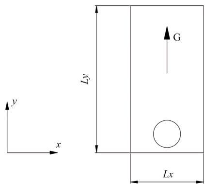

Figure 1. Simulation problem diagram

图 1. 模拟问题示意图

## 4. 数值结果与分析

本文主要研究在气泡生成和脱离阶段，入口速度和管口管径的变化对气泡的影响以及在气泡上升阶 段，Eötvös数(Eo)的大小，对气泡界面以及速度变化的影响。 

## 4.1. 入口速度对气泡生成和脱离过程影响

本小结研究入口速度对气泡生成和脱离阶段的形态演变的影响，在数值模拟中，取管口直径 $d =$ 0.005，入口速度 $V = 0 . 0 2 ~ \mathrm { m / s } , 0 . 0 5 ~ \mathrm { m / s } , 0 . 1 ~ \mathrm { m / s } , 0 . 2 ~ \mathrm { m / s }$ ，下文中 t=0 时刻对应能明显观察到气泡的时 刻即进气管管口处有气泡生成时刻。 

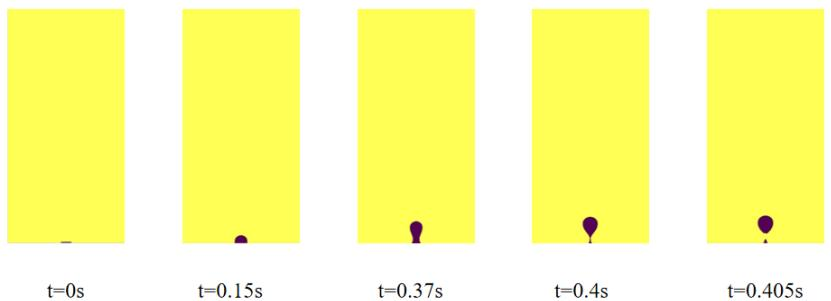

$\mathrm { ( a ) \ V = 0 . 0 2 m / s }$

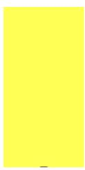

$\scriptstyle { \mathrm { t } } = 0 { \mathrm { s } }$

$\mathrm { \ t = 0 . 0 8 s }$

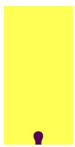

$\mathrm { t } { = } 0 . 2 0 5 \mathrm { s }$

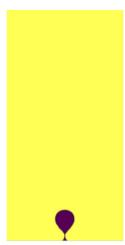

$\mathrm { t } { = } 0 . 2 5 \mathrm { s }$

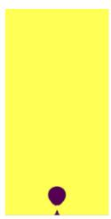

$\mathrm { t } { = } 0 . 2 5 5 \mathrm { s }$

$( \mathrm { b ) \ V = 0 . 0 5 \ m / s }$

$\scriptstyle { \mathrm { t } } = 0 { \mathrm { s } }$

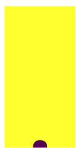

$\mathrm { t } { = } 0 . 1 \mathrm { s }$

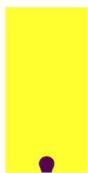

$\mathrm { t } { = } 0 . 1 6 \mathrm { s }$

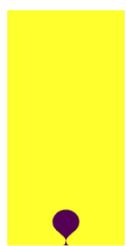

$\mathrm { t } { = } 0 . 2 1 \mathrm { s }$

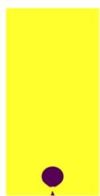

$\mathrm { t } { = } 0 . 2 1 5 \mathrm { s }$

$( \mathrm { c } ) \mathrm { V } = 0 . 1 \mathrm { m } / \mathrm { s }$

$\scriptstyle { \mathrm { t } } = 0 { \mathrm { s } }$

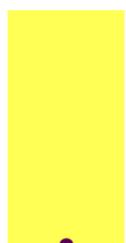

$\mathrm { \ t = } 0 . 0 8 \mathrm { s }$

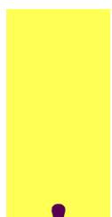

$\mathrm { t } { = } 0 . 1 3 \mathrm { s }$

$\mathrm { \ t = } 0 . 1 8 8 \mathrm { s }$

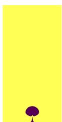

$\mathrm { \ t = } 0 . 1 9 5 \mathrm { s }$

$( \mathrm { d } ) \ : \mathrm { V } = 0 . 2 \ : \mathrm { m / s }$

Figure 2. Morphologic evolution of bubbles in the formation stage at different inlet speeds (bubble formation to detachment)

图 2. 不同入口速度下气泡在生成阶段的形态演变过程(气泡生成到脱离)

图 2 展示了不同入口速度下气泡的行程过程。从图中结果可以发现对于所研究的四种不同进口速度 的情况，都有气泡尺寸不断增大，并在浮力的作用下向上生长，气泡底部形成逐渐缩小的细小通道，最 终生成的气泡与壁面脱离。从气泡生长到完全脱离的过程中，气泡形状随不同入口速度逐渐发生变化。 具体地说，当 $V { = } 0 . 0 2 \mathrm { m } / \mathrm { s }$ 时，演化初期气泡呈球帽状。当时间增加至 $0 . 1 5 \mathrm { s }$ 时，气泡呈半球状。随时间 的不断增加，气泡在液池中受到向上的浮力增加，当 $t = 0 . 3 7 ~ \mathrm { s }$ 时，气泡底部形成颈部。随时间的增加， 气泡所受到的浮力不断增大并逐渐占据主导地位，颈部宽度不断变细，长度增大 $: ( t = 0 . 4 ~ \mathrm { s } )$ 。最终当 $t =$ $0 . 4 0 5 \mathrm { s }$ 时，气泡在颈部发生断裂，此时气泡的形状为扁平状。当入口速度增加到 $V { = } 0 . 0 5 \mathrm { m / s }$ 时，演化初 期气泡仍呈球帽状。而当 $t = 0 . 2 0 5 \mathrm { ~ s ~ }$ 时，气泡开始形成颈部。气泡开始形成颈部并在 $t = 0 . 2 5 5 \mathrm { s }$ 时气泡脱 离固体壁面。当入口速度至 $V = 0 . 1 ~ \mathrm { m / s }$ 时，气泡形成颈部的时间及脱离固体表面的时间变得更短，如图 2(c)所示，此时， $t = 0 . 1 6$ 时气泡出现颈部， $t = 0 . 2 1 5 \mathrm { ~ s ~ }$ 时，气泡颈部完全消失并脱离管口。当入口速度增 加至 $V = 0 . 2 ~ \mathrm { m / s }$ 时，当 $t = 0 . 1 9 5 \mathrm { ~ s ~ }$ 时气泡更容易脱离管口，即气泡可以更快地脱离管口。为了揭示气泡 脱离规律和入口速度之间的关系，图 3 给出了气泡完全脱离管口的时间随入口速度变化趋势。从图中结 果可以看出，随着入口速度的增加，气泡脱离管口的速度先快速减小然后再缓慢减小。 

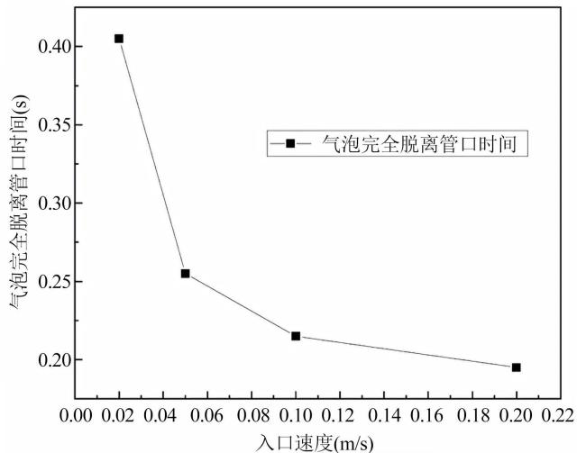

Figure 3. The change of the time when the bubble completely leaves the nozzle with the inlet speed

图 3. 气泡完全脱离管口时间随入口速度变化规律图

## 4.2. 管口直径对气泡生成和脱离过程影响

本小结研究进气管管口直径对气泡生成和脱离阶段的形态演变的影响，在数值模拟中，取入口速度 $V = 0 . 0 2 \mathrm { m } / \mathrm { s }$ ，管口直径分别为 $d = 0 . 0 0 4 , \ 0 . 0 0 5 , \ 0 . 0 0 6$ ，以及 $d = 0 . 0 0 7$ 。 

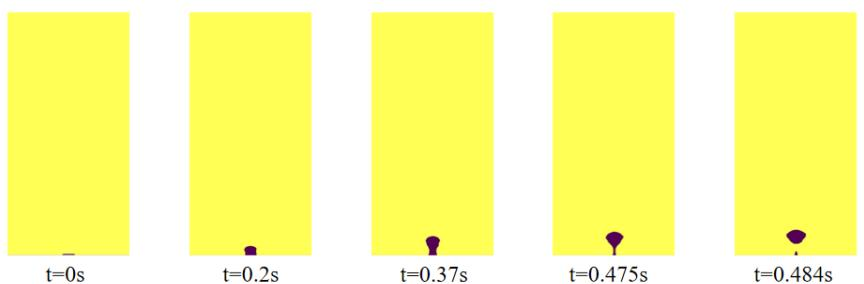

$\mathrm { ( a ) } d = 0 . 0 0 4$

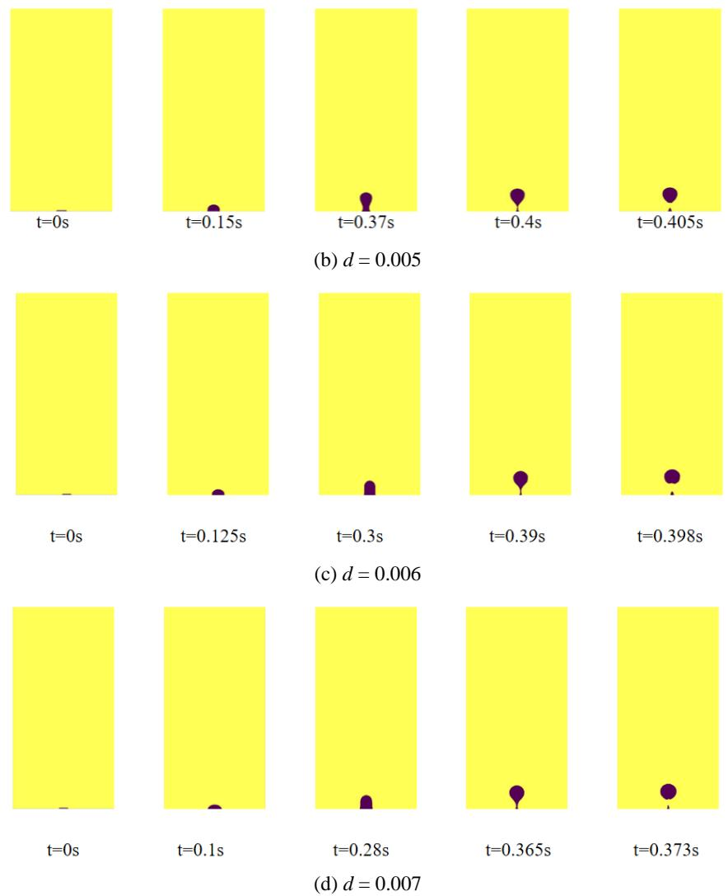

Figure 4. Morphologic evolution of bubbles in the formation stage under different pipe diameters (bubble formation to detachment)

图 4. 不同管径下气泡在生成阶段的形态演变过程(气泡生成到脱离)

图 4 给出了不同管径下气泡在生成阶段的形态演变过程。从图中气泡的形态图以及对应的时刻可以 发现，管口直径对气泡脱离时间和脱离后的形态都有很显著的影响。如图 4(a)所示，当管径 $d = 0 . 0 0 4$ 时， 从 $t = 0$ 时至 $t = 0 . 2 ~ \mathrm { s }$ 时，气泡呈球帽状。当 $t = 0 . 2 ~ \mathrm { s }$ 时，气泡因向上膨胀而呈半球状。当时间增加至 $t =$ $0 . 3 7 s$ 时，气泡在液池中受到向上的浮力开始逐渐克服粘附力，气泡开始做向上脱离运动。当速度不断增 加至 $t = 0 . 3 7 \mathrm { ~ s ~ }$ 时，气泡所受到的浮力不断增大并逐渐占据主导地位，气泡开始形成颈部。当时间从 $t =$ $0 . 3 7 \mathrm { s }$ 增加至 $t = 0 . 4 7 5 \mathrm { s }$ 的过程中时，气泡浮力不断增大，颈部宽度不断变细，长度增大。当时间进一步 增加到 $t = 0 . 4 8 4 \mathrm { s }$ 时，气泡颈部完全消失并脱离管口，形态呈上宽下窄的倒置水滴状。随着管径增加，气 泡在形成阶段形状变化相似，而气泡脱离管径的时间和脱离时的形状有很大区别。如 $d = 0 . 0 0 5$ ，气泡在 $t = 0 . 4 0 5 \mathrm { ~ s ~ }$ 脱离管口，此时气泡的形态接近水滴状。当进气管管径增加至 0.006，气泡在 0.398 时脱离管 口，此时气泡底部呈现凹状。当进气管管径增加至 0.007， $t = 0 . 3 7 3 \mathrm { ~ s ~ }$ 时，气泡脱离管口时，此时气泡形 态近似呈球状。 

图 5 给出了气泡完全脱离管口的时间和管径之间的关系，由图 5 所示，随着管口直径的增加气泡脱 离时间快速减小。这是因为随着管口管径的增大，气泡体积不断增大，受到的浮力不断增大，因此气泡 在生成阶段的形态演变过程越迅速，达到水滴状、椭球状或近似球状所需要的时间也越短。 

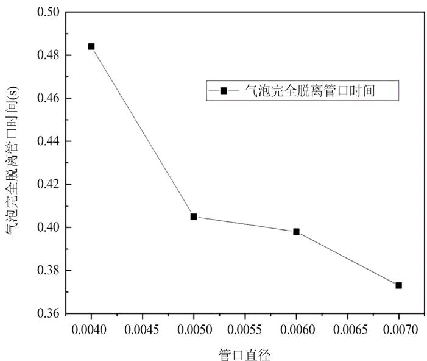

Figure 5. The change of the time for the bubble to completely leave the nozzle with the diameter of the nozzle

图 5. 气泡完全脱离管口时间随管口直径变化规律

## 4.3. Eo对气泡上升阶段界面变化的影响

本节研究表征流体所受浮力和表面张力之比的无量纲数 Eo 和气泡尺寸大小对气泡在上升阶段的形 态尺寸影响。其中 $E o = \frac { g \left( \rho _ { l } - \rho _ { g } \right) \cdot d ^ { 2 } } { \sigma }$ ( ) 2l g g d − ⋅ 代表浮力与表面张力之比。在数值模拟中分别研究了四种不同 Eo 下气泡的上升过程。 

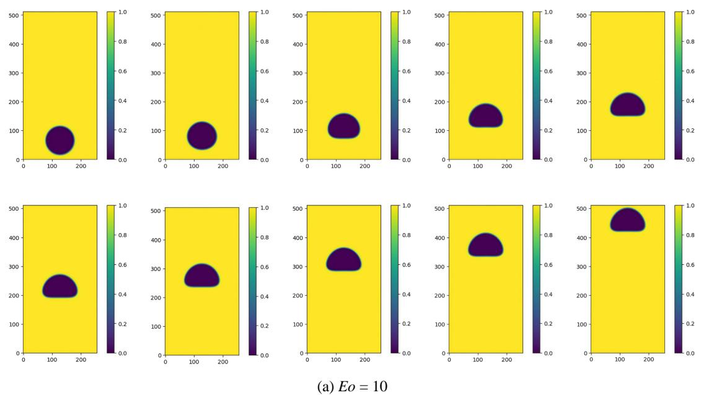

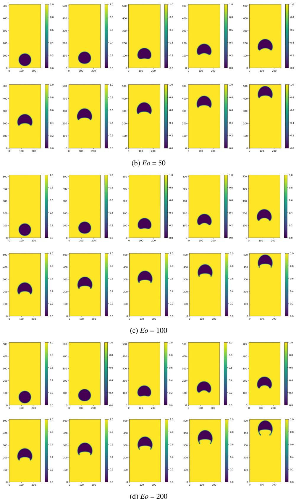

Figure 6. Morphological and dimensional changes of bubbles under different Eo in the rising stage

图 6. 不同 Eo 下气泡在上升阶段的形态尺寸变化特性

图 6 展示了 $E o$ 对气泡上升过程中界面变化的影响。每一行图形从左到右对应的时刻分别为步数 $t =$ 1000，5000，10,000，15,000，20,000，25,000，30,000，35,000，40,000，47,000。如图 $6 ( \mathrm { a } ) ,$ 所示，当 $E o$ $= 1 0$ 时，由于 $E o$ 较小，气泡所受的表面张力相对于浮力较大，因此气泡在时间步数 $t = 1 0 0 0$ 至 $t = 5 0 0 0$ 时还可以维持球状，随时间步数增加至 $t = 1 0 { , } 0 0 0$ 时，气泡下半部消失，呈半球状。从时间步数 $t = 1 0 { , } 0 0 0$ 至 $t = 4 7 { , } 0 0 0$ 时，气泡仍保持半球状形态。整个上升过程中，气泡形态的变化有着较高的规律性，并保持 半球状从时间步数 $t = 1 5 { , } 0 0 0$ 运动至液池顶端。 

当 $E o$ 增加至 50，如图 $6 ( \mathrm { b } )$ 所示，气泡在时间步数 $t = 1 0 0 0$ 至 $t = 5 0 0 0$ 时仍呈球状，当随时间步数增 加至 $1 0 { , } 0 0 0$ 时，气泡下半部消失且发生轻微凹陷。当气泡从时间步数 $t = 1 0 { , } 0 0 0$ 运动至 $t = 4 7 , 0 0 0$ 时，气 泡尾部凹陷逐渐加剧，呈月牙状。相较于 $E o = 1 0$ ，此时表面张力对气泡的形态尺寸影响程度较小，气泡 变形程度较大。当 $E o$ 增大至 100，如图 $6 ( \mathrm { c } )$ 所示，气泡在上升初期仍呈球状。当时间步数 $t = 1 0 { , } 0 0 0$ 时， 此时表面张力对气泡的作用非常小而浮力成为气泡形态尺寸的主要影响因素，气泡在上升过程中出现较 大的形变，表现为下半部发生凹陷。随着气泡的继续上升，当时间步数 $t = 2 5 { , } 0 0 0$ 时，气泡两侧形成一个 拖尾，这个拖尾随着气泡高度的增加变得越来越细长。再增加 Eo 至 200 时，气泡所受的浮力相对于表面 张力更大，如图 $6 ( \mathrm { d } )$ 所示，气泡在 $t = 2 5 { , } 0 0 0$ 时两侧形成拖尾。气泡在运动至接近顶端以及顶端时形变程 度更大，拖尾变得细长的同时又向内延伸。 

从图 6 可以看出，随 $E o$ 的增大，气泡在上升阶段的形变也就愈发明显。当 $E o = 1 0$ 时，气泡从开始 运动至运动到模型顶端，其底部都未有明显凹陷，当 $E o = 5 0 , t = 2 5 , 0 0 0$ 时底部明显凹陷。当 $E o = 1 0 0$ ， $t = 2 0 { , } 0 0 0$ 时，底部明显凹陷。当 $E o = 1 0 0 , t = 2 0 , 0 0 0$ 时，底部明显凹陷。为了探究气泡运动至顶端时的 形变情况，本文运用变形参数来比较气泡的形变程度，气泡的变形参数定义为： 

$$
D. I. = \frac {L _ {C} - \omega}{L _ {C} + \omega},
$$

其中 $L _ { c }$ 和 $\omega$ 分别是当气泡的形状稳定时对应的长度和宽度，当 $D . I . = 0$ 时，得到的气泡为球形。通过计 算发现当 $E o = 1 0$ 时， $D . I . = 0 . 1 9 4$ ；当 $E o = 3 0$ 时， $D . I . = 0 . 2 1 0 ;$ ；当 $E o = 5 0$ 时， $D . I . = 0 . 2 2 3$ 。通过变形参 数公式可得在其余条件不变的情况下，当 $E o$ 较小时，随 $E o$ 增大气泡变形参数 $D . I .$ 增大，这表明随 $E o$ 增 大，气泡的形变程度越大。 

## 4.4. Eo对气泡速度变化的影响

本节主要研究气泡在上升过程质心速度和气泡终端速度的变化特性。 

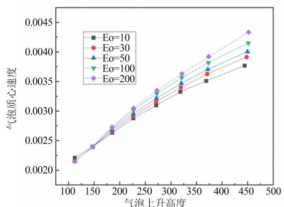

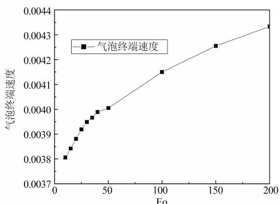

Figure 7. The change law of bubble centroid velocity and terminal velocity with different values of $E o$ 图 7. 气泡质心和终端速度随气泡上升高度的变化规律

图 7 反映的是当气泡半径 $R = 5 0$ ，初始位置 $x _ { c } = 1 2 8$ 时，不同 $E o$ 下，气泡质心和终端速度随气泡上 升高度的变化规律。如图 7(a)所示，当气泡上升高度处于 125 至 450 区间内时，曲线呈近似线性，气泡 质心速度变化相对稳定。图 7(b)反映的是当气泡半径 $R = 5 0$ ，初始位置 $x _ { c } = 1 2 8$ 时，气泡终端速度随 Eo 的变化规律。当 Eo 由 0 增大到 50 的过程中，该段曲线呈近似线性，而当 Eo 从 50 增大到 200 的过程 中，曲线也呈近似线性，且斜率要小于 Eo 处于 0~50 区间内，说明当 Eo 由 0 增长到 50 的阶段，气泡终 端速度的增长速率要大于 Eo 由 50 增长到 200 的阶段，因此，Eo 越小，对气泡终端速度的影响更加明 显，随 Eo 增大，气泡终端速度的变化越来越小。 

## 5. 结论

学报(自然科学版), 2023, 51(6): 818-826. 

本文运用格子 Boltzmann 方法探究气泡在生成和脱离阶段的形态演变过程，以及气泡在上升阶段界 面和速度的变化特性，得到如下结论： 

[13] 徐生玮, 宋龙波, 康灿. 液体介质对上升气泡几何形态和运动特征的影响[J]. 化工学报, 2023, 74(10): 4140-4152. 

[14] 钱凯凯, 王治云. 水平通气横流中气泡的运动特性数值模拟[J]. 广州化学, 2021, 46(5): 61-69. 

(1) 气泡在生成阶段形态表现有近似球状、椭球状、扁平状和球帽状(从生成到脱离)。随着时间的变 化，气泡尺寸不断增大，并在浮力的作用下向上生长，气泡底部形成逐渐缩小的细小通道，最终导致气 泡与固体壁面分离。随着气泡速度的增大，气泡在生成阶段的形态演变过程越迅速，气泡完全脱离所需 要的时间也越短。随着管口管径的增大，气泡在生成阶段的形态演变过程越迅速，气泡完全脱离所需要 的时间也越短。 

[15] 刘筹资, 查恩尧, 欧阳和平, 等. 水下爆炸气泡运动对水面形态影响的数值模拟[J]. 工程爆破, 2021, 27(4): 40-50. 

(2) 随 Eo 的增大，气泡在上升阶段的形变也就愈发明显。在其余条件不变的情况下，当 Eo 较小时， 随 Eo 增大气泡变形参数 D.I.增大，这表明随 Eo 增大，气泡的形变程度越大。当气泡半径 $R = 5 0$ ，初始 位置 $x _ { c } = 1 2 8$ 时，气泡上升高度在处于 125 至 450 区间内时，曲线呈近似线性；气泡终端速度随 Eo 增大 而增大，且小 Eo 对气泡终端速度的影响更加明显，随 Eo 增大，气泡终端速度的变化越来越小。 

[16] 李永胜, 王治云, 杨茉. 横向水流作用下气泡运动数值模拟[J]. 轻工机械, 2018, 36(5): 29-33. 

## 参考文献

[17] 王乐, 樊敏, 詹翔宇, 等. 交错气泡运动特性数值模拟研究[J]. 水资源与水工程学报, 2017, 28(5): 142-149. 

[18] 程军明, 吴伟烽, 聂娟, 等. 气泡在静水中上升破裂产生射流特性的数值模拟[J]. 江苏大学学报(自然科学版), 2014, 35(5): 513-517. 

[1] Sulaiman, S.A. and Kamarudin, N.A.Z. (2012) Bubbles Size Estimation in Liquid Flow through a Vertical Pipe. Journal of Applied Sciences, 12, 2464-2468. https://doi.org/10.3923/jas.2012.2464.2468 

[19] 李晏丞, 唐永刚. 2 个气泡运动的数值模拟[J]. 江苏船舶, 2013, 30(6): 1-3, 6-7. 

[2] Yi, T., Yang, G., Wang, B., Zhuan, R., Huang, Y. and Wu, J. (2022) Dynamics of a Gas Bubble Penetrating through Porous Media. Physics of Fluids, 34, Article ID: 012103. https://doi.org/10.1063/5.0076298 

[20] 徐玲君, 陈刚, 邵建斌, 等. 单个气泡静水中上升特性的数值模拟[J]. 沈阳农业大学学报, 2012, 43(3): 357-361. 

[3] 闫红杰, 赵国建, 刘柳, 等. 静止水中单气泡形状及上升规律的实验研究[J]. 中南大学学报(自然科学版), 2016, 47(7): 2513-2520. 

[21] Liang, H., Xu, J., Chen, J., Wang, H., Chai, Z. and Shi, B. (2018) Phase-Field-Based Lattice Boltzmann Modeling of Large-Density-Ratio Two-Phase Flows. Physical Review E, 97, Article ID: 033309. https://doi.org/10.1103/physreve.97.033309 

[4] Luo, X., Yang, G., Lee, D.J. and Fan, L. (1998) Single Bubble Formation in High Pressure Liquid—Solid Suspensions. Powder Technology, 100, 103-112. https://doi.org/10.1016/s0032-5910(98)00130-2 

[5] Zawala, J. and Malysa, K. (2011) Influence of the Impact Velocity and Size of the Film Formed on Bubble Coalescence Time at Water Surface. Langmuir, 27, 2250-2257. https://doi.org/10.1021/la104324u 

[6] Wu, M. and Gharib, M. (2002) Experimental Studies on the Shape and Path of Small Air Bubbles Rising in Clean Water. Physics of Fluids, 14, L49-L52. https://doi.org/10.1063/1.1485767 

[7] Yu, Z., Hemminger, O. and Fan, L. (2007) Experiment and Lattice Boltzmann Simulation of Two-Phase Gas-Liquid Flows in Microchannels. Chemical Engineering Science, 62, 7172-7183. https://doi.org/10.1016/j.ces.2007.08.075 

[8] Abbassi, W., Besbes, S., El Hajem, M., Ben Aissia, H., Champagne, J.Y. and Jay, J. (2017) Influence of Operating Conditions and Liquid Phase Viscosity with Volume of Fluid Method on Bubble Formation Process. European Journal of Mechanics—B/Fluids, 65, 284-298. https://doi.org/10.1016/j.euromechflu.2017.04.001 

[9] Cao, Y. and Macián-Juan, R. (2020) Numerical Study of the Central Breakup Behaviors of a Large Bubble Rising in Quiescent Liquid. Chemical Engineering Science, 225, Article ID: 115804. https://doi.org/10.1016/j.ces.2020.115804 

[10] Smolianski, A., Haario, H. and Luukka, P. (2005) Vortex Shedding behind a Rising Bubble and Two-Bubble Coalescence: A Numerical Approach. Applied Mathematical Modelling, 29, 615-632. https://doi.org/10.1016/j.apm.2004.09.017 

[11] 彭诗洋, 张亚新, 张峰. 气泡在液体中生成的试验及模拟[J]. 中国科技论文, 2018, 13(18): 2087-2091. 

[12] 黄晓婷, 孙鹏楠, 彭玉祥, 等. 基于新型轴对称无网格方法的水下爆炸冲击波和气泡运动数值模拟[J]. 同济大学 

