# Phase-field-based lattice Boltzmann model for multiphase ferrofluid flows

Yang Hu* and Decai Li† 

Department of Mechanical Engineering, Tsinghua University, Beijing 100084, People’s Republic of China 

Xiaodong Niu 

College of Engineering, Shantou University, Shantou 515063, People’s Republic of China 

(Received 12 December 2017; published 4 September 2018) 

In this work, the phase-field-based lattice Boltzmann model is extended to simulate the multiphase ferrofluid flows. The hydrodynamical behavior of the ferrofluids is modeled by the incompressible Navier-Stokes equation with the nonlinear Langevin magnetization law. The phase interface is tracked by the conservative Allen-Cahn equation. A modified magnetic potential equation is used to describe the magnetic field. All governing equations are solved by the lattice Boltzmann method. Several typical problems, including a circular cylinder in a uniform applied magnetic field, deformation of a ferrofluid droplet under a uniform applied magnetic field, bubble merging in ferrofluid under a uniform applied magnetic field, and ferrofluid droplets moving and merging on a flat surface in the presence of a permanent magnet, are simulated to test the accuracy and numerical stability of the present model. The computations are performed in the range of density ratios from 1.975 to 850.7 and viscosity ratios from 20 to 279.3. Some basic phenomenological features of multiphase ferrofluid flows are captured. 

DOI: 10.1103/PhysRevE.98.033301 

## I. INTRODUCTION

Ferrofluids are composed of magnetic nanoscale particles coated by a layer of surfactants and the carrier liquid (water, oil, and biocompatible liquids), which can be strongly magnetized in the presence of applied magnetic fields. These nanoparticles dispersed in ferrofluids are suspended stably due to the effects of Brownian motion and the surfactants. Because ferrofluids can be controlled by the external magnetic fields, they have been extensively used in many engineering and biomedical applications, such as seals, lubrication, vibration damping, sensors, actuators and transducers, heat transfer enhancement, and delivery of therapeutic drugs. As early as the 1960s, Rosensweig and his coworkers established the fundamental motion laws of ferrofluids and named them ferrohydrodynamics [1,2]. 

It should be noted that multiphase ferrofluid flows can be frequently encountered in many application fields. For example, in the ferrofluidic seal system, the gases or vapors are obstructed by the ferrofluid O ring, which involves gas-ferrofluid interfacial interactions [3]. When ferrofluid is used for treatment of retinal detachment, the motion of ferrofluid droplets through immiscible viscous media needs to be considered [4]. In addition to the motivation by practical applications, the interfacial behavior of ferrofluids is also a significant theoretical problem. One famous example is the Rosensweig instability (normal-field instability), which is a unique phenomenon in ferrohydrodynamics [5]. In such case, the ferrofluid is subjected to a strong static perpendicular magnetic field, and the surface forms a regular pattern of peaks and valleys. To investigate the multiphase ferrofluid flows in detail, some theoretical and experimental studies have been done in recent years [6–8]. With the rapid advance of computer hardware and the development of efficient numerical methods, the numerical simulation method has been a power alternative tool to obtain better insight into the interfacial behavior of ferrofluids. Lavrova et al. proposed a decoupled algorithm to solve the Maxwell equations, Young-Laplace equation, and Navier-Stokes equations [9]. Interfacial interactions in dissipative systems, rotary shaft seals, equilibrium shapes of ferrofluid droplets, and pattern formation in the normal-field instability of ferrofluid layers were studied. Gollwitzer et al. applied a similar method to study the surface topography of ferrofluids and the numerical results agreed well with the experimental data [10]. However, their methods can only be used for the stationary free surface problems. To simulate the time-dependence multiphase ferrofluid flows, some well-validated methods, such as the volume-of-fluid method [11], the level set method [12,13], and the diffuse interface method [14,15], were introduced. Korlie et al. developed a volume-of-fluid method to model the motion of bubbles and droplets in ferrofluids, where the ferrofluids were assumed to be a linear magnetizable fluid [16]. Later Afkhami et al. applied a volume-of-fluid algorithm with the piecewise linear interface reconstruction scheme to simulate field-induced motion of ferrofluid droplets through immiscible viscous media under an externally nonuniform magnetic field and deformation of a hydrophobic ferrofluid droplet suspended in a viscous medium under a uniform magnetic field [17,18], where the nonlinear magnetization behavior of ferrofluids was considered. Lee et al. utilized a volume-offluid approach which incorporated a multiple-color function scheme to simulate the bubble aggregation and deformation in ferrofluids, where the relation between the speed of bubblepair coalescence and its centroid separation was investigated [19]. Liu et al. presented a numerical study of the formation process of ferrofluid droplets using the particle level set method. The influences of the magnetic Bond number and the susceptibility on the droplet size were investigated [20]. Zhu et al. adopted the level set method to study the deformation of a ferrofluid droplet on a super-hydrophobic surface under the effect of a uniform magnetic field [21]. The good agreement between the experimental and numerical results indicated that the numerical model can predict the behavior of the ferrofluid droplets. Because the original volume-of-fluid methods suffer from the challenge of accurately reconstructing the interface based only on the fluid volume fraction and the original level set methods lack mass conservation property, some improved volume-of-fluid methods or level set methods were also used to simulate multiphase ferrofluid flows. The corresponding works can be found in Refs. [22,23]. 

Unlike the volume-of-fluid method and level set method, the phase field method, because of its solid physical background and simple calculation process, has been particularly attractive in recent years. In the framework of the phase field method, the phase interface is treated as a thin but diffuse layer where the two components mix to some extent. The order parameter is used to identify the different phases and calculate certain properties of the interface between different fluids such as gradients and curvature. Note that there are very few works on describing the behavior of multiphase ferrofluid flows using the phase field technique. Very recently, Nochetto et al. developed a phase field model for two-phase ferrofluid flows [24]. The Cahn-Hilliard equation was chosen to capture the phase interface. They also proposed an energystable finite element method to solve the Cahn-Hilliard equation, the Navier-Stokes equations, the magnetization equation, and the magnetostatics equations. This phase field model was capable of capturing basic phenomenological features of ferrofluids such as the Rosensweig instability and the ferrofluid hedgehog. However, their model can only be used for multiphase ferrofluid flows with matching density. 

The purpose of this paper is to propose a phase-field-based lattice Boltzmann model for multiphase ferrofluid flows. Differently from the conventional methods based on the Navier-Stokes equations, the lattice Boltzmann method (LBM) is derived from kinetic theory [25]. Because the LBM incorporates the intermolecular interactions in a straightforward way, it is very suitable to deal with the complex interfacial dynamics [26,27]. To combine the advantages of the LBM and the phase field method, some phase-field-based lattice Boltzmann models have been proposed. The Cahn-Hilliard equation was used to track the interface in the earlier studies of the phase-field-based LBM. He et al. proposed a doublepopulation multiphase LBM which can reduce the effect of numerical errors in calculation of molecular interactions [28]. However, this model can only be applied for multiphase flows with low density ratio due to numerical instability. To obtain stable phase-field-based lattice Boltzmann models for high density ratio problems, the pressure-correction method [29] and three-step stable discretization scheme [30] were developed. However, these algorithms lose the advantage in simplicity of the LBM. Liu et al. developed several kinds of phase-field lattice Boltzmann models for the multiphase flows with soluble surfactants [31] and thermocapillary flows [32,33]. It should be pointed out that in addition to the Cahn-Hilliard equation, the Allen-Cahn equation which only has a second-order derivative term is also used for interface tracking. The original Allen-Cahn equation cannot conserve the mass. The conservative Allen-Cahn equation was proposed by Sun and Beckermann [34] and improved by Chiu and Lin [35]. Geier et al. constructed an LB model for the conservative Allen-Cahn equation [36]. Later Fakhari et al. applied the LB model based on the conservative Allen-Cahn equation to simulate immiscible two-phase flows [37] and moving-contact-line problems with large density ratio (up to 1000) [38]. To recover the conservative Allen-Cahn equation completely, the improved models were given by Ren et al. [39] and Wang et al. [40]. In this paper, we develop a unified lattice Boltzmann model (LBM) to simulate multiphase ferrofluid flows under a magnetic field. The Navier-Stokes equations, the phase field equation, and the Poisson equation of magnetic potential are solved by three lattice Boltzmann equations. Numerical simulations for a circular cylinder in a uniform applied magnetic field, deformation of a ferrofluid droplet under a uniform magnetic field, two bubbles merging in a ferrofluid under a uniform magnetic field, and ferrofluid droplets moving and merging on a flat surface in the presence of a permanent magnet are performed. The numerical results indicate that the proposed model is an effective tool for direct numerical simulation of multiphase ferrofluid flows. It should be noted that Falcucci et al. have presented a pseudopotential lattice Boltzmann model for simulating ferrofluid droplet deformation [41]. As pointed out by Chen et al. [42], this model can only be used for the multiphase flow with low density ratio. However, the density ratio considered in this paper is up to 850.7. 

## II. MATHEMATICAL MODELS

## A. Governing equations for two-phase ferrofluid flows

To describe the behavior of the ferrofluids, Resensweig and Shliomis proposed two well established partial differential equation models [2,43]. In this work, we focus on the interfacial dynamics of ferrofluids. The internal rotation effect of ferrofluids is neglected. In the diffuse interface framework, the governing equations of multiphase ferrofluid flows include the Maxwell equations, the Navier-Stokes equations, and the phase field equation. The Maxwell equations for a nonconducting ferrofluid are 

$$
\nabla \cdot \mathbf {B} = 0,\tag{1}
$$

$$
\nabla \times \mathbf {H} = 0,\tag{2}
$$

where B and H are the magnetic induction and the magnetic field, respectively. B can be expressed as 

$$
\mathbf {B} = \mu_ {0} (\mathbf {H} + \mathbf {M}) = \mu_ {0} (1 + \chi) \mathbf {H} = \mu \mathbf {H},\tag{3}
$$

where M is the magnetization. $\mu$ and $\chi$ are the permeability and the magnetic susceptibility, respectively. The vacuum permeability $\mu _ { 0 }$ is 4π $\times \bar { 1 } 0 ^ { - 7 } \bar { \mathrm { N } } / \mathrm { A } ^ { 2 }$ 

Considering the irrotationality condition (2) of the magnetic field H, a magnetic scalar potential $\psi$ is introduced, which is defined as 

$$
\mathbf {H} = - \nabla \psi .\tag{4}
$$

Substituting Eqs. (3) and (4) into Eq. (1), we have the following magnetic potential equation: 

$$
\nabla \cdot (\mu \nabla \psi) = 0.\tag{5}
$$

The mass and momentum conservative equations for ferrofluids are 

$$
\nabla \cdot \mathbf {u} = 0,\tag{6}
$$

$$
\rho \left[ \frac {\partial \mathbf {u}}{\partial t} + \nabla \cdot (\mathbf {u u}) \right] = - \nabla p + \eta \nabla^ {2} \mathbf {u} + \nabla \cdot \boldsymbol {\tau} _ {m} + \mathbf {f} _ {s} + \mathbf {f} _ {b},\tag{7}
$$

where $\rho ,$ , u, and $p$ are the density, velocity, and pressure, respectively. η is the kinetic viscosity. $\mathbf { f } _ { s }$ and $\mathbf { f } _ { b }$ are the surface tension and body force, respectively. $\tau _ { m }$ is the magnetic stress tensor proposed by Cowley and Rosensweig [5], which is defined as 

$$
\pmb {\tau} _ {m} = - \frac {\mu_ {0}}{2} | \mathbf {H} | ^ {2} \mathbf {I} + \mathbf {H B},\tag{8}
$$

where I is the identity operator. The Kelvin force $\mathbf { f } _ { m }$ is calculated as 

$$
\mathbf {f} _ {m} = \nabla \cdot \boldsymbol {\tau} _ {m} = - \frac {\mu_ {0}}{2} \nabla (| \mathbf {H} | ^ {2}) + (\nabla \cdot \mu \mathbf {H}) \mathbf {H} + (\mu \mathbf {H} \cdot \nabla) \mathbf {H}
$$

$$
= - \frac {\mu_ {0}}{2} \nabla (| \mathbf {H} | ^ {2}) + (\mu \mathbf {H} \cdot \nabla) \mathbf {H}
$$

$$
= - \frac {\mu_ {0}}{2} \nabla (| \mathbf {H} | ^ {2}) + \mu \bigg [ \frac {1}{2} \nabla (\mathbf {H} \cdot \mathbf {H}) - \mathbf {H} \times (\nabla \times \mathbf {H}) \bigg ]\tag{9}
$$

$$
= \frac {\mu - \mu_ {0}}{2} \nabla (| \mathbf {H} | ^ {2}) = \frac {\mu_ {0} \chi}{2} \nabla (| \mathbf {H} | ^ {2}).\tag{10}
$$

The magnetic susceptibility $\chi$ can be calculated using the Langevin law 

$$
\chi = \frac {M}{H} = \frac {M _ {s}}{H} \left[ \coth \left(\frac {3 \chi_ {0} H}{M _ {s}}\right) - \frac {M _ {s}}{3 \chi_ {0} H} \right],\tag{11}
$$

where $\chi _ { 0 }$ is the initial value of magnetic susceptibility. When $H \ll M _ { s } ,$ , we have $\chi \approx \chi _ { 0 }$ . Note that the Langevin magnetization law and the numerical method proposed in this paper are independent. If the ferrofluid does not obey the Langevin magnetization law [44], we only need to modify Eq. (11). 

Instead of the Cahn-Hilliard equation, the conservative Allen-Cahn equation is used to track the interface [36]: 

$$
\frac {\partial \phi}{\partial t} + \nabla \cdot (\mathbf {u} \phi) = \nabla \cdot \left\{M _ {\phi} \left[ \nabla \phi + \frac {4}{\xi} \phi (\phi - 1) \hat {\mathbf {n}} \right] \right\},\tag{12}
$$

where $\phi$ is the order parameter, $M _ { \phi }$ is the mobility, and nˆ is the normal vector, which is calculated by 

$$
\hat {\mathbf {n}} = \frac {\nabla \phi}{| \nabla \phi |}.\tag{13}
$$

Once the distribution of the order parameter is obtained, the surface tension $\mathbf { f } _ { s }$ can be computed by 

$$
\mathbf {f} _ {s} = \mu_ {\phi} \nabla \phi ,\tag{14}
$$

where $\mu _ { \phi }$ is the chemical potential, which can be written as 

$$
\mu_ {\phi} = 4 \beta \phi (\phi - 1) \left(\phi - \frac {1}{2}\right) - \kappa \nabla^ {2} \phi ,\tag{15}
$$

where $\beta$ and $\kappa$ are the parameters relating to the surface tension coefficient and the interfacial thickness: 

$$
\beta = \frac {1 2 \sigma}{D}, \quad \kappa = \frac {3 D \sigma}{2}.\tag{16}
$$

## B. Lattice Boltzmann model for the conservative Allen-Cahn equation

The D2Q9 lattice velocity model is used in this study, and the corresponding discrete velocity set is given as 

$$
\mathbf {e} _ {\alpha} = (e _ {\alpha x}, e _ {\alpha y}) = \left\{ \begin{array}{l l} (0, 0), & \alpha = 0, \\ \big \{\cos \big [ (\alpha - 1) \frac {\pi}{2} \big ], \sin \big [ (\alpha - 1) \frac {\pi}{2} \big ] \big \} c, & \alpha = 1, 2, 3, 4, \\ \sqrt {2} \big \{\cos \big [ (2 \alpha - 1) \frac {\pi}{4} \big ], \sin \big [ (2 \alpha - 1) \frac {\pi}{4} \big ] \big \} c, & \alpha = 5, 6, 7, 8, \end{array} \right.\tag{17}
$$

where $c = \Delta x / \Delta t$ . -x and -t are the lattice spacing and the time step, respectively. 

The corresponding multiple-relaxation-time (MRT) LB equation for the phase field parameter $\phi$ can be expressed as 

$$
\begin{array}{r l} & g _ {\alpha} (\mathbf {x} + \mathbf {e} _ {\alpha} \Delta t, t + \Delta t) \\ & \quad = g _ {\alpha} (\mathbf {x}, t) - (\mathbf {M} ^ {- 1} \mathbf {S} ^ {g} \mathbf {M}) _ {\alpha \beta} \big [ g _ {\beta} (\mathbf {x}, t) - g _ {\beta} ^ {e q} (\mathbf {x}, t) \big ], \end{array}\tag{18}
$$

where $g _ { \alpha } ( \mathbf { x } , t )$ is the distribution function for the discrete velocities $\mathbf { e } _ { \alpha }$ . The equilibrium distribution function $g _ { \alpha } ^ { e q }$ is given by 

$$
g _ {\alpha} ^ {e q} = \omega_ {\alpha} \lambda \phi + \omega_ {\alpha} \frac {\mathbf {e} _ {\alpha} \cdot \mathbf {u}}{c _ {s} ^ {2}} + \omega_ {\alpha} \frac {4 M _ {\phi}}{\xi} \phi (1 - \phi) \frac {\mathbf {e} _ {\alpha} \cdot \hat {\mathbf {n}}}{c _ {s} ^ {2}},\tag{19}
$$

where $c _ { s } = c / \sqrt { 3 }$ is the speed of sound. M is the orthogonal transformation matrix and it can be constructed as 

$$
\mathbf {M} = \left( \begin{array}{c c c c c c c c c} 1 & 1 & 1 & 1 & 1 & 1 & 1 & 1 & 1 \\ - 4 & - 1 & - 1 & - 1 & - 1 & 2 & 2 & 2 & 2 \\ 4 & - 2 & - 2 & - 2 & - 2 & 1 & 1 & 1 & 1 \\ 0 & 1 & 0 & - 1 & 0 & 1 & - 1 & - 1 & 1 \\ 0 & - 2 & 0 & 2 & 0 & 1 & - 1 & - 1 & 1 \\ 0 & 0 & 1 & 0 & - 1 & 1 & 1 & - 1 & - 1 \\ 0 & 0 & - 2 & 0 & 2 & 1 & 1 & - 1 & - 1 \\ 0 & 1 & - 1 & 1 & - 1 & 0 & 0 & 0 & 0 \\ 0 & 0 & 0 & 0 & 0 & 1 & - 1 & 1 & - 1 \end{array} \right).\tag{20}
$$

$\mathbf { S } ^ { g }$ is a diagonal matrix, which can be written as 

$$
\mathbf {S} ^ {g} = \mathrm{diag} \big (s _ {0} ^ {g}, s _ {1} ^ {g}, s _ {2} ^ {g}, s _ {3} ^ {g}, s _ {4} ^ {g}, s _ {5} ^ {g}, s _ {6} ^ {g}, s _ {7} ^ {g}, s _ {8} ^ {g} \big),\tag{21}
$$

The order parameter $\phi$ can be calculated by 

where $s _ { 3 } ^ { g }$ and $s _ { 5 } ^ { g }$ can be determined by the mobility coefficient 

$$
\frac {1}{s _ {3} ^ {g}} = \frac {1}{s _ {5} ^ {g}} = \frac {M _ {\phi}}{c _ {s} ^ {2} \Delta t} + 0. 5.\tag{22}
$$

(24) 

The other $s _ { \alpha } ^ { g }$ can be chosen in the range of $0 < s _ { \alpha } ^ { g } < 2$ . In this work, they are chosen as 

$$
\begin{array}{l} s _ {0} ^ {g} = 1. 0, \quad s _ {1} ^ {g} = s _ {2} ^ {g} = 1. 1, \quad s _ {4} ^ {g} = s _ {6} ^ {g} = s _ {3} ^ {g}, \\ s _ {7} ^ {g} = s _ {8} ^ {g} = 1. 2. \end{array}\tag{23}
$$

Once $\phi$ is obtained, the density $\rho$ is given by 

$$
\phi = \sum_ {\alpha} g _ {\alpha}.
$$

$$
\rho = \rho_ {l} + \phi (\rho_ {h} - \rho_ {l}),\tag{25}
$$

where the subscripts h and l identify the heavy and light fluids, respectively. Note that the present method needs to calculate the gradient terms φ and $\nabla ^ { 2 } \phi$ . To ensure the mass and momentum conservation, the following isotropic centered difference schemes are used [45]: 

$$
\frac {\partial \phi}{\partial x} = \frac {2 (\phi_ {i + 1 , j + 1} - \phi_ {i - 1 , j + 1}) + 8 (\phi_ {i + 1 , j} - \phi_ {i - 1 , j}) + 2 (\phi_ {i + 1 , j - 1} - \phi_ {i - 1 , j - 1})}{1 2 \Delta x},\tag{26}
$$

$$
\frac {\partial \phi}{\partial y} = \frac {2 (\phi_ {i + 1 , j + 1} - \phi_ {i + 1 , j - 1}) + 8 (\phi_ {i , j + 1} - \phi_ {i , j - 1}) + 2 (\phi_ {i - 1 , j + 1} - \phi_ {i - 1 , j - 1})}{1 2 \Delta x},\tag{27}
$$

$$
\nabla^ {2} \phi = \frac {4 (\phi_ {i + 1 , j} + \phi_ {i - 1 , j} + \phi_ {i , j + 1} + \phi_ {i , j - 1}) + \phi_ {i + 1 , j + 1} + \phi_ {i + 1 , j - 1} + \phi_ {i - 1 , j + 1} + \phi_ {i - 1 , j - 1} - 2 0 \phi_ {i , j}}{6 \Delta x ^ {2}}.
$$

$$
6 \Delta x ^ {2}\tag{28}
$$

## C. Lattice Boltzmann model for the Navier-Stokes equations

The MRT LB equation with a force term can be expressed as 

$$
\begin{array}{l} f _ {\alpha} (\mathbf {x} + \mathbf {e} _ {\alpha} \Delta t, t + \Delta t) \\ = f _ {\alpha} (\mathbf {x}, t) - (\mathbf {M} ^ {- 1} \mathbf {S} ^ {f} \mathbf {M}) _ {\alpha \beta} \left[ f _ {\beta} (\mathbf {x}, t) - f _ {\beta} ^ {e q} (\mathbf {x}, t) \right] \\ + \left[ \mathbf {M} ^ {- 1} \left(\mathbf {I} - \frac {\mathbf {S} ^ {f}}{2}\right) \mathbf {M} \right] _ {\alpha \beta} F _ {\beta} \Delta t, \end{array}\tag{29}
$$

where $f _ { \alpha } ( { \bf x } , t )$ is the density distribution function for the discrete velocities $\mathbf { e } _ { \alpha }$ . The equilibrium density distribution function $f _ { \alpha } ^ { e q }$ is defined as 

$$
f _ {\alpha} ^ {e q} = \omega_ {\alpha} p + \rho c _ {s} ^ {2} (\Gamma_ {\alpha} - \omega_ {\alpha}),\tag{30}
$$

where 

$$
\Gamma_ {\alpha} = \omega_ {\alpha} \left[ 1 + \frac {\mathbf {e} _ {\alpha} \cdot \mathbf {u}}{c _ {s} ^ {2}} + \frac {(\mathbf {e} _ {\alpha} \cdot \mathbf {u}) ^ {2}}{2 c _ {s} ^ {4}} - \frac {\mathbf {u} ^ {2}}{2 c _ {s} ^ {2}} \right].\tag{31}
$$

$\mathbf { S } ^ { f }$ is a diagonal matrix, which can be written as 

$$
\mathbf {S} ^ {f} = \operatorname{diag} \left(s _ {0} ^ {f}, s _ {1} ^ {f}, s _ {2} ^ {f}, s _ {3} ^ {f}, s _ {4} ^ {f}, s _ {5} ^ {f}, s _ {6} ^ {f}, s _ {7} ^ {f}, s _ {8} ^ {f}\right),\tag{32}
$$

where $s _ { 7 } ^ { f }$ and $s _ { 7 } ^ { f }$ in the single flow simulations can be determined by the viscosity of the fluid 

$$
\frac {1}{s _ {7} ^ {f}} = \frac {1}{s _ {8} ^ {f}} = \frac {\eta}{\rho c _ {s} ^ {2} \Delta t} + 0. 5.\tag{33}
$$

Note that $s _ { 7 } ^ { f }$ and $s _ { 8 } ^ { f }$ are related to the phase field parameter $\phi$ in the multiphase flow system. Here a harmonic interpolation is used to ensure the continuity of viscosity flux [19]. As a result, we have 

$$
\frac {s _ {7} ^ {f}}{1 - 0 . 5 s _ {7} ^ {f}} = \frac {s _ {8} ^ {f}}{1 - 0 . 5 s _ {8} ^ {f}} = \frac {\rho_ {l} c _ {s} ^ {2} \Delta t}{\eta_ {l}} + \phi \left(\frac {\rho_ {h} c _ {s} ^ {2} \Delta t}{\eta_ {h}} - \frac {\rho_ {l} c _ {s} ^ {2} \Delta t}{\eta_ {l}}\right).\tag{34}
$$

As suggested by Luo et al. [46], the other parameters are 

$$
s _ {0} ^ {f} = s _ {3} ^ {f} = s _ {5} ^ {f} = 0, \quad s _ {1} ^ {f} = s _ {2} ^ {f} = s _ {7} ^ {f}, \quad s _ {4} ^ {f} = s _ {6} ^ {f} = 8 \frac {2 - s _ {7} ^ {f}}{8 - s _ {7} ^ {f}}.\tag{35}
$$

The discrete forcing term is given by 

$$
F _ {\alpha} = \frac {\mathbf {e} _ {\alpha} - \mathbf {u}}{c _ {s} ^ {2}} \cdot \left[ c _ {s} ^ {2} \nabla \rho (\Gamma_ {\alpha} - \omega_ {\alpha}) + (\mathbf {f} _ {s} + \mathbf {f} _ {m} + \mathbf {f} _ {b}) \Gamma_ {\alpha} \right].\tag{36}
$$

After the collision and stream steps, the macroscopic velocity and the pressure can be obtained by 

$$
\mathbf {u} = \frac {1}{\rho c _ {s} ^ {2}} \sum_ {\alpha} \mathbf {e} _ {\alpha} f _ {\alpha} + \frac {\Delta t}{2} (\mathbf {f} _ {s} + \mathbf {f} _ {m} + \mathbf {f} _ {b}),\tag{37}
$$

$$
p = \sum_ {\alpha} f _ {\alpha} + \frac {\Delta t}{2} c _ {s} ^ {2} \mathbf {u} \cdot \nabla \rho .\tag{38}
$$

## D. Lattice Boltzmann model for the magnetic potential equation

To solve the static magnetic potential equation, a time derivative term and a free parameter ε are introduced. As a result, we have 

$$
\frac {\partial \psi}{\partial t} = \nabla \cdot (\varepsilon \mu \nabla \psi).\tag{39}
$$

The MRT LB equation for the magnetic potential is 

$$
\begin{array}{l} h _ {\alpha} (\mathbf {x} + \mathbf {e} _ {\alpha} \Delta t, t + \Delta t) \\ = h _ {\alpha} (\mathbf {x}, t) - (\mathbf {M} ^ {- 1} \mathbf {S} ^ {h} \mathbf {M}) _ {\alpha \beta} \big [ h _ {\beta} (\mathbf {x}, t) - h _ {\beta} ^ {e q} (\mathbf {x}, t) \big ], \end{array}\tag{40}
$$

where $h _ { \alpha }$ is the distribution function for the discrete velocities $\mathbf { e } _ { \alpha }$ . The local equilibrium distribution function $h _ { \alpha } ^ { e q }$ can be expressed as 

$$
h _ {\alpha} ^ {e q} = \omega_ {\alpha} \psi .\tag{41}
$$

The diagonal matrix $\mathbf { S } ^ { h }$ is expressed as 

$$
\mathbf {S} ^ {h} = \mathrm{diag} \big (s _ {0} ^ {h}, s _ {1} ^ {h}, s _ {2} ^ {h}, s _ {3} ^ {h}, s _ {4} ^ {h}, s _ {5} ^ {h}, s _ {6} ^ {h}, s _ {7} ^ {h}, s _ {8} ^ {h} \big),\tag{42}
$$

where $s _ { 3 } ^ { h }$ and $s _ { 5 } ^ { h }$ are obtained by 

$$
\frac {1}{s _ {3} ^ {h}} = \frac {1}{s _ {3} ^ {h}} = \frac {\varepsilon \mu}{c _ {s} ^ {2} \Delta t} + 0. 5.\tag{43}
$$

The other parameters $s _ { \alpha } ^ { h }$ are given by 

$$
\begin{array}{l} s _ {0} ^ {h} = 1. 0, \quad s _ {1} ^ {h} = s _ {2} ^ {h} = 1. 1, \quad s _ {4} ^ {h} = s _ {6} ^ {h} = s _ {3} ^ {h}, \\ s _ {7} ^ {h} = s _ {8} ^ {h} = 1. 2. \end{array}\tag{44}
$$

The magnetic potential $\psi$ and the magnetic field H are updated by taking the zeroth and first moments of the distribution function: 

$$
\psi = \sum_ {\alpha} h _ {\alpha},\tag{45}
$$

$$
\mathbf {H} = - \nabla \psi = \frac {\sum_ {\alpha} \mathbf {e} _ {\alpha} h _ {\alpha}}{\tau_ {h} c _ {s} ^ {2} \Delta t}.\tag{46}
$$

## III. NUMERICAL RESULTS AND DISCUSSION

In this section, the present LB model is validated by considering several interesting problems. Unless otherwise state, the free parameter ε in Eq. (39) is determined by $1 / s _ { 3 } ^ { h } = 1 / s _ { 3 } ^ { h } = 4 . 0$ . In the code implementations, all physical parameters and physical quantities are used in lattice units. These physical parameters and physical quantities in lattice units can be obtained by a nondimensionalized method. 

## A. A circular cylinder in uniform applied magnetic field

The capability of the present LB solver for the magnetic potential equation is investigated first. In the polar coordinates, the Laplace equation for the magnetic potential has the form 

$$
\frac {\partial}{\partial r} \left(r \frac {\partial \psi}{\partial r}\right) + \frac {1}{r} \frac {\partial^ {2} \psi}{\partial \theta^ {2}} = 0,\tag{47}
$$

where $r$ and $\theta$ are the radial coordinate and the angular coordinate, respectively. 

Here we consider a circular cylinder in a uniform applied magnetic field. The far-field boundary condition and circular interface conditions are 

$$
\lim _ {r \rightarrow + \infty} \mathbf {H} = H _ {0} (\mathbf {e} _ {r} \sin \theta + \mathbf {e} _ {\theta} \cos \theta),\tag{48}
$$

$$
\mu_ {1} H _ {1, n} = \mu_ {2} H _ {2, n},\tag{49}
$$

$$
H _ {1, t} = H _ {2, t},\tag{50}
$$

where $\mathbf { e } _ { r }$ and $\mathbf { e } _ { \theta }$ are the unit vectors in the radial and angle directions. The subscripts 1 and 2 represent the computational domains inside and outside the circular cylinder. The subscripts n and t represent the normal and tangential components. 

Based on the separate variable method and the properties of the Legendre polynomials, the solution of Eq. (47) can be 

written as [47] 

$$
\psi = \left\{ \begin{array}{l l} A r \sin \theta , & r \leqslant R, \\ \left(C r + \frac {D}{r}\right) \sin \theta , & r > R, \end{array} \right.\tag{51}
$$

where R is the radius of the circular cylinder. The corresponding magnetic field can be written as 

$$
\mathbf {H} = - \nabla \psi = \left\{ \begin{array}{l l} - A \sin \theta \mathbf {e} _ {r} - A \cos \theta \mathbf {e} _ {\theta}, & r \leqslant R, \\ \left(\frac {D}{r ^ {2}} - C\right) \sin \theta \mathbf {e} _ {r} - \left(\frac {D}{r ^ {2}} + C\right) \cos \theta \mathbf {e} _ {\theta}, & r > R. \end{array} \right.\tag{52}
$$

Three boundary (interface) relationships (48), (49), and (50) can be used to obtain the unknown constants A, C, and D. These yield the solution 

$$
A = - \frac {2 \mu_ {2}}{\mu_ {1} + \mu_ {2}} H _ {0}, \quad C = - H _ {0}, \quad D = \frac {\mu_ {1} - \mu_ {2}}{\mu_ {1} + \mu_ {2}} R ^ {2} H _ {0}.\tag{53}
$$

In this simulation, a circular cylinder with radius $R = 2 0$ is placed at the center of a 200 200 lattice domain. The boundary conditions on the bottom and top boundaries are 

$$
\frac {\partial \psi}{\partial y} = H _ {0}.\tag{54}
$$

The magnetic insulation conditions are applied for the left and right boundaries: 

$$
\frac {\partial \psi}{\partial x} = 0.\tag{55}
$$

The magnetic field lines and distribution of magnetic field strength for $\mu _ { 1 } / \mu _ { 2 } = 2$ are plotted in Fig. 1. It can be seen that the magnetic field lines inside the circular cylinder and near the outer boundaries are collinear with the applied magnetic field. However, they are distorted in the vicinity of the circular cylinder due to the jump in permeability across the interface. We can also find that the magnetic field inside the circular cylinder remains uniform which is expected in the exact solution. In Fig. 2, the present numerical results of the magnetic field strength inside the circular cylinder versus the permeability ratio $\mu _ { 1 } / \mu _ { 2 }$ are compared with the analytical solutions. A good agreement between them is found. 

## B. Deformation of a ferrofluid droplet under a uniform magnetic field

In many application fields of droplet-based microfluidics, the ferrofluid is an important working fluid because of its contact-free, wireless, and programmable manipulation capabilities [48]. Deformation of a ferrofluid droplet under a uniform magnetic field is one of the common key scientific issues. As shown in Fig. 3, a water-based ferrofluid droplet is placed at the center of a confined cavity. The other organic liquid (white spirit) is around the ferrofluid droplet. When a uniform magnetic field with the strength $H _ { 0 }$ is imposed in the vertical direction, the shape of the ferrofluid drop begins to change due to the Maxwell stress. Flament et al. had done an experiment to measure the ferrofluid surface tension [49]. In their work, the ferrofluid droplet was placed in a narrow gap between two parallel plates. The flow can be treated as the two-dimensional flow. As a result, their experimental results can provide the benchmark solutions to validate the present model. The physical parameters in this simulation are the same as those in the experimental work. The densities of the ferrofluid and organic liquid are $1 . 5 8 \times 1 0 ^ { 3 } \mathrm { k g } / \mathrm { m } ^ { 3 }$ and $0 . 8 \times$ $1 0 ^ { 3 } ~ \mathrm { k g } / \mathrm { m } ^ { 3 }$ , respectively. The surface tension coefficient is $3 . 0 7 ~ \mathrm { m N } / \mathrm { m } ^ { 2 }$ and the initial value of the magnetic susceptibility is $\chi _ { 0 } = 2 . 2$ . The saturation magnetization $M _ { s } \ { \mathrm { i s } } 4 0 \ { \mathrm { k A / m } } .$ Note that the saturation magnetization is much greater than the strength of the external magnetic field considered in this simulation. The magnetic susceptibility χ is fixed at $\chi _ { 0 } .$ . The viscosities of the ferrofluid and organic liquid are $1 6 \times 1 0 ^ { - 3 }$ Pa s and $0 . 8 \times 1 0 ^ { - 3 }$ Pa s, respectively. The density ratio and viscosity ratio are 1.975 and 20, respectively. 

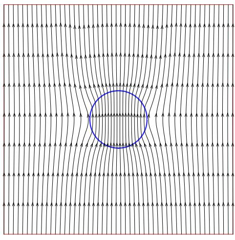

(a)

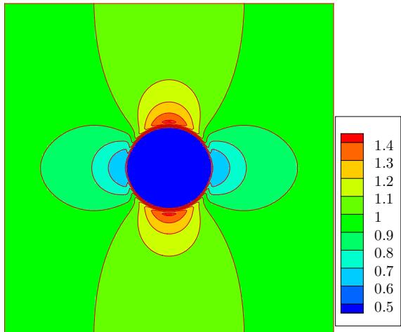

(b)

FIG. 1. Magnetic field lines (a) and distribution of magnetic field strength (b) about a circular cylinder subjected to a uniform impressed magnetic field for $\mu _ { 1 } / \mu _ { 2 } = 2$

Initially, a circular ferrofluid droplet with radius of 1 mm is placed at the center of a square domain with a side length of 16 mm. The reference density, length, and velocity are set to be $0 . 8 \times 1 0 ^ { 3 } \mathrm { k g } / \mathrm { m } ^ { 3 }$ , 0.8 mm, and 5 m s, respectively. The computational domain is divided into $2 0 0 \times 2 0 0$ lattice units. The mobility coefficient $M _ { \phi }$ and the interfacial thickness ξ are set to be 0.1 and 4, respectively. The physical parameters and quantities in lattice units are $\rho _ { l } = 1 , \rho _ { h } = 1 . 9 7 5$ $\mu _ { l } = 0 . 0 0 2 5 , \mu _ { h } = 0 . 0 5$ , and $\sigma = 0 . 0 0 1 9 1 8 7 5$ by simple calculation. The no-slip boundary conditions are used for all boundaries. 

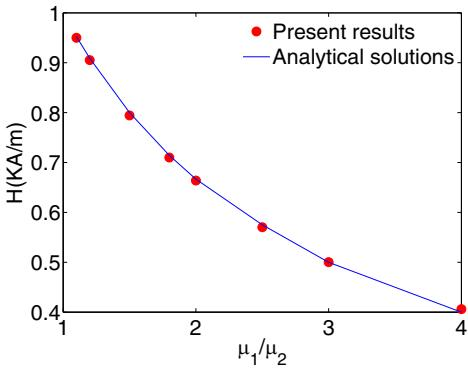

FIG. 2. The magnetic field intensity inside the circular cylinder versus the permeability ratio $\mu _ { 1 } / \mu _ { 2 }$

Figure 4 shows the shapes of ferrodroplets at the equilibrium state for $H = 1 . 2 \mathrm { k A / m } , 2 . 4 \mathrm { k A / m } , 2 . 9 \mathrm { k A / m }$ $3 . 7 \mathrm { k A } / \mathrm { m }$ , and 5.5 kA/m. In fact, during the deformation process, there is a competition between the surface tension and magnetic interfacial force. The surface tension tries to make the droplet maintain circular shape. However, the ferrofluid droplet can be elongated and becomes thinner along the vertical direction due to the effect of the magnetic interfacial force. As a result, the final equilibrium shape depends on the ratio between the two forces. From Fig. 4, the ferrodroplet has a circular shape when the external magnetic field is weak $( H = 1 . 2 \mathrm { k A / m } )$ . As the external magnetic field strength increases, the droplet shape changes from circle to ellipse. When $H = 5 . 5 \mathrm { k A / m }$ , we find that the semimajor axis b of the ferrofluid droplet is much great than the semimajor axis a. In Fig. 5, the numerical results are compared with the experimental results for the equilibrium state aspect ratio $b / a .$ It can be observed that the present model can give quite good results. 

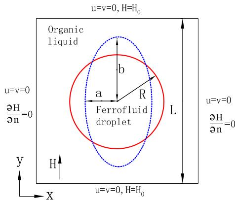

FIG. 3. A schematic illustration of deformation of a ferrofluid droplet under a uniform magnetic field.

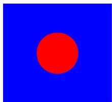

(a)

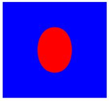

(b)

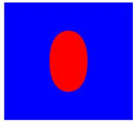

(c)

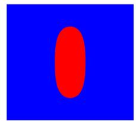

(d)

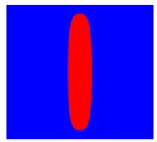

(e)

FIG. 4. Shapes of the ferrofluid droplet for different applied magnetic fields: (a) $H = 1 . 2 ~ \mathrm { k A } / \mathrm { m } ,$ (b) $H = 2 . 4 ~ \mathrm { k A } / \mathrm { m } ,$ , (c) $H =$ $2 . 9 \mathrm { k A } / \mathrm { m } ,$ , (d) H  3.7 kA/m, (e) $H = 5 . 5 \mathrm { k A / m }$

## C. Two bubbles merging in a ferrofluid under a uniform magnetic field

In this section, the present LB model is used to simulate two gas bubbles merging in a ferrofluid under a uniform magnetic field. The large topological changes of the interface can be observed during the merging process. Zheng et al. studied two gas bubbles merging in an ordinary liquid [50]. Their results indicated that the merging only occurs due to surface tension force when the gap between the two bubbles is less than twice the interface thickness. However, the phenomenon of aggregation will occur when bubbles are immersed in a ferrofluid under a uniform magnetic field, which is independent of the separation distances between the bubbles [19]. Here the water-based ferrofluid with 2.0%-vol 10-nm $\mathrm { F e } _ { 4 } \mathrm { O } _ { 3 }$ nanoparticles (EMG707, Ferrotec, USA) is used. The densities of the gas and the ferrofluid are 1.293 $\mathrm { k g } / \mathrm { m } ^ { 3 }$ and $1 1 0 0 \mathrm { k g } / \mathrm { m } ^ { 3 }$ , respectively. The dynamic viscosities of the gas and the ferrofluid are $1 \cdot 7 9 \times 1 \dot { 0 } ^ { - 5 }$ Pa s and $5 . 0 \times 1 0 ^ { - 3 }$ Pa ${ \bf S } ,$ respectively. The surface tension coefficient is $5 0 ~ \mathrm { m N } / \mathrm { m } ^ { 2 }$ and the initial value of the magnetic susceptibility is $\chi _ { 0 } = 1 . 5 1$ . The saturation magnetization $M _ { s }$ is $8 . 8 \mathrm { k A } / \mathrm { m }$ Simple calculation gives $\rho _ { h } / \rho _ { l } = 8 5 0 . 7$ and $\mu _ { h } / \mu _ { l } = 2 7 9 . 3$ It is a great challenge for numerical methods in simulating this case with such high density/viscosity ratios. 

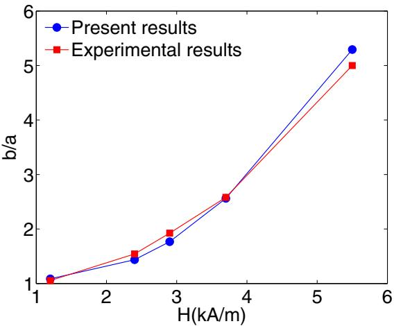

FIG. 5. Comparison between the numerical results and experi mental results for the equilibrium state aspect ratio $b / a$

The radius of the bubble is 1 mm in SI units. The reference density, length, and velocity are set to be $1 2 . 9 3 ~ \mathrm { k g } / \mathrm { m } ^ { 3 }$ 0.04 mm, and $1 0 \mathrm { m } \mathrm { s } ,$ respectively. The computational domain is set as $[ - 8 0 , 8 0 ] \times [ - 1 6 0 , 1 6 0 ]$ in lattice units. Two gas bubbles with an identical radius of $R = 2 5$ are placed at $( 0 , - 3 2 )$ and (0,32) in the initial moment. The interfacial thickness is set to be $\xi = 4$ . Obviously, the gap between the two bubbles $d = 1 4$ is far more than twice the interface thickness $2 \xi = 8 .$ The physical parameters and quantities in lattice units are $\rho _ { l } = 0 . 1 , \rho _ { h } = 8 5 . 0 7 3 5 , \mu _ { l } = 3 . 4 6 1 \times$ $1 0 ^ { - 4 } , \mu _ { h } = 9 . 6 6 7 \times 1 0 ^ { - 2 }$ , and $\sigma = 9 . 6 6 7 \times 1 0 ^ { - 3 }$ by simple calculation. The no-slip boundary conditions are implemented at all boundaries. 

Figure 6 shows the evolution process of two bubbles merging in a ferrofluid under a uniform magnetic field of $H = 3 \mathrm { k A } / \mathrm { m }$ . At the beginning of the evolution process, a low-pressure region is formed between the bubbles due to the magnetic interfacial force and surface tension. As a result, the two bubbles get close each other. At $t \approx 0 . 2 4 9 6 \mathrm { ~ s ~ }$ , the two bubbles begin contact. Compared with the bubbles’ moving process, the time of the merging process is very short. When $t = 0 . 2 6 2 4 ~ \mathrm { s } ,$ a large oval bubble is formed. Differently from the cases in Refs. [51,52], due to the effect of the magnetic interfacial force, the bubble oscillation cannot be observed in the present problem. $\mathrm { A t } ~ t = 0 . 4$ s, the bubble stays in a static state. Figure 7 shows the time of two bubbles moving as a function of the strength of the magnetic field. The numerical results indicate that the time of two bubbles moving shows an $H ^ { - 2 }$ dependence. Moreover, note that the large topological change occurs during the merging process. Here the total mass of the system is checked to verify the mass conservation property of the model. The total mass of the system M is calculated by 

$$
M = \sum_ {i, j} \phi_ {i, j} \Delta x ^ {2}.\tag{56}
$$

The evolution of the dimensionless total mass $M / M _ { 0 }$ for different strengths of magnetic field are plotted in Fig. 8, where $M _ { 0 }$ is the initial total mass. As can be seen, the total mass loss of the present model is within 0.03%. 

## D. Ferrofluid droplets moving and merging on a flat surface in the presence of a permanent magnet

The motion of ferrofluid droplets on solid surfaces has important applications in droplet-based microfluidics [53] and the self-assembly process [54]. In this section, the present model is adopted to simulate wetting and moving contact problems of the ferrofluid. In the presence of fluid interaction with solid walls, the wetting boundary condition needs to be considered. According to Young’s law, a finite steady-state contact angle can be reached due to the balance of surface tension forces at the contact line. In the framework of the LBM based on the Cahn-Hilliard equation, Lee and Liu proposed a treatment method for the wetting boundary conditions which can eliminate the parasitic currents in the vicinity of the contact line [55]. To ensure the mass conservation law and minimize the total free energy contributed to the specified wall free energy, the following boundary conditions were used: 

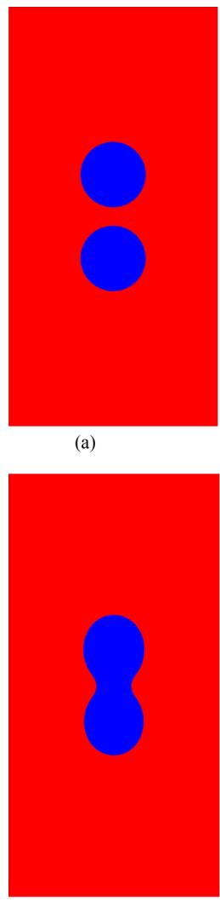

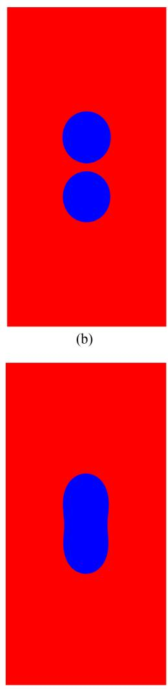

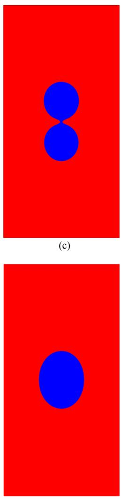

(f)

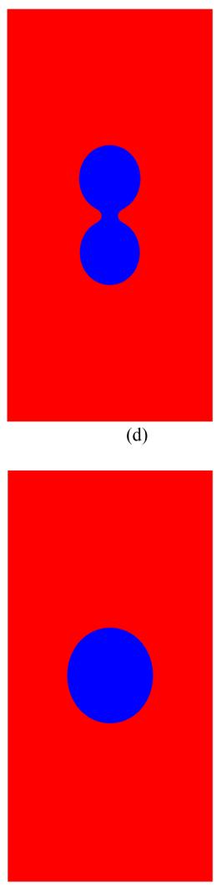

(e)

(g)

(h)

FIG. 6. Two bubbles merging in a ferrofluid under a uniform magnetic field of $H = 3 \mathrm { k A } / \mathrm { m } ;$ (a) t 0 s, (b) t 0.2 s, (c) t 0.2496 s, ( $\mathrm { d } ) \ t = 0 . 2 5 1 2 \mathrm { s } , ( \mathrm { e } ) \ t = 0 . 2 5 4 4 \mathrm { s } , ( \mathrm { f } ) \ t = 0 . 2 6 2 4 \mathrm { s } , ( \mathrm { g } ) \ t = 0 . 3 \mathrm { s } , ( \mathrm { h } ) \ t = 0 . 4 \mathrm { s } .$

$$
\mathbf {n} _ {w} \cdot \nabla \mu_ {\phi , w} = 0,\tag{57}
$$

$$
\mathbf {n} _ {w} \cdot \nabla \phi_ {w} = - \frac {4}{\xi} \cos \theta^ {e q} \phi_ {w} (1 - \phi_ {w}),\tag{58}
$$

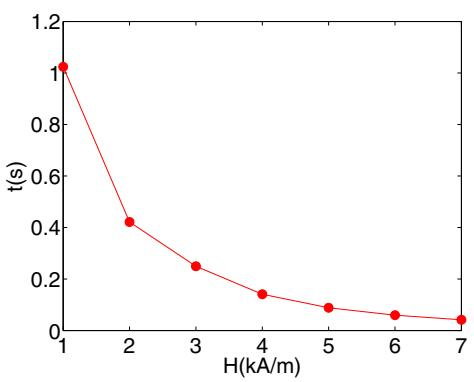

FIG. 7. Time of two bubbles moving as a function of strength of magnetic field.

where $\mathbf { n } _ { w }$ is the unit vector normal and outwards to the solid wall. $\theta ^ { e q }$ is the equilibrium contact angle. It should be pointed out that the Cahn-Hilliard equation is a fourth-order partial differential equation. When it is solved, two boundary conditions (57) and (58) are needed. However, when the secondorder conservative Allen-Cahn equation is solved, only one boundary condition needs to be provided. Fortunately, for the second-order conservative Allen-Cahn equation, the boundary condition (58) can ensure both mass conservation law and Young’s law at the same time. In fact, based on the mass conservation law, we have 

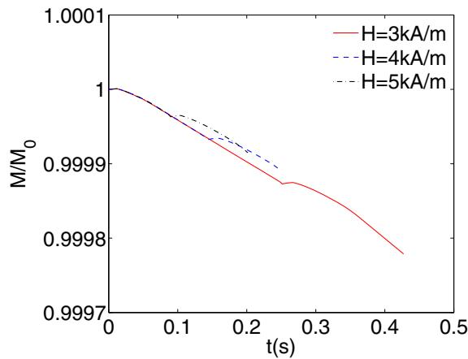

FIG. 8. Evolution of the total mass for different strengths of magnetic field.

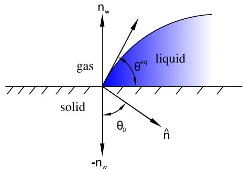

FIG. 9. Schematic of the contact angle and unit normal vectors.

$$
\mathbf {n} _ {w} \cdot \left[ \nabla \phi_ {w} - \frac {4}{\xi} \phi_ {w} (1 - \phi_ {w}) \hat {\mathbf {n}} \right] = 0.\tag{59}
$$

As shown in Fig. 9, according to the geometrical relation, it can be found that the angle $\theta _ { 0 }$ between the unit vectors $- \mathbf { n } _ { w }$ and nˆ is equal to the contact angle $\theta ^ { e q }$ . It yields 

$$
\mathbf {n} _ {w} \cdot \hat {\mathbf {n}} = - | \mathbf {n} _ {w} | | \hat {\mathbf {n}} | \cos \theta_ {0} = - \cos \theta^ {e q}.\tag{60}
$$

As expected, Eq. (59) is equivalent to Eq. (58). 

To guarantee the correct implementation of wetting boundary condition, the evolution process of the shape of a droplet in the absence of the magnetic field is simulated first. A rectangular domain with a grid size of $2 5 6 \times 1 2 8$ is chosen as the computational domain. Initially, a semicircular droplet with radius of $R = 3 2$ lattice units attaches to the domain’s bottom boundary. The other simulation parameters are $\sigma =$ $0 . 0 1 , M _ { \phi } = 0 . 1 , \xi = 4 , \rho _ { h } = 1 . 0 , \rho _ { l } = 0 . 1$ , and $\mu _ { h } / \mu _ { l } = 1 0$ The no-slip boundary conditions are used on the top and bottom boundaries. The periodic boundary conditions are applied on the left and right boundaries. As shown in Fig. 10, the dimensionless heights of the droplet $h _ { \mathrm { m a x } } / R$ predicted by the present model for $\theta ^ { e q } = \pi / 6 , \pi / 3 , \pi / 2 , 2 \pi / 3$ , and 5π/6 are compared with the analytical data, where $h _ { \mathrm { m a x } }$ is the maximum height of the droplet and can be expressed as 

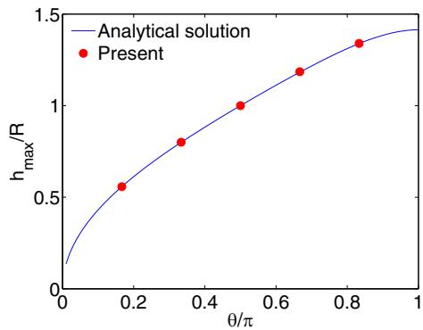

FIG. 10. Comparison of the dimensionless height of the droplet $h _ { \mathrm { m a x } } / R$ between the present results and the analytical data.

$$
h _ {\max} = R (1 - \cos \theta^ {e q}) \sqrt {\frac {\pi}{2 \theta^ {e q} - \sin 2 \theta^ {e q}}}.\tag{61}
$$

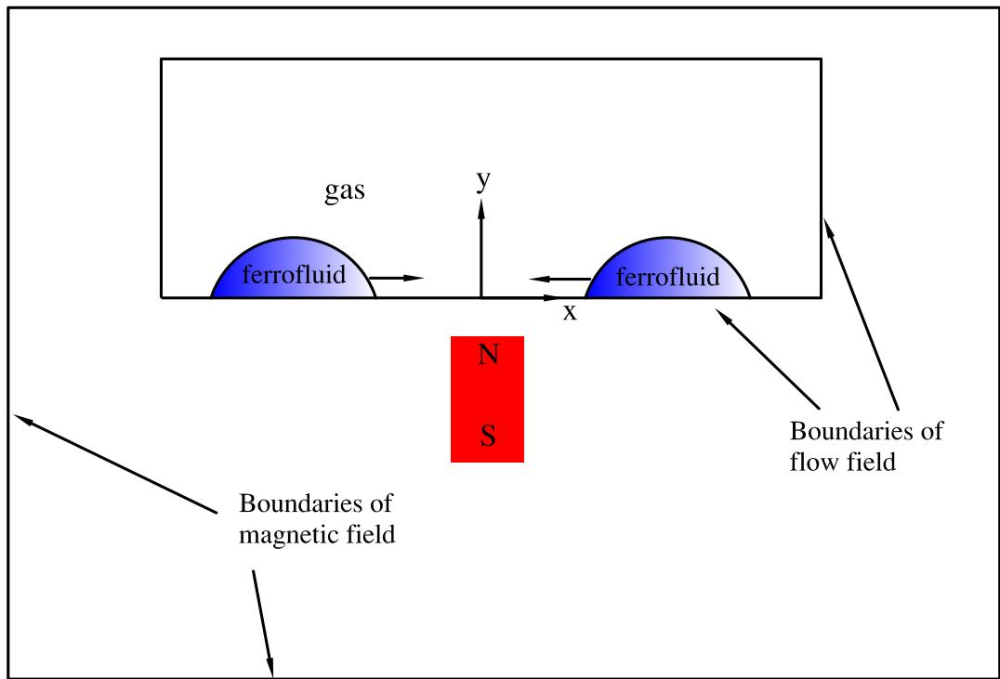

FIG. 11. Schematic and coordinate system of ferrofluid droplets moving and merging on a flat surface in the presence of a permanent magnet.

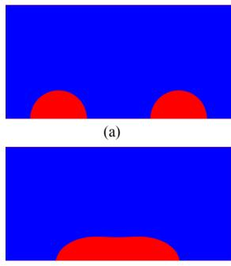

(b)

(e)

(f)

(f)

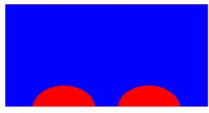

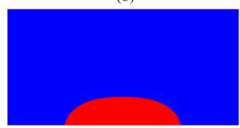

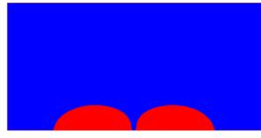

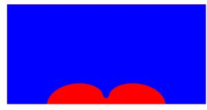

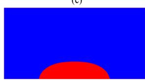

(g)

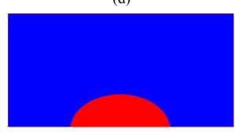

(h)

FIG. 12. Two ferrofluid droplets move and merge on a flat surface in the presence of a permanent magnet with $M _ { 0 } = 8 0 \mathrm { k A } / \mathrm { m } \colon ( \mathrm { a } ) t = 0$ ms, (b) t  25 ms, (c) t  50 ms, (d) t  62.5 ms, (e) t  68.75 ms, (f) t  78.12 ms, (g) t  93.75 ms, (h) t  156.25 ms.

It can be seen that the present numerical results are in good agreement with the analytical solution. 

Finally, the present model is used to simulate two ferrofluid droplets moving and merging on a flat surface in the presence of a permanent magnet. As shown in Fig. 11, two semicircular ferrofluid droplets with radius of 1 mm are placed on a flat solid wall. A permanent magnet is placed below the solid wall. Under the effect of magnetic force, two ferrofluid droplets will move, be close each other, and merge in the end. In this study, the water-based ferrofluid (EMG508 Ferrotec, USA) is used. The density and dynamics viscosity of the ferrofluid are $1 1 0 0 ~ \mathrm { k g } / \mathrm { m } ^ { 3 }$ and $5 . 0 \times 1 0 ^ { - 3 }$ Pa s, respectively. The surface tension coefficient is 31.66 $\mathrm { m N } / \mathrm { m } ^ { 2 }$ and the initial value of the magnetic susceptibility is $\chi _ { 0 } =$ 0.88. The saturation magnetization $M _ { s }$ is $5 . 2 8 \mathrm { k A } / \mathrm { m }$ . The equilibrium contact angle is 0.4π. The physical parameters of gas are the same as those in Sec. III C. Unlike the two above cases in which the magnetic field and the flow field share the same computational domain and boundaries, the two are different in this problem. From Fig. 11, it can be seen that the computational domain of the magnetic field is larger than that of the flow field. The reference density, length, and velocity are set to be 12.93 kg/m3, 0.03125 mm, and 10 m s, respectively. The computational domain of the flow field is set as [ 128, 128] [0, 128] in lattice units. Two semicircular ferrofluid droplets with an identical radius of R 32 are placed at (−68, 0) and (68,0). The physical parameters and quantities in lattice units are $\rho _ { l } = 0 . 1 , \rho _ { h } = 8 5 . 0 7 3 5 , \mu _ { l } =$ $3 . 4 6 1 \times 1 0 ^ { - 4 } , \mu _ { h } = 9 . 6 6 7 \times 1 0 ^ { - 2 } , \mathrm { a n d } \sigma = 7 . 8 3 5 \times 1 0 ^ { - 3 } \mathrm { b } ;$ y simple calculation. The no-slip boundary conditions are imposed on the top and bottom boundaries of the flow field. The periodic boundary conditions are applied on the left and right boundaries. For the magnetic field, a computational domain $[ - 2 2 8 , 2 2 8 ] \times [ - 2 0 0$ , 148] is used. The domain $[ - 2 0 , 2 0 ] \times$ $[ - 7 0 , - 1 0 ]$ is occupied by a permanent magnet. For magnetic field generated by a permanent magnet, the magnetization of the permanent magnet $( 0 , M _ { 0 } )$ is given. The governing equation of the magnetic field can be written as 

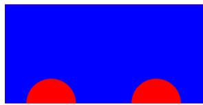

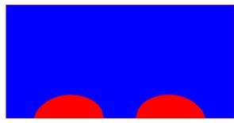

$$
\mu_ {0} \nabla^ {2} \psi = \mu_ {0} \nabla \cdot \mathbf {M},\tag{62}
$$

where the magnetization field M is defined as $( 0 , M _ { 0 } )$ within the permanent magnet, $\chi \mathbf { H }$ in the ferrofluid regions, and (0,0) in other regions. As in Sec. II D, Eq. (62) can be reformulated by adding a time derivative term and a free parameter ε: 

$$
\frac {\partial \psi}{\partial t} = \varepsilon \mu_ {0} \nabla^ {2} \psi - \varepsilon \mu_ {0} \nabla \cdot \mathbf {M}.\tag{63}
$$

To treat the term $- \varepsilon \mu _ { 0 } \nabla \cdot \mathbf { M } .$ , a discrete source term $\omega _ { \alpha } ( - \varepsilon \mu _ { 0 } \nabla \cdot \mathbf { M } ) \Delta t$ should be added on the right side of Eq. (40). The magnetic insulation conditions are applied for all boundaries 

$$
\frac {\partial \psi}{\partial n _ {m}} = \frac {1}{\mu_ {0}} \mathbf {n} _ {m} \cdot \mathbf {B} = 0,
$$

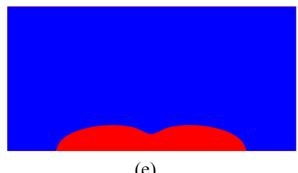

(64) 

where ${ \bf n } _ { m }$ is the unit normal vector of the boundaries of the magnetic field. 

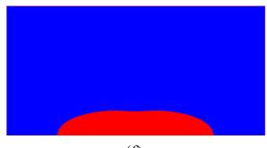

Figure 12 displays the evolution process of two ferrofluid droplets moving and merging on a flat surface in the presence of a permanent magnet with $M _ { 0 } = 8 0 \mathrm { k A / m }$ . With the effect of magnetic field, the droplets become flattened and move towards each other. When $t = 5 0$ ms, two droplets begin contact. A static droplet is formed at $t = 1 5 6 . 2 5$ ms. When a stronger magnetic field $( M _ { 0 } = 1 6 0 \mathrm { k A / m } )$ is applied, as shown in Fig. 13, the moving and merging processes are faster. From Fig. 14, we find that the position of the contact point on the right side of the left droplet changes with time. Note that there is an almost linear relation between the time and the position of the contact point. This indicates that the moving velocity of the contact point is almost a constant. The driving magnetic force and the friction force are almost in balance during the sliding motion. The same behavior can be observed in the experimental work of Nguyen et al. [56]. 

(e)

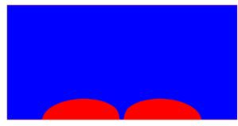

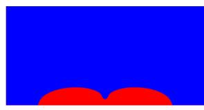

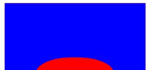

(g)

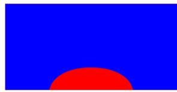

(h)

FIG. 13. Two ferrofluid droplets move and merge on a flat surface in the presence of a permanent magnet with $M _ { 0 } = 1 6 0 \mathrm { k A } / \mathrm { m } \mathrm { : } \left( \mathrm { a } \right) t = 0$ ms, (b) t 7.81 ms, (c) t 15.6 ms, (d) t 18.2 ms, (e) t 20.3 ms, (f) t 28.1 ms, (g) t 37.5 ms, (h) t 62.5 ms

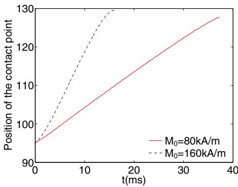

FIG. 14. The position of the contact point on the right side of the left droplet versus the time.

## IV. CONCLUSIONS

In this paper, a phase-field-based lattice Boltzmann model is presented to simulate the multiphase ferrofluid flows with large density ratio. In the work of Nochetto et al. [24], the diffuse interface model was first proposed to deal with two-phase ferrofluid flows. In their model, the Cahn-Hilliard equation was adopted to track the interface and all governing equations were solved by an energy-stable finite element method. However, their model was designed for multiphase flows with matching density (or almost matching density). Differently from the existing model, in our model the 

[1] J. L. Neuringer and R. E. Rosensweig, Phys. Fluids 7, 1927 (1964). 

[2] R. E. Rosensweig, Ferrohydrodynamics (Courier Corporation, Mineola, New York, 1997). 

[3] K. Raj and R. Moskowitz, J. Magn. Magn. Mater. 85, 233 (1990). 

[4] O. T. Mefford, R. C. Woodward, J. D. Goff, T. P. Vadala, T. G. S. Pierre, J. P. Dailey, and J. S. Riffle, J. Magn. Magn. Mater. 311, 347 (2007). 

[5] M. D. Cowley and R. E. Rosensweig, J. Fluid Mech. 30, 671 (1967). 

[6] R. E. Rosensweig, Ind. Eng. Chem. Res. 46, 6113 (2007). 

[7] A. Chaves and C. Rinaldi, Phys. Fluids 26, 042101 (2014). 

[8] C. Y. Chen and Z. Y. Cheng, Phys. Fluids 20, 054105 (2008). 

conservative Allen-Cahn model is used for evolution of the phase field variable. The ferrofluid is treated as a Newtonian fluid. A modified Poisson equation is derived to describe the magnetic potential. Three lattice Boltzmann equations are formulated for all governing equations for physical fields. 

The magnetic field solver in the present model is verified by an example: a circular cylinder in uniform applied magnetic field. The present numerical results agree well with the analytical solutions. Deformation of a ferrofluid droplet under a uniform magnetic field is also simulated using the present model. The equilibrium droplet aspect ratios are compared with the experimental data and a good agrement is achieved. Moreover, the present LB model is used to simulate two bubbles merging in a ferrofluid under a uniform magnetic field with density ratio $\rho _ { h } / \rho _ { l } = 8 5 0 . 7$ and viscosity ratio $\mu _ { h } / \mu _ { l } =$ 279.3. The results indicate that the present model can deal with multiphase ferrofluid flows with large density/viscosity ratio. Finally, ferrofluid droplets moving and merging on a flat surface in the presence of a permanent magnet are studied. The results demonstrate the capacity of the present method in the modeling of three-phase contact line dynamics of ferrofluids. 

It should be pointed out that the present work needs to be improved in some respects. First, the LB solver of the Poisson equation has low accuracy. It is necessary to solve the Poisson equation using a higher accuracy solver. Second, the numerical results obtained by using the conservation Allen-Cahn equation are very sensitive to the mobility $M _ { \phi } .$ . However, the effect of $M _ { \phi }$ is not studied. Third, the non-Newtonian effect of the ferrofluids is not considered. Last, only simple two-dimensional problems are simulated in this paper. More complex flow problems, such as the Rosensweig instability and the three-dimensional multiphase ferrofluid flows, are not involved. These issues will be investigated in the future. 

## ACKNOWLEDGMENTS

This work is supported by the National Postdoctoral Program for Innovative Talents (Grant No. BX201700133) and the China Postdoctoral Science Foundation (Grant No. 2017M620041). 

[9] O. Lavrova, G. Matthies, T. Mitkova, V. Polevikov, and L. Tobiska, J. Phys.: Condens. Matter 18, S2657 (2006). 

[10] C. Gollwitzer, G. Matthies, R. Richter, I. Rehberg, and L. Tobiska, J. Fluid Mech. 571, 455 (2007) 

[11] C. W. Hirt and B. D. Nichols, J. Comput. Phys. 39, 201 (1981). 

[12] S. Osher and J. A. Sethian, J. Comput. Phys. 79, 12 (1988). 

[13] M. Sussman, P. Smereka, and S. Osher, J. Comput. Phys. 114, 146 (1994). 

[14] D. M. Anderson, G. B. McFadden, and A. A. Wheeler, Annu. Rev. Fluid Mech. 30, 139 (1998). 

[15] P. Yue, J. J. Feng, C. Liu, and J. Shen, J. Fluid Mech. 515, 293 (2004). 

[16] M. S. Korlie, A. Mukherjee, B. G. Nita, J. G. Stevens, A. D. Trubatch, and P. Yecko, J. Phys.: Condens. Matter 20, 204143 (2008). 

[17] S. Afkhami, Y. Renardy, M. Renardy, J. S. Riffle, and T. St Pierre, J. Fluid Mech. 610, 363 (2008). 

[18] S. Afkhami, A. J. Tyler, Y. Renardy, M. Renardy, T. S. Pierre, R. C. Woodward, and J. S. Riffle, J. Fluid Mech. 663, 358 (2010). 

[19] W. K. Lee, R. Scardovelli, A. D. Trubatch, and P. Yecko, Phys. Rev. E 82, 016302 (2010). 

[20] J. Liu, Y. F. Yap, and N. T. Nguyen, Phys. Fluids 23, 072008 (2011). 

[21] G. P. Zhu, N. T. Nguyen, R. V. Ramanujan, and X. Y. Huang, Langmuir 27, 14834 (2011). 

[22] D. Shi, Q. Bi, and R. Zhou, Numer. Heat Tr. A-Appl. 66, 144 (2014). 

[23] A. Ghaffari, S. H. Hashemabadi, and M. Bazmi, Colloids Surf. A Physicochem. Eng. Asp. 481, 186 (2015). 

[24] R. H. Nochetto, A. J. Salgado, and I. Tomas, Comput. Methods Appl. Mech. Eng. 309, 497 (2016). 

[25] S. Chen and G. D. Doolen, Annu. Rev. Fluid Mech. 30, 329 (1998). 

[26] X. Shan and H. Chen, Phys. Rev. E 47, 1815 (1993). 

[27] M. R. Swift, W. R. Osborn, and J. M. Yeomans, Phys. Rev. Lett. 75, 830 (1995). 

[28] X. He, S. Chen, and R. Zhang, J. Comput. Phys. 152, 642 (1999). 

[29] T. Inamuro, T. Ogata, S. Tajima, and N. Konishi, J. Comput. Phys. 198, 628 (2004). 

[30] T. Lee and C. L. Lin, J. Comput. Phys. 206, 16 (2005). 

[31] H. Liu and Y. Zhang, J. Comput. Phys. 229, 9166 (2010). 

[32] H. Liu, A. J. Valocchi, Y. Zhang, and Q. Kang, Phys. Rev. E 87, 013010 (2013). 

[33] H. Liu, A. J. Valocchi, Y. Zhang, and Q. Kang, J. Comput. Phys. 256, 334 (2014). 

[34] Y. Sun and C. Beckermann, J. Comput. Phys. 220, 626 (2007). 

[35] P. H. Chiu and Y. T. Lin, J. Comput. Phys. 230, 185 (2011). 

[36] M. Geier, A. Fakhari, and T. Lee, Phys. Rev. E 91, 063309 (2015). 

[37] A. Fakhari, M. Geier, and T. Lee, J. Comput. Phys. 315, 434 (2016). 

[38] A. Fakhari and D. Bolster, J. Comput. Phys. 334, 620 (2017). 

[39] F. Ren, B. Song, M. C. Sukop, and H. Hu, Phys. Rev. E 94, 023311 (2016). 

[40] H. L. Wang, Z. H. Chai, B. C. Shi, and H. Liang, Phys. Rev. E 94, 033304 (2016). 

[41] G. Falcucci, G. Chiatti, S. Succi, A. A. Mohamad, and A. Kuzmin, Phys. Rev. E 79, 056706 (2009). 

[42] L. Chen, Q. Kang, Y. Mu, Y. L. He, and W. Q. Tao, Int. J. Heat Mass Transfer 76, 210 (2014). 

[43] M. I. Shliomis, Lect. Notes Phys. 594, 85 (2002). 

[44] A. O. Ivanov and O. B. Kuznetsova, Phys. Rev. E 85, 041405 (2012). 

[45] A. Kumar, J. Comput. Phys. 201, 109 (2004). 

[46] L. S. Luo, W. Liao, X. Chen, Y. Peng, and W. Zhang, Phys. Rev. E 83, 056710 (2011). 

[47] D. Shi, Q. Bi, and R. Zhou, Journal of Xi’an Jiaotong University 48, 123 (2014). 

[48] S. H. Tan and N. T. Nguyen, Phys. Rev. E 84, 036317 (2011). 

[49] C. Flament, S. Lacis, J. C. Bacri, A. Cebers, S. Neveu, and R. Perzynski, Phys. Rev. E 53, 4801 (1996). 

[50] H. W. Zheng, C. Shu, and Y. T. Chew, J. Comput. Phys. 218, 353 (2006). 

[51] Y. Wang, C. Shu, J. Y. Shao, J. Wu, and X. D. Niu, J. Comput. Phys. 290, 336 (2015). 

[52] H. Z. Yuan, Z. Chen, C. Shu, Y. Wang, X. D. Niu, and S. Shu, J. Comput. Phys. 345, 404 (2017). 

[53] C. Rigoni, M. Pierno, G. Mistura, D. Talbot, R. Massart, J. C. Bacri, and A. Abou-Hassan, Langmuir 32, 7639 (2016). 

[54] J. V. Timonen, M. Latikka, L. Leibler, R. H. Ras, and O. Ikkala, Science 341, 253 (2013). 

[55] T. Lee and L. Liu, J. Comput. Phys. 229, 8045 (2010) 

[56] N. T. Nguyen, G. Zhu, Y. C. Chua, V. N. Phan, and S. H. Tan, Langmuir 26, 12553 (2010). 

